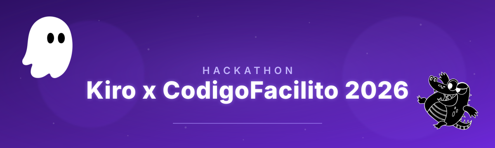

<p align="center">
  
</p>

<p align="center">
  <a href="https://github.com/VECTORG99/Artemisa/actions/workflows/ci.yml"></a>
  <a href="LICENSE"></a>
  <a href="https://artemisa.vercel.app"></a>
</p>

> [!IMPORTANT]
> Built for the Kiro x Código Facilito 2026 Hackathon.
> Documentation in Spanish. LLM Readers: read AGENTS.md and CONTEXT.md for the full project context.

**Open-source generator of configuration files for development and operations agents. It designs through a decision tree, generates the bundle, and explains why it was built that way.**

Artemisa generates a reproducible bundle of configuration files (Markdown + JSON): a canonical blueprint, verifiable manifest, installation guide, and explanation of decisions. You apply the bundle manually in your repository after reviewing each artifact.

The Creator does not use an LLM to decide the architecture, does not execute commands, and does not modify the user's project. Its questions, recommendations, and artifacts are deterministic and auditable.


---

## Current status

### Implemented in the backend

- Versioned technology catalog with languages, frameworks, databases, architectures, cloud, CI/CD, IaC, containers, observability, security, repositories, knowledge, and agent platforms.
- **Stateless** decision tree of 32 questions (28 mandatory, 4 optional) with different branches for development and production.
- Explainable recommendations with evidence, benefits, trade-offs, and alternatives.
- Preview of a bundle with blueprint, manifest, SHA-256 hashes, installation, and justification.
- Conditional generation of Artemisa, RAG, PR review, `AGENTS.md`, hooks, skills, and Kiro configuration.
- Fictitious and skippable tutorial available as API content.
- Unit and integration tests for branches, validation, determinism, and HTTP contract.

### Implemented in the interface

- `frontend/agents/new` loads catalog, workflow, skills, and MCPs directly from `/api/v1/creator`.
- Four input modes: **Auto-short** (8 curated questions plus safe default values for the rest), **Auto-long** (goes through all visible questions, including the 4 optional ones, which can be skipped), **Presets** (8 complete configurations ready to review and adjust), and **Advanced** (dense panel with all questions from the tree grouped by section, global search, and rail of pending mandatory answers).
- Search, max counter, selection chips, and `custom:<slug>` input in each catalog question, in all four modes.
- Keyboard shortcuts (`Enter`, `Alt+←`, `1-9`, `S`/`N`, `Esc`, `?`) with help panel.
- Draft saved in `sessionStorage` per workflow version, with explicit restart action.
- Renders questions and backend branches without hardcoding the order in React.
- Space background and "liquid glass" aesthetic shared with the Landing.
- Review recommendations and warnings before generating, with each response editable.
- Download the bundle as ZIP (preserving relative paths), as full JSON, or individual artifacts.
- The Creator is stateless: keeps the draft in `sessionStorage` per workflow version, without a database.

---

## User journey

```text
[Tutorial ficticio opcional]
      ↓ saltar o completar
[Árbol de decisiones]
      ├─ problema y criterio de éxito
      ├─ stack y arquitectura
      ├─ desarrollo / producción / ambos
      ├─ DevOps, cloud y observabilidad
      ├─ permisos, conocimiento y PR review
      └─ Artemisa / Kiro / Portable
      ↓
[Recomendaciones explicables]
      ↓
[Preview del bundle]
      ├─ configuraciónes
      ├─ manifest + hashes
      ├─ INSTALL.md
      └─ WHY.md
      ↓
[Aplicación manual y validada en el proyecto]
```

The experience is inspired by a workflow like n8n: each response opens or closes nodes. It is not a fixed form. The client retains the responses and resends them; the backend recalculates the entire path, progress, and next question.

### 1. Optional Tutorial

`GET /api/v1/creator/tutorial` provides a fictional story: rescuing a production API. It teaches four ideas before creating a real agent:

1. define a verifiable outcome;
2. separate rules, documentation, and live data;
3. grant minimal permissions;
4. choose artifacts Artemisa, Kiro, or portable.

The tutorial can be skipped without creating state in the backend.

### 2. Guided Creator

The tree asks for:

- name, purpose, objective, and success criteria;
- new project, existing, or migration;
- languages, frameworks, persistence, and custom technologies;
- monolith, modular monolith, microservices, serverless, event-driven, hexagonal, CQRS, or data pipelines;
- repository and CI/CD;
- development, production, or both environments;
- EC2, ECS, EKS, Lambda, Azure, GCP, Vercel, Render, Fly.io, or VPS;
- Docker, Compose, Kubernetes, Helm, and infrastructure automation;
- observability, secrets, supply chain, and least privilege;
- agent capabilities and autonomy;
- RAG and knowledge sources;
- PR review and review criteria;
- destinations Artemisa, Kiro, and portable;
- hooks and skills.

All catalog selections accept `custom:<slug>`. A custom option is retained in the blueprint and generates a pending adapter warning; `WHY.md` documents the custom decisions that are part of their explanatory sections.

### 3. Recommendations

Recommendations are deterministic rules. Some examples:

- production requires policies different from development, least privilege, and rollback;
- EC2 needs reproducible process, patches, identity, secrets, and observability;
- microservices require limits, contracts, and distributed traceability;
- SQLite in concurrent production produces a warning;
- PR review keeps the merge under human control;
- Kiro separates steering, hooks, and skills;
- deploy or operation generate a privilege warning.

Each recommendation includes reason, evidence used, benefits, trade-offs, and alternatives. The backend does not present a probabilistic decision as if it were model knowledge.

### 4. Ready-to-apply bundle

Always generated:

| File                      | Function                                                               |
| ------------------------- | ---------------------------------------------------------------------- |
| `artemisa.blueprint.json` | Canonical model of all decisions.                                      |
| `manifest.json`           | Inventory of files and SHA-256 hashes.                                 |
| `docs/INSTALL.md`         | Tutorial to apply and validate the agent.                              |
| `docs/WHY.md`             | Explanation of the objective, stack, environment, and recommendations. |
| `PROMPT.md`               | Consolidated prompt to copy along with the bundle.                     |

According to the selected destinations and options, the following are added:

| Destination / Option | Artifacts                                                                                           |
| -------------------- | --------------------------------------------------------------------------------------------------- |
| `agents-md`          | `AGENTS.md`                                                                                         |
| `portable`           | `skills/<agente>/SKILL.md`                                                                          |
| `cursor`             | `.cursorrules`, `.cursor/rules/<agente>.mdc`                                                        |
| `devin-desktop`      | `.windsurfrules`, `.windsurf/rules/<agente>.md`                                                     |
| `coderabbit`         | `.coderabbit.yaml`                                                                                  |
| `kilo-code`          | `.kilocodemodes`, `.kilocode/rules/<agente>.md`                                                     |
| `kiro`               | `.kiro/steering/<agente>.md`, `.kiro/hooks/<agente>-quality.json`, `.kiro/skills/<agente>/SKILL.md` |
| Selected skills      | `skills/<id>/SKILL.md`                                                                              |
| Selected MCPs        | `mcp.json`                                                                                          |

The bundle is returned as JSON. Artemisa does not write these files automatically: the user must review them and copy them to the destination project. To apply them safely, see [`docs/reference/`](docs/reference/README.md): guides on `security-policy.json`, `steering.json`, and the reference implementation of hooks.

---

## Development versus production

The environment changes the tree, recommendations, and installation tutorial.

### Development agent

Prioritizes:

- limited reading to the repository;
- small and reviewable patches;
- allowlisted lint, test, and build commands;
- `AGENTS.md`, steering and team skills;
- reproducible Docker Compose or Dev Containers;
- review before commit or merge.

### Production agent

Prioritizes:

- separate workload identity;
- secrets in an external manager;
- least privilege and read-only mode by default;
- staging, human approval, backup, and rollback;
- logs, metrics, traces, alerts, and cost limits;
- timeout, rate limiting, and tool auditing.

For EC2, Artemisa also recommends documenting the service process, patching, access via SSM/IAM, CloudWatch, persistence, and recovery. The preview **does not deploy** on EC2 or any other provider.

---

## Architecture

```text
┌────────────────────────────────────────────────────────────┐
│ Agent Creator web                                         │
│ Renderiza workflow + conserva answers localmente           │
└─────────────────────────────┬──────────────────────────────┘
                              │ JSON
┌─────────────────────────────▼──────────────────────────────┐
│ Creator API v1 (stateless)                                 │
│                                                            │
│  Catálogo → Árbol → Recomendaciones → Blueprint            │
│                                ↓                           │
│                    Generadores puros                       │
│                                ↓                           │
│       Bundle JSON + manifest + INSTALL + WHY               │
└────────────────────────────────────────────────────────────┘
```

### Why the Creator is stateless

- Allows rolling back by changing responses and recalculating the path.
- Avoids anonymous sessions and orphaned state.
- Facilitates reproducibility, testing, and versioning.
- The same input produces the same blueprint, content, and hash.
- Scales horizontally without coordinating sessions or sharing state.

### How to apply the bundle

1. Download the ZIP or the individual artifacts from the final screen.
2. Copy the files respecting the relative paths of `manifest.json`.
3. Review `artemisa.blueprint.json`, `docs/INSTALL.md`, and `docs/WHY.md` with the team.
4. Validate the SHA-256 hashes of the manifest before applying changes.
5. Configure secrets and integrations with least privilege.
6. Test the agent in advisor mode before activating actions with effects.

For details on allowlists and hooks, see [`docs/reference/`](docs/reference/README.md).

---

## Creator API

Base URL:

```text
/api/v1/creator
```

### Creator Authentication

In production, authentication is active with `AUTH_REQUIRED=true` (see `render.yaml`).
Configure `ARTEMISA_API_KEYS` as a comma-separated list and do not commit real keys
in `.env`, examples, logs, or documentation.

```bash
AUTH_REQUIRED=true
ARTEMISA_API_KEYS=dev-key-1,ops-key-2
```

The protected routes accept any of these headers:

```bash
curl -X POST http://localhost:3001/api/v1/creator/generate \
  -H "Authorization: Bearer dev-key-1" \
  -H "Content-Type: application/json" \
  -d '{"answers":{}}'

curl -X POST http://localhost:3001/api/v1/creator/preview \
  -H "X-API-Key: dev-key-1" \
  -H "Content-Type: application/json" \
  -d '{"answers":{}}'
```

Public Creator routes, mounted before `requireAuth` and available without an API key:

| Route             | Method |
| ----------------- | ------ |
| `/catalog`        | GET    |
| `/workflow`       | GET    |
| `/tutorial`       | GET    |
| `/skills`         | GET    |
| `/mcps`           | GET    |
| `/models`         | GET    |
| `/docs`           | GET    |
| `/agent`          | GET    |
| `/agent/start`    | GET    |
| `/agent/answer`   | POST   |
| `/agent/generate` | POST   |
| `/startup`        | GET    |

Protected routes of the Creator, mounted after `requireAuth`:

| Route       | Method |
| ----------- | ------ |
| `/evaluate` | POST   |
| `/preview`  | POST   |
| `/generate` | POST   |

For local development you can disable auth:

```bash
AUTH_REQUIRED=false
```

### `GET /catalog`

Returns version, categories, and technologies.

Optional filters:

```text
?category=cloud
?environment=production
?q=kubernetes
```

### `GET /workflow`

Returns the contract of questions and conditions. The client should not encode the order on their own.

### `GET /tutorial`

Returns the fictitious tutorial with `skippable: true`.
**NEWNEWLINE**### `POST /evaluate`

Recalculates the tree from the accumulated answers.
__NEWNEWLINE```json
{
"workflowVersion": "1.0.0",
"catalogVersion": "1.0.0",
"answers": {
"agent_name": "Platform Reviewer",
"purpose": "pr-review",
"objective": "Revisar cambios y explicar riesgos sin hacer merge.",
"success_criteria": "Cada PR recibe hallazgos priorizados con evidencia."
}
}

````
__NEWNEWLINE__Summary answer:

CODEBLOCK_8__
__NEWNEWLINE__The total changes because it only counts questions visible to the current branch.
__NEWNEWLINE__### `POST /preview`

Requires a complete tree and returns blueprint, artifacts, manifest, guide, and warnings.
__NEWNEWLINE__### `POST /generate`

Semantic alias of `/preview`. Also only generates the bundle in memory; does not write files or run the agent.
__NEWNEWLINE__### Endpoints for AI Agents

These endpoints are public and are designed for AI agents (Claude, GPT, Copilot, Devin, etc.) to consume the Creator without authentication. They return JSON except `GET /startup`, which responds with Markdown by default or JSON if `Accept: application/json` is sent.

| Path              | Method | Description                                    |
| ----------------- | ------ | ---------------------------------------------- |
| `/agent`          | GET    | Complete onboarding protocol                   |
| `/agent/start`    | GET    | First question + summarized catalog           |
| `/agent/answer`   | POST   | Sends answers, receives next question         |
| `/agent/generate` | POST   | Generates bundle with application instructions |
| `/startup`        | GET    | Self-contained onboarding Markdown document   |

### Other endpoints
| Route                   | Method | Description                                      |
| ----------------------- | ------ | ------------------------------------------------ |
| `GET /api/health`       | GET    | Deep health check (memory, disk, uptime).       |
| `GET /api/health/live`  | GET    | Liveness probe (always 200 if the process is alive). |
| `GET /api/health/ready` | GET    | Readiness probe (200 if it can serve requests).  |
| `GET /api/metrics`      | GET    | HTTP metrics (protected by `METRICS_SECRET`).      |
| `GET /api/openapi.json` | GET    | OpenAPI 3.1 document.                            |

> [!IMPORTANT]
> Complete API reference at [`docs/api-reference.md`](docs/api-reference.md).

### Versioning and errors

The client can set `workflowVersion` and `catalogVersion`:

- `200`: correct evaluation or generation;
- `400`: structurally invalid body or disallowed properties;
- `200` with `issues[]`: evaluation of responses with invalid type/option;
- `409`: obsolete workflow/catalog version;
- `422`: preview with incomplete tree, invalid responses, literal secret, or unsafe bundle;
- `500`: internal error.

Creator errors use `application/problem+json` and include `issues[]` with field paths.

---

## Creator Security and Determinism

The Creator:

- validates types, options, duplicates, and maximums per question;
- ignores answers from another version with a warning;
- limits HTTP JSON to 128 KB;
- rejects absolute paths, `..`, backslashes, and duplicate files;
- limits the preview to 40 files and 256 KB generated;
- rejects tokens and private keys with known patterns;
- uses references like `${GITHUB_TOKEN}` instead of literal secrets;
- serializes objects with ordered keys;
- computes SHA-256 for each artifact;
- does not use filesystem, network, SQLite, LLM, MCP, or shell.

The generated MCP configurations are suggestions. Before production, exact versions must be fixed, allowlists applied, and execution done in a sandbox. The guide [`docs/reference/security-policy-guide.md`](docs/reference/security-policy-guide.md) documents how to implement the allowlist; [`docs/reference/steering-roles-guide.md`](docs/reference/steering-roles-guide.md) documents how to adapt roles.

---

## Reference artifacts

The folder [`docs/reference/`](docs/reference/README.md) contains curated examples and guides for applying the artifacts generated by the Creator. They are used as documentation and **are not loaded at runtime**:

- `steering-roles.json` — the 7 steering roles with system prompt, tools, and temperature.
- `security-policy.example.json` — real allowlist policy.
- `hooks-implementation.ts` — reference implementation of `before_action` and `validateCommand`.
- `mcps.example.json`, `rag.example.json` — examples of MCP server declaration and RAG sources.
- `prompts/` — prompt snippets (`_safety_prefix`, `_context_section`, `_output_format`).

The JSON schemas that validate these files follow in `src/kiro/schemas/` because the Creator generates artifacts with the same shape.

---

## Quick start

Web app: https://artemisa.vercel.app

### Backend

```9```

Backend local:

```10```

Check Creator:

```11```

> [!IMPORTANT]
> The backend does not require `OPENAI_API_KEY`, database, or persistent disk. It only needs `ARTEMISA_API_KEYS` and `BYPASS_SECRET` in production (see [`docs/deployment.md`](docs/deployment.md)).

### Frontend

```12```

- Creator: `http://localhost:3000/agents/new`

### Docker

```13```

See [`docs/deployment.md`](docs/deployment.md) for deployment.

---

## Tests

```14```

The suite covers:

- catalog, search, and custom options;
- progress and development/production branches;- explainable recommendations;
- Artemisa, Kiro, and portable generation;
- RAG, PR review, hooks, skills, and `AGENTS.md`;
- determinism and hashes;
- incomplete tree and literal secrets;
- HTTP contracts and response validation.

---

## Relevant structure

```text
src/
├── creator/
│   ├── domain.ts        # Contratos y errores
│   ├── catalog.ts       # Catálogo tecnológico versionado
│   ├── decisionTree.ts  # Preguntas, condiciones y recomendaciones
│   ├── generator.ts     # Blueprint y artefactos puros
│   └── router.ts        # API /api/v1/creator
├── routes/
│   ├── health.ts        # /api/health (stateless)
│   ├── metrics.ts       # /api/metrics
│   ├── openapi.ts       # /api/openapi.json
│   └── debug.ts         # /api/debug/* (sólo dev)
├── middleware/           # auth, sanitize, validation, errorHandler
├── kiro/schemas/         # Esquemas JSON de artefactos generados
├── config.ts             # Sólo configuración del servidor
└── server.ts

docs/reference/           # Artefactos de referencia (no se cargan en el servidor)
test/
├── CreatorDecisionTree.test.mjs
├── CreatorGenerator.test.mjs
├── creatorFixture.mjs
└── api_test.mjs
````

---

## Roadmap

### Web experience

- [x] Render dynamic questions from `/workflow`.
- [x] Keep answers in `sessionStorage` and call `/evaluate` per step.
- [x] Show recommendations and warnings before generating, with evidence, benefits, trade-offs, and alternatives.
- [x] Edit any response from the review without restarting the flow.- [x] Download the JSON bundle and individual artifacts, with manifest, hashes, and application guide.
- [x] Keyboard shortcuts and help panel.
- [ ] Implement the skippable visual tutorial like a game. The content exists in `GET /api/v1/creator/tutorial`; the interface does not render it yet.
- [ ] Add validated ZIP export and visual revision comparison.

---

## Additional documentation

- [`docs/api-reference.md`](docs/api-reference.md): complete reference of the Creator API.
- [`docs/architecture.md`](docs/architecture.md): internal architecture of the Creator.
- [`docs/deployment.md`](docs/deployment.md): local deployment, Docker, and Render.
- [`docs/self-hosting.md`](docs/self-hosting.md): self-hosting guide on VPS/bare metal.
- [`docs/troubleshooting.md`](docs/troubleshooting.md): Creator troubleshooting.
- [`docs/apply-bundle.md`](docs/apply-bundle.md): how to apply and validate a generated bundle.
- [`docs/use_cases.md`](docs/use_cases.md): use cases.
- [`docs/reference/`](docs/reference/README.md): reference artifacts and application guides.
- [`docs/CONVENTIONS.md`](docs/CONVENTIONS.md): code conventions and docs.
- OpenAPI spec: available at `/api/openapi.json` when running the backend.

## License

MPL-2.0 — see [`LICENSE`](LICENSE). Weak copyleft: files derived from this code must remain under MPL-2.0 and keep the copyright and contributor notice, but can be combined with proprietary code in the same project without licensing that code under the MPL.
