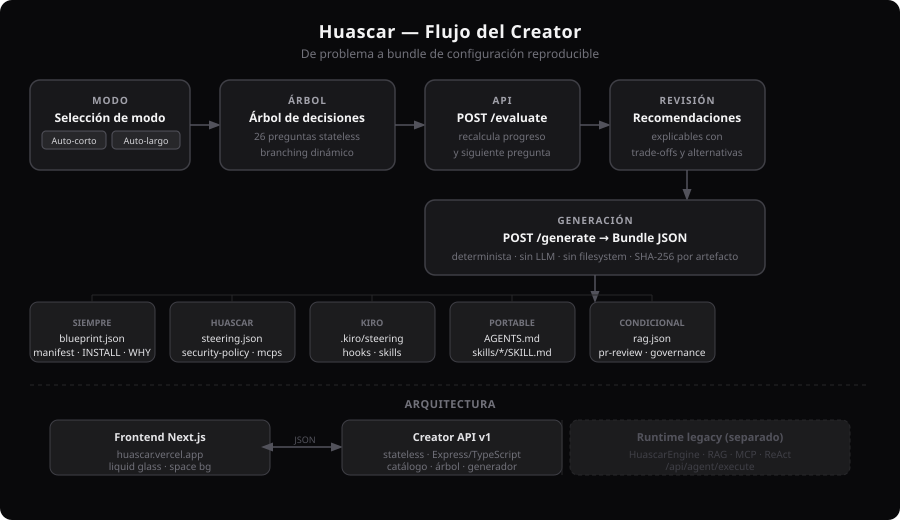

# Huascar

[CI](https://github.com/VECTORG99/Huascar/actions/workflows/ci.yml) | [License](LICENSE) | [Homepage](https://huascar.vercel.app)

> Construido para el Hackathon Kiro x Código Facilito 2026.
> Documentación en español. Lectores LLM: leer AGENTS.md y CONTEXT.md para el contexto completo del proyecto.

**Generador open-source de archivos de configuración para agentes de desarrollo y operación. Diseña mediante un árbol de decisiones, genera el bundle y explica por qué fue construido así.**

Huascar **sólo genera archivos de configuración** (Markdown + JSON). No ejecuta, no despliega, no hostea agentes. El Runtime anterior (motor ReAct, LLM, RAG, MCP, SQLite) se eliminó en el issue #584 — ver [ADR-0008](docs/adr/0008-remove-runtime-generator-only.md).

El Creator no usa un LLM para decidir la arquitectura, no ejecuta comandos y no modifica el proyecto del usuario. Sus preguntas, recomendaciones y artefactos son deterministas y auditables.



---

## Estado actual

### Implementado en el backend

- Catálogo tecnológico versionado con lenguajes, frameworks, bases de datos, arquitecturas, cloud, CI/CD, IaC, contenedores, observabilidad, seguridad, repositorios, conocimiento y plataformas de agentes.
- Árbol de decisiones **stateless** de 32 preguntas (28 obligatorias, 4 opcionales) con ramas diferentes para desarrollo y producción.
- Recomendaciones explicables con evidencia, beneficios, trade-offs y alternativas.
- Preview de un bundle con blueprint, manifest, hashes SHA-256, instalación y justificación.
- Generación condicional de Huascar, RAG, PR review, `AGENTS.md`, hooks, skills y configuración Kiro.
- Tutorial ficticio y skippable disponible como contenido de API.
- Pruebas unitarias e integración para ramas, validación, determinismo y contrato HTTP.

### Implementado en la interfaz

- `frontend/agents/new` carga catálogo, workflow, skills y MCPs directamente desde `/api/v1/creator`.
- Cuatro modos de entrada: **Auto-corto** (8 preguntas curadas más valores por defecto seguros para el resto), **Auto-largo** (recorre todas las preguntas visibles, incluidas las 4 opcionales, que se pueden omitir), **Presets** (8 configuraciones completas listas para revisar y ajustar) y **Avanzado** (panel denso con todas las preguntas del árbol agrupadas por sección, buscador global y rail de respuestas obligatorias pendientes).
- Buscador, contador de máximo, chips de selección y entrada `custom:<slug>` en cada pregunta de catálogo, en los cuatro modos.
- Atajos de teclado (`Enter`, `Alt+←`, `1-9`, `S`/`N`, `Esc`, `?`) con panel de ayuda.
- Borrador conservado en `sessionStorage` por versión de workflow, con acción explícita de reinicio.
- Renderiza preguntas y ramas del backend sin codificar el orden en React.
- Fondo espacial y estética "liquid glass" compartidos con el Landing.
- Revisión de recomendaciones y advertencias antes de generar, con cada respuesta editable.
- Descarga el bundle como ZIP (preservando rutas relativas), como JSON completo, o artefactos individuales.
- `agent-creator/` (Vite) queda como app legacy, sin desarrollo activo de Creator.
- **Login, cuentas y guardado de blueprints están en el roadmap; no están implementados.** El Creator es stateless por diseño.

---

## Recorrido del usuario

```text
[Login futuro]
      ↓
[Tutorial ficticio opcional]
      ↓ saltar o completar
[Árbol de decisiones]
      ├─ problema y criterio de éxito
      ├─ stack y arquitectura
      ├─ desarrollo / producción / ambos
      ├─ DevOps, cloud y observabilidad
      ├─ permisos, conocimiento y PR review
      └─ Huascar / Kiro / Portable
      ↓
[Recomendaciones explicables]
      ↓
[Preview del bundle]
      ├─ configuraciónes
      ├─ manifest + hashes
      ├─ INSTALL.md
      └─ WHY.md
      ↓
[Aplicación manual y validada en el proyecto]
```

La experiencia se inspira en un workflow como n8n: cada respuesta abre o cierra nodos. No es un formulario fijo. El cliente conserva las respuestas y las reenvía; el backend recalcula el camino completo, progreso y siguiente pregunta.

### 1. Login futuro

La entrada con cuenta permitirá guardar agentes, versionarlos y compartirlos. No existe actualmente ninguna ruta de autenticación ni almacenamiento de sesiones del Creator. Esta decisión evita presentar como segura una sesión anónima que todavía no tiene identidad, ownership o autorización.

### 2. Tutorial opcional

`GET /api/v1/creator/tutorial` entrega una historia ficticia: rescatar una API en producción. Enseña cuatro ideas antes de crear un agente real:

1. definir un resultado verificable;
2. separar reglas, documentación y datos vivos;
3. conceder permisos mínimos;
4. elegir artefactos Huascar, Kiro o portables.

El tutorial se puede omitir sin crear estado en el backend.

### 3. Creator guiado

El árbol pregunta por:

- nombre, propósito, objetivo y criterio de éxito;
- proyecto nuevo, existente o migración;
- lenguajes, frameworks, persistencia y tecnologías personalizadas;
- monolito, monolito modular, microservicios, serverless, event-driven, hexagonal, CQRS o pipelines de datos;
- repositorio y CI/CD;
- entorno de desarrollo, producción o ambos;
- EC2, ECS, EKS, Lambda, Azure, GCP, Vercel, Render, Fly.io o VPS;
- Docker, Compose, Kubernetes, Helm y automatización de infraestructura;
- observabilidad, secretos, supply chain y mínimo privilegio;
- capacidades y autonomía del agente;
- RAG y fuentes de conocimiento;
- PR review y criterios de revisión;
- destinos Huascar, Kiro y portable;
- hooks y skills.

Todas las selecciones de catálogo aceptan `custom:<slug>`. Una opción custom se conserva en el blueprint y genera una advertencia de adaptador pendiente; `WHY.md` documenta las decisiones custom que forman parte de sus secciones explicativas.

### 4. Recomendaciones

Las recomendaciones son reglas deterministas. Algunos ejemplos:

- producción exige políticas distintas de desarrollo, mínimo privilegio y rollback;
- EC2 necesita proceso reproducible, parches, identidad, secretos y observabilidad;
- microservicios requieren límites, contratos y trazabilidad distribuida;
- SQLite en producción concurrente produce una advertencia;
- PR review mantiene el merge bajo control humano;
- Kiro separa steering, hooks y skills;
- deploy u operación generan una advertencia de privilegios.

Cada recomendación incluye motivo, evidencia usada, beneficios, trade-offs y alternativas. El backend no presenta una decisión probabilística como si fuera conocimiento del modelo.

### 5. Bundle listo para aplicar

Siempre se generan:

| Archivo                  | Función                                                     |
| ------------------------ | ----------------------------------------------------------- |
| `huascar.blueprint.json` | Modelo canónico de todas las decisiones.                    |
| `manifest.json`          | Inventario de archivos y hashes SHA-256.                    |
| `docs/INSTALL.md`        | Tutorial para aplicar y validar el agente.                  |
| `docs/WHY.md`            | Explicación del objetivo, stack, entorno y recomendaciones. |

Según las respuestas se agregan:

| Condición                           | Artefactos                                                                      |
| ----------------------------------- | ------------------------------------------------------------------------------- |
| Desarrollo, Kiro o portable         | `AGENTS.md`                                                                     |
| Skills activadas                    | `skills/<agente>/SKILL.md`                                                      |
| Target Huascar                      | `huascar/steering.json`, `security-policy.json`, `governance.json`, `mcps.json` |
| Target Huascar + RAG activado       | `huascar/rag.json`                                                              |
| Target Huascar + PR review activado | `huascar/pr-review.json`                                                        |
| Target Kiro                         | `.kiro/steering/<agente>.md`                                                    |
| Kiro + hooks                        | `.kiro/hooks/<agente>-quality.json`                                             |
| Kiro + skills                       | `.kiro/skills/<agente>/SKILL.md`                                                |

El bundle se devuelve como JSON. Huascar no escribe estos archivos automáticamente: el usuario debe revisarlos y copiarlos al proyecto destino. Para aplicarlos de forma segura, ver [`docs/reference/`](docs/reference/README.md): guías de `security-policy.json`, `steering.json` y la implementación de referencia de hooks.

---

## Desarrollo frente a producción

El entorno cambia el árbol, recomendaciones y tutorial de instalación.

### Agente de desarrollo

Prioriza:

- lectura acotada al repositorio;
- parches pequeños y revisables;
- comandos allowlisted de lint, test y build;
- `AGENTS.md`, steering y skills del equipo;
- Docker Compose o Dev Containers reproducibles;
- revisión antes de commit o merge.

### Agente de producción

Prioriza:

- identidad de workload separada;
- secretos en un gestor externo;
- mínimo privilegio y modo de sólo lectura por defecto;
- staging, aprobación humana, backup y rollback;
- logs, métricas, trazas, alertas y límites de costo;
- timeout, rate limiting y auditoría de herramientas.

Para EC2, Huascar recomienda documentar además el proceso de servicio, parcheo, acceso mediante SSM/IAM, CloudWatch, persistencia y recuperación. El preview **no despliega** en EC2 ni en otro proveedor.

---

## Arquitectura

```text
┌────────────────────────────────────────────────────────────┐
│ Agent Creator web                                         │
│ Renderiza workflow + conserva answers localmente           │
└─────────────────────────────┬──────────────────────────────┘
                              │ JSON
┌─────────────────────────────▼──────────────────────────────┐
│ Creator API v1 (stateless)                                 │
│                                                            │
│  Catálogo → Árbol → Recomendaciones → Blueprint            │
│                                ↓                           │
│                    Generadores puros                       │
│                                ↓                           │
│       Bundle JSON + manifest + INSTALL + WHY               │
└────────────────────────────────────────────────────────────┘
```

### Por qué el Creator es stateless

- Permite volver atrás cambiando respuestas y recalcular el camino.
- Evita sesiones anónimas y estado huérfano antes de implementar login.
- Facilita reproducibilidad, pruebas y versionado.
- El mismo input produce el mismo blueprint, contenido y hash.
- Escala horizontalmente sin coordinar sesiones ni compartir estado.

### Por qué Huascar sólo genera y no ejecuta

Generar configuración no debe iniciar procesos, llamar un LLM, cargar archivos, consultar URLs ni usar credenciales. El preview es una compilación pura. Ejecutar un agente requiere controles de autenticación, sandbox, autorización, cuotas y auditoría que están fuera del alcance de un generador. Quien aplique el bundle es responsable de esos controles; `docs/reference/` documenta cómo.

---

## API del Creator

Base URL:

```text
/api/v1/creator
```

### `GET /catalog`

Devuelve versión, categorías y tecnologías.

Filtros opcionales:

```text
?category=cloud
?environment=production
?q=kubernetes
```

### `GET /workflow`

Devuelve el contrato de preguntas y condiciones. El cliente no debe codificar el orden por su cuenta.

### `GET /tutorial`

Devuelve el tutorial ficticio con `skippable: true`.

### `POST /evaluate`

Recalcula el árbol desde las respuestas acumuladas.

```json
{
  "workflowVersion": "1.0.0",
  "catalogVersion": "1.0.0",
  "answers": {
    "agent_name": "Platform Reviewer",
    "purpose": "pr-review",
    "objective": "Revisar cambios y explicar riesgos sin hacer merge.",
    "success_criteria": "Cada PR recibe hallazgos priorizados con evidencia."
  }
}
```

Respuesta resumida:

```json
{
  "workflowVersion": "1.0.0",
  "nextQuestion": {
    "id": "project_stage",
    "section": "Proyecto",
    "prompt": "¿En qué estado está el proyecto?"
  },
  "progress": {
    "answered": 4,
    "total": 19,
    "percent": 21,
    "complete": false
  },
  "recommendations": [],
  "warnings": [],
  "issues": []
}
```

El total cambia porque sólo cuenta preguntas visibles para la rama actual.

### `POST /preview`

Exige un árbol completo y devuelve blueprint, artefactos, manifest, guía y warnings.

### `POST /generate`

Alias semántico de `/preview`. También genera únicamente el bundle en memoria; no escribe archivos ni ejecuta el agente.

### Endpoints para Agentes IA

Estos endpoints son públicos y están diseñados para que agentes de IA (Claude, GPT, Copilot, Devin, etc.) consuman el Creator sin autenticación. Devuelven JSON excepto `GET /startup`, que responde Markdown por defecto o JSON si se envía `Accept: application/json`.

| Ruta              | Método | Descripción                                    |
| ----------------- | ------ | ---------------------------------------------- |
| `/agent`          | GET    | Protocolo de onboarding completo               |
| `/agent/start`    | GET    | Primera pregunta + catálogo resumido           |
| `/agent/answer`   | POST   | Envía answers, recibe siguiente pregunta       |
| `/agent/generate` | POST   | Genera bundle con instrucciones de aplicación  |
| `/startup`        | GET    | Documento Markdown de onboarding autocontenido |

### Otros endpoints

| Ruta                    | Método | Descripción                                     |
| ----------------------- | ------ | ----------------------------------------------- |
| `GET /api/health`       | GET    | Salud del backend (memoria, disco, uptime).     |
| `GET /api/metrics`      | GET    | Métricas HTTP (protegido por `METRICS_SECRET`). |
| `GET /api/openapi.json` | GET    | Documento OpenAPI 3.1.                          |

### Versionado y errores

El cliente puede fijar `workflowVersion` y `catalogVersion`:

- `200`: evaluación o generación correcta;
- `400`: body estructuralmente inválido o propiedades no permitidas;
- `200` con `issues[]`: evaluación de respuestas con tipo/opción inválida;
- `409`: versión de workflow/catálogo obsoleta;
- `422`: preview con árbol incompleto, respuestas inválidas, secreto literal o bundle inseguro;
- `500`: error interno.

Los errores de Creator usan `application/problem+json` e incluyen `issues[]` con rutas de campo.

---

## Seguridad y determinismo del Creator

El Creator:

- valida tipos, opciones, duplicados y máximos por pregunta;
- ignora respuestas de otra versión con warning;
- limita JSON HTTP a 128 KB;
- rechaza rutas absolutas, `..`, backslashes y archivos duplicados;
- limita el preview a 40 archivos y 256 KB generados;
- rechaza tokens y claves privadas con patrones conocidos;
- usa referencias como `${GITHUB_TOKEN}` en vez de secretos literales;
- serializa objetos con claves ordenadas;
- calcula SHA-256 para cada artefacto;
- no usa filesystem, red, SQLite, LLM, MCP ni shell.

Las configuraciónes MCP generadas son sugerencias. Antes de producción deben fijarse versiones exactas, aplicarse allowlists y ejecutarse en sandbox. La guía [`docs/reference/security-policy-guide.md`](docs/reference/security-policy-guide.md) documenta cómo implementar la allowlist; [`docs/reference/steering-roles-guide.md`](docs/reference/steering-roles-guide.md) documenta cómo adaptar los roles.

---

## Artefactos de referencia

El Runtime anterior usaba configuraciones reales que ahora sirven como referencia curada para los bundles que genera el Creator. Viven en [`docs/reference/`](docs/reference/README.md) y **no se cargan en tiempo de ejecución**:

- `steering-roles.json` — los 7 roles de steering con system prompt, herramientas y temperatura.
- `security-policy.example.json` — política allowlist real.
- `hooks-implementation.ts` — implementación de referencia de `before_action` y `validateCommand`.
- `mcps.example.json`, `rag.example.json` — ejemplos de declaración de servidores MCP y fuentes RAG.
- `prompts/` — parciales de prompt (`_safety_prefix`, `_context_section`, `_output_format`).

Los esquemas JSON que validan estos archivos siguen en `src/kiro/schemas/` porque el Creator genera artefactos con la misma forma.

---

## Quick start

Web app: https://huascar.vercel.app

### Backend

```bash
npm ci
cp .env.example .env
npm run dev
```

Backend local:

```text
http://localhost:3001
```

Comprobar Creator:

```bash
curl http://localhost:3001/api/v1/creator/catalog
curl http://localhost:3001/api/v1/creator/workflow
curl http://localhost:3001/api/v1/creator/tutorial
```

> El backend no requiere `OPENAI_API_KEY`, base de datos ni disco persistente. Sólo necesita `HUASCAR_API_KEYS` y `BYPASS_SECRET` en producción (ver [`docs/deployment.md`](docs/deployment.md)).

### Frontend

```bash
cd frontend && npm ci && npm run dev
```

- Creator: `http://localhost:3000/agents/new`

`agent-creator/` (Vite, `http://localhost:5173`) sigue en el workspace como app legacy sin desarrollo activo del Creator; no recibe nuevas features.

### Docker

```bash
make docker-build
make docker-up
```

Consulta [`docs/deployment.md`](docs/deployment.md) para despliegue.

---

## Pruebas

```bash
npm run build
npm run test:unit
npm test
```

La suite cubre:

- catálogo, búsqueda y opciones custom;
- progreso y ramas desarrollo/producción;
- recomendaciones explicables;
- generación Huascar, Kiro y portable;
- RAG, PR review, hooks, skills y `AGENTS.md`;
- determinismo y hashes;
- árbol incompleto y secretos literales;
- contratos HTTP y ausencia de rutas del Runtime eliminado.

---

## Estructura relevante

```text
src/
├── creator/
│   ├── domain.ts        # Contratos y errores
│   ├── catalog.ts       # Catálogo tecnológico versionado
│   ├── decisionTree.ts  # Preguntas, condiciones y recomendaciones
│   ├── generator.ts     # Blueprint y artefactos puros
│   └── router.ts        # API /api/v1/creator
├── routes/
│   ├── health.ts        # /api/health (stateless)
│   ├── metrics.ts       # /api/metrics
│   ├── openapi.ts       # /api/openapi.json
│   └── debug.ts         # /api/debug/* (sólo dev)
├── middleware/           # auth, sanitize, validation, errorHandler
├── kiro/schemas/         # Esquemas JSON de artefactos generados
├── config.ts             # Sólo configuración del servidor
└── server.ts

docs/reference/           # Artefactos de referencia (no se cargan en runtime)
test/
├── CreatorDecisionTree.test.mjs
├── CreatorGenerator.test.mjs
├── creatorFixture.mjs
└── api_test.mjs
```

---

## Roadmap

### Experiencia web

- [x] Renderizar preguntas dinámicas desde `/workflow`.
- [x] Conservar answers en `sessionStorage` y llamar `/evaluate` por paso.
- [x] Mostrar recomendaciones y warnings antes de generar, con evidencia, beneficios, trade-offs y alternativas.
- [x] Editar cualquier respuesta desde la revisión sin reiniciar el flujo.
- [x] Descargar el bundle JSON y artefactos individuales, con manifest, hashes y guía de aplicación.
- [x] Atajos de teclado y panel de ayuda.
- [ ] Implementar el tutorial visual skippable tipo juego. El contenido existe en `GET /api/v1/creator/tutorial`; la interfaz todavía no lo renderiza.
- [ ] Añadir exportación ZIP validada y comparación visual de revisiones.

### Identidad y persistencia

- [ ] Login mediante OIDC/OAuth.
- [ ] Organizaciones, ownership y roles.
- [ ] Guardar blueprints versionados y comparar revisiones.
- [ ] Reanudar borradores de forma autenticada.
- [ ] Auditoría de generación.

### Aplicación y ejecución segura (fuera del producto actual)

- [ ] Aplicación del bundle mediante PR revisable.
- [ ] Servicio de ejecución separado y security-reviewed (sandbox, autorización, cuotas, audit).
- [ ] Despliegue controlado en EC2, contenedores y Kubernetes.

> Huascar no ejecuta agentes. La ejecución segura requiere un servicio aparte con sandboxing, autorización, cuotas y auditoría — fuera del alcance del generador (ADR-0008).

---

## Documentación adicional

- [`docs/architecture.md`](docs/architecture.md): arquitectura interna del Creator.
- [`docs/deployment.md`](docs/deployment.md): despliegue local, Docker y Render.
- [`docs/use_cases.md`](docs/use_cases.md): casos de uso.
- [`docs/reference/`](docs/reference/README.md): artefactos de referencia y guías de aplicación.
- [`docs/CONVENTIONS.md`](docs/CONVENTIONS.md): convenciones de código y docs.
- OpenAPI spec: disponible en `/api/openapi.json` al ejecutar el backend.

## Licencia

MPL-2.0 — ver [`LICENSE`](LICENSE). Copyleft débil: los archivos derivados de este código deben conservarse bajo MPL-2.0 y mantener el aviso de copyright y contribuidores, pero puede combinarse con código propietario en un mismo proyecto sin licenciar ese código bajo MPL.
