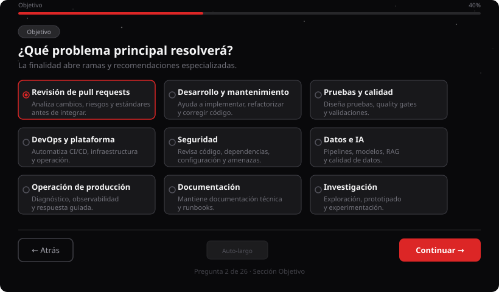
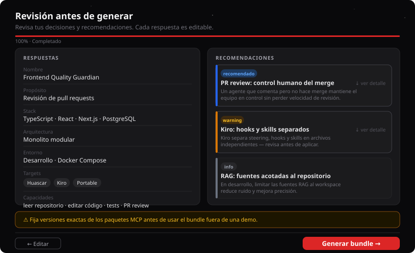

# Artemisa Agent Creator

Frontend Vite + React que renderiza el árbol de decisiones del Creator Backend v1.

> **Nota:** `agent-creator/` es la app legacy. El Creator activo está en `frontend/agents/new` (Next.js). Esta app se mantiene en el workspace pero no recibe nuevas features del Creator.

## Capturas

### 1. Árbol de decisiones — selección de propósito

El usuario elige el propósito del agente. Cada opción abre ramas específicas del árbol (26 preguntas en total, pero sólo se muestran las relevantes).



### 2. Revisión de recomendaciones

Antes de generar el bundle, el Creator muestra las respuestas acumuladas y las recomendaciones explicables (con motivo, beneficios, trade-offs y alternativas). Cada respuesta es editable.



### 3. Bundle generado

El bundle es un conjunto de artefactos deterministas con SHA-256 por archivo. Artemisa no escribe los archivos automáticamente — el usuario los revisa y los copia al proyecto destino.

## Funcionalidad

- Carga catálogo, workflow y tutorial desde `/api/v1/creator`.
- Presenta un tutorial ficticio y skippable.
- Renderiza preguntas de texto, booleanas, opciones y catálogo sin codificar el flujo en el cliente.

## Desarrollo

```bash
# Desde la raíz del repo
npm ci
npm run dev  # backend en :3001

# App legacy
npm --prefix agent-creator run dev  # frontend en :5173
```

La app activa del Creator (Next.js) corre en `http://localhost:3000/agents/new`.
