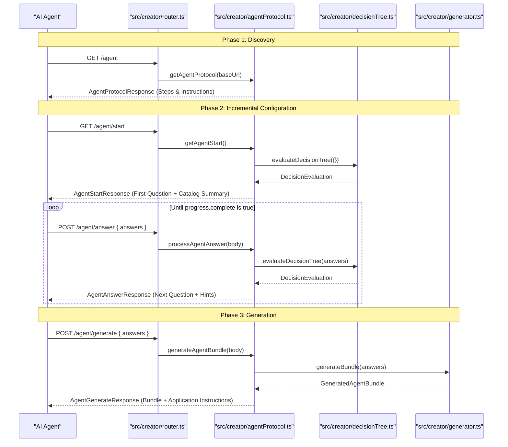
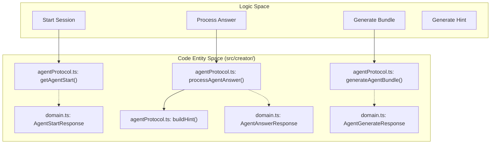

# Agent Protocol and Onboarding Flow

Relevant source files

The following files were used as context for generating this wiki page:

- [frontend/src/app/docs/page.tsx](frontend/src/app/docs/page.tsx)
- [frontend/src/app/sitemap.ts](frontend/src/app/sitemap.ts)
- [src/creator/agentProtocol.ts](src/creator/agentProtocol.ts)
- [src/creator/docs-catalog.ts](src/creator/docs-catalog.ts)
- [src/creator/domain.ts](src/creator/domain.ts)
- [src/creator/router.ts](src/creator/router.ts)
- [test/AgentProtocol.test.mjs](test/AgentProtocol.test.mjs)
- [test/api_test.mjs](test/api_test.mjs)
- [test/creator-testing-tools.test.mjs](test/creator-testing-tools.test.mjs)
- [test/creatorFixture.mjs](test/creatorFixture.mjs)

The **Agent Protocol** is a specialized machine-to-machine API layer designed to allow AI agents (such as Cursor, Windsurf, or custom LLM-based scripts) to self-configure and generate Artemisa bundles without human intervention in the UI [src/creator/agentProtocol.ts:101-106](<>). While the standard Creator UI is optimized for human decision-making, the Agent Protocol focuses on structured, incremental data exchange and provides "hints" to guide the AI's choices [src/creator/agentProtocol.ts:40-44](<>).

## Protocol Design and Goals

The protocol, identified as `artemisa-agent-onboarding` version `1.0.0` [src/creator/agentProtocol.ts:15-18](<>), implements a stateless, step-by-step onboarding flow. Unlike the standard `/evaluate` endpoint which returns the entire decision tree state, the agent endpoints provide simplified views tailored for LLM context windows [src/creator/domain.ts:226-259](<>).

### Key Differences from Standard Flow

| Feature             | Standard Creator Flow            | Agent Protocol Flow                   |
| :------------------ | :------------------------------- | :------------------------------------ |
| **Endpoint Path**   | `/api/v1/creator/evaluate`       | `/api/v1/creator/agent/*`             |
| **Target Audience** | Web Frontend (Next.js)           | AI Agents / LLMs                      |
| **Discovery**       | Hardcoded logic in UI            | `/agent` discovery endpoint           |
| **Context**         | Full `DecisionEvaluation` object | Simplified `AgentAnswerResponse`      |
| **Guidance**        | Visual recommendations           | Textual `hints` for LLM prompting     |
| **Completion**      | JSON download                    | `application_instructions` per target |

**Sources:** [src/creator/agentProtocol.ts:101-143](<>), [src/creator/domain.ts:226-259](<>).

## Technical Implementation

The protocol is implemented in `src/creator/agentProtocol.ts` and exposed via `src/creator/router.ts`. It utilizes the same underlying `evaluateDecisionTree` and `generateAgentBundle` logic used by the UI to ensure consistency [src/creator/agentProtocol.ts:11-13](<>).

### Sequence Diagram: Agent Self-Configuration

The following diagram illustrates the interaction between an external **AI Agent** and the **Artemisa Backend** entities.

"AI Agent Onboarding Sequence"

**Sources:** [src/creator/router.ts:193-228](<>), [src/creator/agentProtocol.ts:101-200](<>).

## API Endpoints and Data Structures

### 1. Discovery and Documentation

- **`GET /agent`**: Returns the protocol definition, available targets, and step-by-step instructions for the agent to follow [src/creator/agentProtocol.ts:101-143](<>).
- **`GET /startup`**: Provides a Markdown document (`text/markdown`) or JSON object containing a detailed onboarding guide for the agent [src/creator/agentProtocol.ts:202-233](<>).

### 2. The Onboarding Flow

The flow is driven by the `AgentAnswerResponse` structure, which simplifies the complex `DecisionEvaluation` into a format easy for an LLM to parse:

- **`first_question` / `next_question`**: Contains the `id`, `prompt`, `type`, and `options`. Crucially, it includes a `hint` field [src/creator/domain.ts:229-237](<>).
- **`hint` Generation**: The `buildHint` function dynamically generates advice based on the current `purpose` and existing `recommendations`. For example, if the purpose is `operations`, it suggests high-availability cloud providers [src/creator/agentProtocol.ts:40-83](<>).
- **`catalog_summary`**: Provided at start to give the agent a high-level view of available technologies (languages, frameworks, targets) before it begins answering [src/creator/agentProtocol.ts:156-164](<>).

### 3. Finalization and Instructions

When the agent calls `POST /agent/generate`, the response includes `application_instructions`. This is a map where each key is a selected target (e.g., `cursor`, `kiro`) and the value is a specific string instructing the agent on where to place the files [src/creator/agentProtocol.ts:17-25](<>).

**Sources:** [src/creator/domain.ts:204-259](<>), [src/creator/agentProtocol.ts:17-83](<>).

## Entity Mapping: Logic to Code

This diagram maps the logical steps of the protocol to the specific functions and types defined in the codebase.

"Agent Protocol Entity Mapping"

**Sources:** [src/creator/agentProtocol.ts:40-200](<>), [src/creator/domain.ts:226-260](<>).

## Integration Testing

The protocol is verified via integration tests in `test/api_test.mjs` and unit tests in `test/AgentProtocol.test.mjs`.

- **Flow Completion**: Tests verify that providing a full set of `developmentAnswers` results in `progress.complete === true` [test/api_test.mjs:86-93](<>).
- **Determinism**: The protocol ensures that the same set of answers always produces the exact same bundle and SHA-256 hashes [test/AgentProtocol.test.mjs:122-126](<>).
- **Error Handling**: If `generate` is called with incomplete answers, the protocol throws a `422 Unprocessable Entity` equivalent error [test/AgentProtocol.test.mjs:118-120](<>).

**Sources:** [test/api_test.mjs:71-148](<>), [test/AgentProtocol.test.mjs:14-156](<>).
