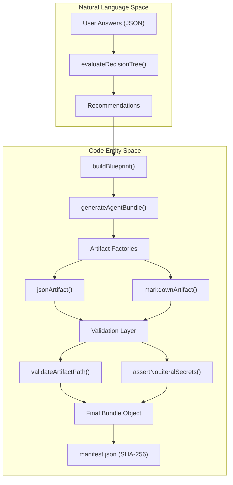
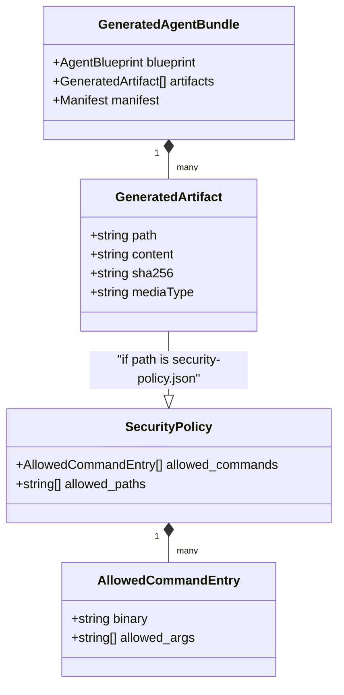

# Applying a Bundle

<details>
<summary>Relevant source files</summary>

The following files were used as context for generating this wiki page:

- [AGENTS.md](AGENTS.md)
- [docs/CONVENTIONS.md](docs/CONVENTIONS.md)
- [docs/apply-bundle.md](docs/apply-bundle.md)
- [docs/architecture.md](docs/architecture.md)
- [docs/deployment.md](docs/deployment.md)
- [docs/images/creator-flow.svg](docs/images/creator-flow.svg)
- [src/creator/generator.ts](src/creator/generator.ts)
- [test/CreatorGenerator.test.mjs](test/CreatorGenerator.test.mjs)
- [test/conventions.test.mjs](test/conventions.test.mjs)

</details>

The Artemisa Creator is a stateless generator that transforms a user's decision tree into a deterministic configuration bundle. Because Artemisa does not have a runtime engine (as per [docs/architecture.md:1-4](<>)), it does not write files directly to a target project. Instead, it provides a `GeneratedAgentBundle` containing the necessary artifacts to configure AI agents across various platforms.

## Understanding the Bundle Artifacts

Every generated bundle is composed of core metadata and target-specific files. The generation process ensures that all files are deterministic and validated for security [src/creator/generator.ts:128-140](<>).

### The Artifact Table

| Category          | File                     | Purpose                                                                                                       |
| :---------------- | :----------------------- | :------------------------------------------------------------------------------------------------------------ |
| **Metadata**      | `blueprint.json`         | The canonical model of all user decisions [src/creator/generator.ts:185-210](<>).                             |
| **Metadata**      | `manifest.json`          | Inventory of all files with SHA-256 hashes for integrity verification [src/creator/generator.ts:106-116](<>). |
| **Documentation** | `docs/INSTALL.md`        | Step-by-step installation and validation guide [docs/apply-bundle.md:15](<>).                                 |
| **Documentation** | `docs/WHY.md`            | Explains the rationale behind the chosen stack and architecture [docs/apply-bundle.md:16](<>).                |
| **Portable**      | `AGENTS.md`              | Universal entrypoint for AI agents (Cursor, Windsurf, etc.) [AGENTS.md:1-3](<>).                              |
| **Artemisa**      | `artemisa/steering.json` | Roles, system prompts, and tool permissions [docs/apply-bundle.md:24](<>).                                    |
| **Artemisa**      | `security-policy.json`   | Command and path allowlists [src/creator/generator.ts:15-19](<>).                                             |
| **Kiro**          | `.kiro/steering/*.md`    | Steering files specifically for the Kiro environment [test/CreatorGenerator.test.mjs:42](<>).                 |

### Data Flow: From Answers to Artifacts

The following diagram illustrates how the `generateAgentBundle` function processes `CreatorAnswers` to produce the final artifacts.

**Bundle Generation Flow**



Sources: [src/creator/generator.ts:97-127](<>), [src/creator/generator.ts:128-184](<>), [docs/architecture.md:135-145](<>)

## Verification and Integrity

Integrity is a first-class citizen in Artemisa. Every artifact includes a SHA-256 hash calculated at the moment of generation [src/creator/generator.ts:106](<>).

### SHA-256 Verification Process

The `manifest.json` serves as the source of truth for the bundle's state. To verify the integrity of a bundle after unzipping:

1.  **Extract the manifest**: Locate the `sha256` field for each file in the `files` array.
2.  **Run Comparison**: Use a utility like `sha256sum` to ensure the local file matches the generated hash.

```bash
# Verify all files in the bundle using jq and sha256sum
jq -r '.files[] | "\(.sha256)  \(.path)"' manifest.json | sha256sum -c -
```

Sources: [docs/apply-bundle.md:93-111](<>), [src/creator/generator.ts:37-39](<>)

## Applying Target-Specific Files

Artemisa supports multiple "Targets" which determine the directory structure and format of the generated rules.

### Target Mapping

| Target       | Primary Directory | Key Files                               |
| :----------- | :---------------- | :-------------------------------------- |
| **Portable** | Root              | `AGENTS.md`, `skills/`                  |
| **Kiro**     | `.kiro/`          | `steering/`, `hooks/`, `skills/`        |
| **Artemisa** | `artemisa/`       | `steering.json`, `security-policy.json` |
| **Cursor**   | `.cursor/`        | `.cursorrules`, `rules/*.mdc`           |

### Security Policy Enforcement

The `security-policy.json` contains an allowlist of binaries and arguments [src/creator/generator.ts:15-19](<>). It is the responsibility of the executing runtime (e.g., Kiro or a custom Artemisa-compatible runner) to enforce these rules.

**Security Policy Data Structure**



Sources: [src/creator/generator.ts:15-19](<>), [src/creator/domain.ts:1-8](<>), [docs/apply-bundle.md:128-152](<>)

## Custom Options Workflow

When a user selects a technology or tool not explicitly present in the `CreatorCatalog` (using the `custom:` prefix), the generator adopts a "documentation-first" approach.

1.  **Blueprint Storage**: The custom value is stored in `blueprint.json` under the relevant category [docs/apply-bundle.md:130-131](<>).
2.  **Warning Generation**: The bundle includes a warning about a "pending adapter" (adaptador pendiente) [docs/apply-bundle.md:133](<>).
3.  **Manual Implementation**: Users must manually add the specific tool commands to the `security-policy.json` and update the `steering.json` to include instructions for that tool [docs/apply-bundle.md:136-141](<>).

## Common Implementation Errors

- **Path Flattening**: Copying all files into a single folder. Files must maintain the relative structure defined in the `path` property of each artifact [docs/apply-bundle.md:160](<>).
- **Secret Injection**: Hardcoding API keys into the `objective` or `agent_persona` fields. The generator will throw a `CreatorInputError` if it detects patterns resembling secrets (e.g., `ghp_`, `sk-`) [src/creator/generator.ts:81-95](<>).
- **Ignoring INSTALL.md**: Failing to set the environment variables required by the generated `AGENTS.md` instructions [docs/apply-bundle.md:115-124](<>).

Sources: [src/creator/generator.ts:66-79](<>), [src/creator/generator.ts:81-95](<>), [docs/apply-bundle.md:156-163](<>)
