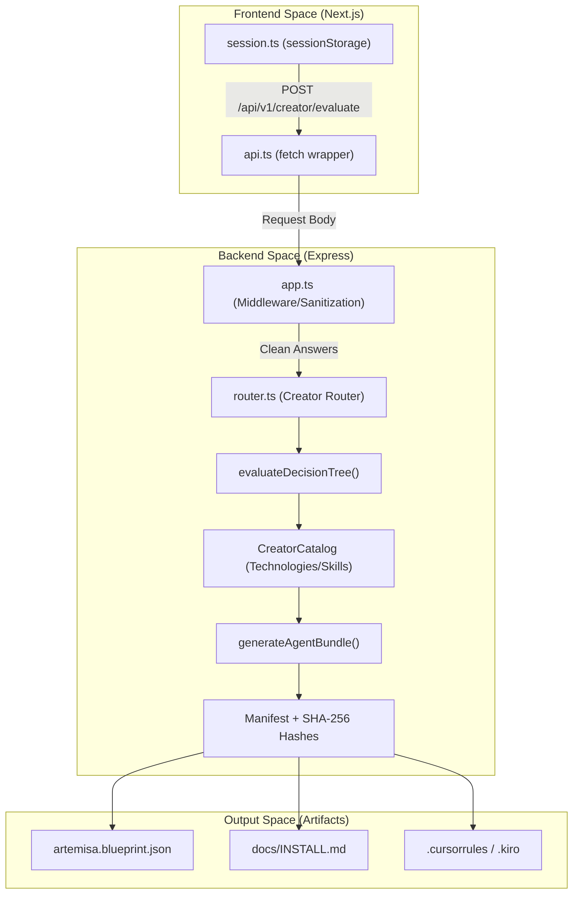

# Architectural Decision Records (ADRs)

<details>
<summary>Relevant source files</summary>

The following files were used as context for generating this wiki page:

- [.do/app.yaml](.do/app.yaml)
- [README.md](README.md)
- [docs/CONTRIBUTING.md](docs/CONTRIBUTING.md)
- [docs/adr/0007-npm-workspaces-for-shared-types-package.md](docs/adr/0007-npm-workspaces-for-shared-types-package.md)
- [docs/adr/0008-remove-runtime-generator-only.md](docs/adr/0008-remove-runtime-generator-only.md)
- [docs/architecture.md](docs/architecture.md)
- [docs/deployment.md](docs/deployment.md)
- [test/adr.test.mjs](test/adr.test.mjs)
- [test/deploy-security.test.mjs](test/deploy-security.test.mjs)

</details>

This page documents the critical architectural pivots and structural decisions that define Artemisa's current state. It focuses on the transition from a runtime-heavy engine to a stateless configuration generator and the adoption of a monorepo workspace model for type safety.

## Overview of Architectural Strategy

Artemisa's architecture is governed by the principle of **Stateless Determinism** [README.md:18-21](<>). Every decision made in the system is designed to be a pure function of its input, ensuring that the same user answers always result in identical configuration bundles with matching SHA-256 hashes [README.md:21-26](<>).

### ADR-0008: Removal of the Runtime Engine

The most significant architectural shift occurred in issue #584, where the project pivoted from an agent execution platform to a dedicated configuration generator [docs/adr/0008-remove-runtime-generator-only.md:1-2](<>).

**Rationale:**

- **Scope Focus:** The product's primary value was identified as turning a decision tree into a reproducible bundle [docs/adr/0008-remove-runtime-generator-only.md:9-10](<>).
- **Security Complexity:** Executing agents safely requires complex sandboxing, tool allowlists, and auditing which were out of scope for the project [docs/adr/0008-remove-runtime-generator-only.md:11-12](<>).
- **Operational Reduction:** Removing the runtime eliminated dependencies on SQLite, LLM SDKs, and persistent disk requirements [docs/adr/0008-remove-runtime-generator-only.md:12-13](<>).

**Consequences:**

- The backend no longer requires an `OPENAI_API_KEY` or database migrations [docs/deployment.md:110-111](<>).
- The system is now horizontally scalable as it maintains no server-side state [docs/adr/0008-remove-runtime-generator-only.md:27-28](<>).
- The "Runtime" routes now return 404, and the API surface is limited to the Creator and metadata endpoints [docs/adr/0008-remove-runtime-generator-only.md:32-33](<>).

**Sources:** [README.md:11-14](<>), [docs/adr/0008-remove-runtime-generator-only.md:1-42](<>), [docs/architecture.md:3-4](<>)

---

### ADR-0007: npm Workspaces and Shared Types

To manage the relationship between the Express backend and the Next.js/Vite frontends, the project adopted npm workspaces [docs/adr/0007-npm-workspaces-for-shared-types-package.md:1-2](<>).

**Implementation:**

- **Shared Package:** `@artemisa/types` (located in `packages/types`) serves as the single source of truth for domain interfaces like `CatalogItem`, `AgentBlueprint`, and `CreatorAnswers` [docs/adr/0007-npm-workspaces-for-shared-types-package.md:10-11](<>).
- **Unified Lockfile:** A single `package-lock.json` at the root governs all dependencies, preventing version drift across the stack [docs/adr/0007-npm-workspaces-for-shared-types-package.md:31-32](<>).

**Workflow Rules:**

1.  Dependencies must be installed from the root using `npm ci` [docs/adr/0007-npm-workspaces-for-shared-types-package.md:19-20](<>).
2.  Running `npm install` inside a sub-workspace (like `frontend/`) is prohibited to maintain lockfile integrity [docs/deployment.md:166-167](<>).

**Sources:** [docs/adr/0007-npm-workspaces-for-shared-types-package.md:1-40](<>), [docs/deployment.md:152-167](<>)

---

## Data Flow: From Decisions to Bundle

The following diagram illustrates how the architectural decision to remain stateless manifests in the data flow between code entities.

**Artemisa Creator Pipeline Flow**



**Sources:** [README.md:18-27](<>), [docs/architecture.md:25-50](<>), [docs/architecture.md:135-146](<>)

---

## System Structure and Enforcement

The architecture is enforced through automated tests that ensure ADR compliance, particularly regarding security and deployment configurations.

| Constraint           | Enforcement Mechanism                          | File Reference                                                       |
| :------------------- | :--------------------------------------------- | :------------------------------------------------------------------- |
| **No Persistence**   | Absence of `better-sqlite3` in `package.json`  | [docs/adr/0008-remove-runtime-generator-only.md:19-20](<>)           |
| **Fail-Closed Auth** | `AUTH_REQUIRED=true` check in deployment tests | [test/deploy-security.test.mjs:9-11](<>)                             |
| **ADR Structure**    | `adr.test.mjs` validates required sections     | [test/adr.test.mjs:7-14](<>)                                         |
| **Shared Types**     | `packages/types` workspace declaration         | [docs/adr/0007-npm-workspaces-for-shared-types-package.md:10-11](<>) |

### Code Entity Association

This diagram bridges the conceptual "Stateless Generator" to the specific files and classes that implement it.

**Architectural Mapping: Concept to Code**

```mermaid
classDiagram
    class "Stateless Generator" {
        <<Concept>>
        src/creator/generator.ts
        src/creator/decisionTree.ts
    }
    class "Security Boundary" {
        <<Middleware>>
        src/middleware/auth.ts
        src/app.ts (Helmet/CORS)
    }
    class "Shared Contracts" {
        <<Workspace>>
        packages/types/index.ts
    }
    class "Deployment Specs" {
        <<Infrastructure>>
        .do/app.yaml
        Dockerfile.backend
    }

    "Stateless Generator" ..> "Shared Contracts" : Uses interfaces
    "Security Boundary" ..> "Stateless Generator" : Protects /generate
    "Deployment Specs" ..> "Security Boundary" : Configures ARTEMISA_API_KEYS
```

**Sources:** [docs/architecture.md:58-90](<>), [docs/architecture.md:121-131](<>), [docs/adr/0007-npm-workspaces-for-shared-types-package.md:17-20](<>), [.do/app.yaml:15-29](<>)

---

## Preservation of Reference Material

While the runtime engine was removed in **ADR-0008**, its logic was preserved as static reference material to guide users in applying the generated bundles. This material is located in `docs/reference/` and includes:

- **Steering Roles:** Seven predefined AI personas [docs/architecture.md:15-16](<>).
- **Security Policy:** Example allowlists for agent execution [docs/architecture.md:131-132](<>).
- **Hooks Implementation:** Reference TypeScript code for integrating agents into workflows [docs/architecture.md:131-132](<>).

**Sources:** [README.md:113-121](<>), [docs/adr/0008-remove-runtime-generator-only.md:20-21](<>), [docs/architecture.md:131-132](<>)
