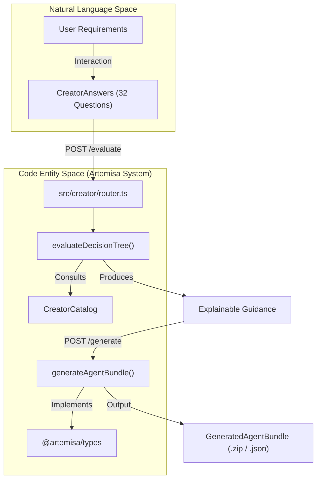
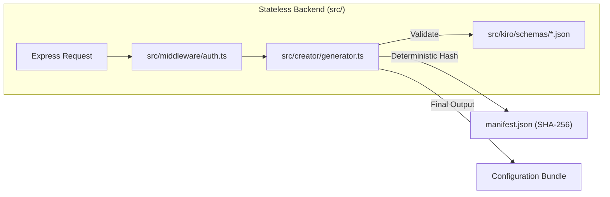

# Artemisa Overview

Relevant source files

The following files were used as context for generating this wiki page:

- [.do/app.yaml](.do/app.yaml)
- [AGENTS.en.md](AGENTS.en.md)
- [AGENTS.md](AGENTS.md)
- [CONTEXT.en.md](CONTEXT.en.md)
- [README.en.md](README.en.md)
- [README.md](README.md)
- [docs/CHANGELOG.md](docs/CHANGELOG.md)
- [docs/CONTRIBUTING.md](docs/CONTRIBUTING.md)
- [docs/CONVENTIONS.md](docs/CONVENTIONS.md)
- [docs/adr/0008-remove-runtime-generator-only.md](docs/adr/0008-remove-runtime-generator-only.md)
- [docs/apply-bundle.md](docs/apply-bundle.md)
- [docs/images/creator-flow.svg](docs/images/creator-flow.svg)
- [package-lock.json](package-lock.json)
- [package.json](package.json)
- [test/conventions.test.mjs](test/conventions.test.mjs)
- [test/deploy-security.test.mjs](test/deploy-security.test.mjs)

Artemisa is an open-source, **stateless and deterministic** configuration generator for AI development and operations agents [README.md:18-18](<>). It transforms architectural decisions into reproducible bundles of configuration files, enabling developers to self-configure agents like Cursor, Kiro, or Claude Code with evidence-based guidance.

The project originated as a full agentic platform but pivoted in **ADR-0008** to focus exclusively on configuration generation [docs/adr/0008-remove-runtime-generator-only.md:1-20](<>). It currently operates as a monorepo utilizing **npm workspaces** to manage a shared types package, a TypeScript/Express backend, and a Next.js frontend [package.json:10-14](<>).

### System Architecture

The following diagram illustrates how Artemisa bridges the "Natural Language Space" (user requirements) to the "Code Entity Space" (reproducible configuration bundles).

**Artemisa Conceptual Flow**

Sources: [README.md:20-27](<>), [src/creator/router.ts:38-38](<>), [docs/CONVENTIONS.md:24-24](<>), [package.json:10-14](<>)

---

### Monorepo Structure

Artemisa is organized as a monorepo to ensure type safety and consistent deployment across its components.

| Workspace        | Path             | Technology           | Role                                                               |
| :--------------- | :--------------- | :------------------- | :----------------------------------------------------------------- |
| **Backend**      | `src/`           | Node.js 22+, Express | Stateless generation engine [package.json:8-8](<>).                |
| **Frontend**     | `frontend/`      | Next.js 16           | Modern UI for the Creator and landing page [AGENTS.md:19-19](<>).  |
| **Shared Types** | `packages/types` | TypeScript           | Shared interfaces between all workspaces [package.json:11-11](<>). |
| **Legacy UI**    | `agent-creator/` | Vite + React         | Original Creator UI (Maintenance only) [AGENTS.md:20-20](<>).      |

Sources: [package.json:10-14](<>), [AGENTS.md:15-20](<>)

---

### Architectural Pivot: Generator-Only

Following **ADR-0008**, Artemisa removed its execution runtime (ReAct engine, LLM providers, and SQLite persistence) [docs/adr/0008-remove-runtime-generator-only.md:1-20](<>). This shift ensures that the backend remains pure and horizontally scalable.

**Stateless Generation Pipeline**

Sources: [README.md:29-31](<>), [docs/adr/0008-remove-runtime-generator-only.md:17-19](<>), [docs/CONVENTIONS.md:87-87](<>)

For a deep dive into the rationale behind these changes, see [Architectural Decision Records (ADRs)](#1.2).

---

### Core Workspaces

#### Backend (Core Engine)

The backend is a stateless Express application [README.md:37-41](<>). Its primary responsibility is running the `Creator` module, which includes:

- **Decision Tree**: Evaluates `CreatorAnswers` to determine the next question and final recommendations [README.md:20-23](<>).
- **Generator**: Produces the `GeneratedAgentBundle`, including `artemisa.blueprint.json` and target-specific files like `.cursorrules` or `AGENTS.md` [docs/apply-bundle.md:7-30](<>).
- **Security**: Implements a fail-closed authentication model in `src/middleware/auth.ts` [README.md:80-83](<>).

#### Frontend (Next.js Application)

Located in `frontend/`, this workspace provides the primary user interface [AGENTS.md:19-19](<>).

- **Landing Page**: High-performance landing page with glassmorphism design [docs/CHANGELOG.md:7-9](<>).
- **Creator UI**: A multi-mode flow (Auto-short, Auto-long, Presets, Advanced) that guides users through the decision tree [README.md:55-55](<>).
- **Internationalization**: Full support for Spanish and English [docs/CHANGELOG.md:41-45](<>).

#### Shared Types (@artemisa/types)

This package acts as the contract between the backend and frontend, defining critical structures like `AgentBlueprint` and `CatalogItem` [package.json:11-11](<>).

---

### Next Steps

- **[Getting Started](#1.1)**: Learn how to clone the repo, install dependencies via npm workspaces, and run the stack locally.
- **[Architectural Decision Records (ADRs)](#1.2)**: Review the history of the project, including the removal of the runtime and the implementation of shared types.
- **[Backend Core](#2)**: Explore the Express middleware, the decision tree evaluator, and the bundle generator.
- **[Frontend Application](#3)**: Details on the Next.js App Router, state management, and the i18n system.
- **[Infrastructure and Deployment](#6)**: Guide to Dockerization and deploying to DigitalOcean and Vercel.

Sources: [package.json:15-43](<>), [README.md:87-107](<>), [docs/CONTRIBUTING.md:51-65](<>)
