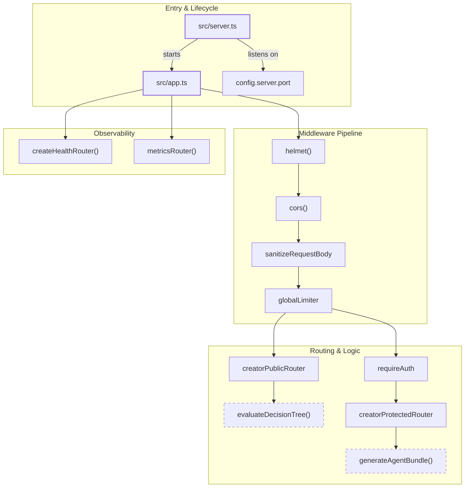
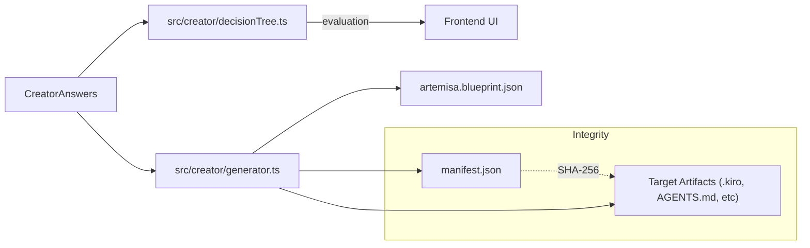

# Backend Core

Relevant source files

The following files were used as context for generating this wiki page:

- [.env.example](.env.example)
- [AGENTS.md](AGENTS.md)
- [CONTEXT.md](CONTEXT.md)
- [docs/CONVENTIONS.md](docs/CONVENTIONS.md)
- [docs/apply-bundle.md](docs/apply-bundle.md)
- [docs/images/creator-flow.svg](docs/images/creator-flow.svg)
- [src/app.ts](src/app.ts)
- [src/config.ts](src/config.ts)
- [src/routes/health.ts](src/routes/health.ts)
- [src/routes/metrics.ts](src/routes/metrics.ts)
- [src/routes/openapi.ts](src/routes/openapi.ts)
- [src/server.ts](src/server.ts)
- [test/conventions.test.mjs](test/conventions.test.mjs)
- [test/issue-267-deep-health.test.mjs](test/issue-267-deep-health.test.mjs)
- [test/openapi.test.mjs](test/openapi.test.mjs)

The Artemisa backend is a stateless, deterministic Express/TypeScript application focused exclusively on **agent configuration generation** [AGENTS.md:16-18](<>). Following the architectural pivot in ADR-0008, the backend no longer includes a runtime engine, database, or LLM integration [CONTEXT.md:8-11](<>). Instead, it operates as a pure function: it accepts user answers and returns a cryptographically signed bundle of configuration artifacts [CONTEXT.md:24](<>).

### System Architecture Overview

The backend is designed for high availability and security, utilizing a strict middleware pipeline and a decoupled "Creator" module that contains the core business logic.

#### Code Entity Mapping: Request Lifecycle

The following diagram maps the natural language request flow to specific code entities within the `src/` directory.

**Sources:** [src/server.ts:1-15](<>), [src/app.ts:20-138](<>), [src/config.ts:16-22](<>), [CONTEXT.md:58-68](<>)

---

### Core Components

#### 1. Server Entrypoint and Middleware

The application entrypoint is `src/server.ts`, which manages the process lifecycle and graceful shutdowns [src/server.ts:23-39](<>). The `src/app.ts` file configures the Express instance with a "security-first" pipeline, including:

- **Security Headers:** Powered by `helmet` and custom `cors` configurations [src/app.ts:25-74](<>).
- **Sanitization:** The `sanitizeRequestBody` middleware strips dangerous keys like `__proto__` to prevent prototype pollution [src/app.ts:77-78](<>).
- **Rate Limiting:** Separate tiers for global traffic (`RATE_LIMIT_GLOBAL`) and intensive Creator evaluations (`RATE_LIMIT_CREATOR`) [src/app.ts:84-104](<>).

For details, see [Server Entrypoint and Middleware](#2.1).

#### 2. Creator Pipeline

The `src/creator/` module is the heart of Artemisa. It implements a deterministic pipeline that transforms a `CreatorAnswers` object into a `GeneratedAgentBundle` [CONTEXT.md:24](<>).

- **Decision Tree:** Uses `evaluateDecisionTree()` to calculate the next required question and visible question set based on `visibleWhen` conditions [CONTEXT.md:27-28](<>).
- **Generator:** The `generateAgentBundle()` function produces artifacts (e.g., `steering.json`, `security-policy.json`) and calculates SHA-256 hashes for each to ensure integrity [CONTEXT.md:24](<>), [docs/apply-bundle.md:93-111](<>).

For details, see [Creator Pipeline](#2.2).

#### 3. Security and Authentication

Artemisa employs a "fail-closed" authentication model [CONTEXT.md:14](<>). In production, the server will refuse to start if `ARTEMISA_API_KEYS` are not configured [src/server.ts:9-11](<>).

- **Auth Methods:** Supports `Bearer` tokens and `X-API-Key` headers [CONTEXT.md:14](<>).
- **Protected Routes:** While catalog and workflow metadata are public, mutation endpoints like `/generate` require valid credentials [src/app.ts:127-133](<>).
- **Metrics Protection:** The `/api/metrics` endpoint is protected by a timing-safe comparison against `METRICS_SECRET` [src/routes/metrics.ts:60-74](<>).

For details, see [Security and Authentication](#2.3).

---

### Backend Configuration

The system is configured via environment variables, with `src/config.ts` acting as the central owner for server settings [src/config.ts:16-22](<>).

| Variable             | Description                                   | Default         |
| :------------------- | :-------------------------------------------- | :-------------- |
| `PORT`               | The port the Express server listens on        | `3001`          |
| `AUTH_REQUIRED`      | Toggle for API authentication                 | `false` (local) |
| `RATE_LIMIT_CREATOR` | Requests per minute for the creator endpoints | `120`           |
| `REQUEST_TIMEOUT_MS` | Max time allowed for a single request         | `120000`        |

**Sources:** [.env.example:1-48](<>), [src/config.ts:1-22](<>)

### Data Flow: Answers to Artifacts

This diagram illustrates how user input moves through the internal modules to produce the final bundle.

**Sources:** [src/creator/router.ts:65-68](<>), [docs/apply-bundle.md:7-30](<>), [CONTEXT.md:24](<>)
