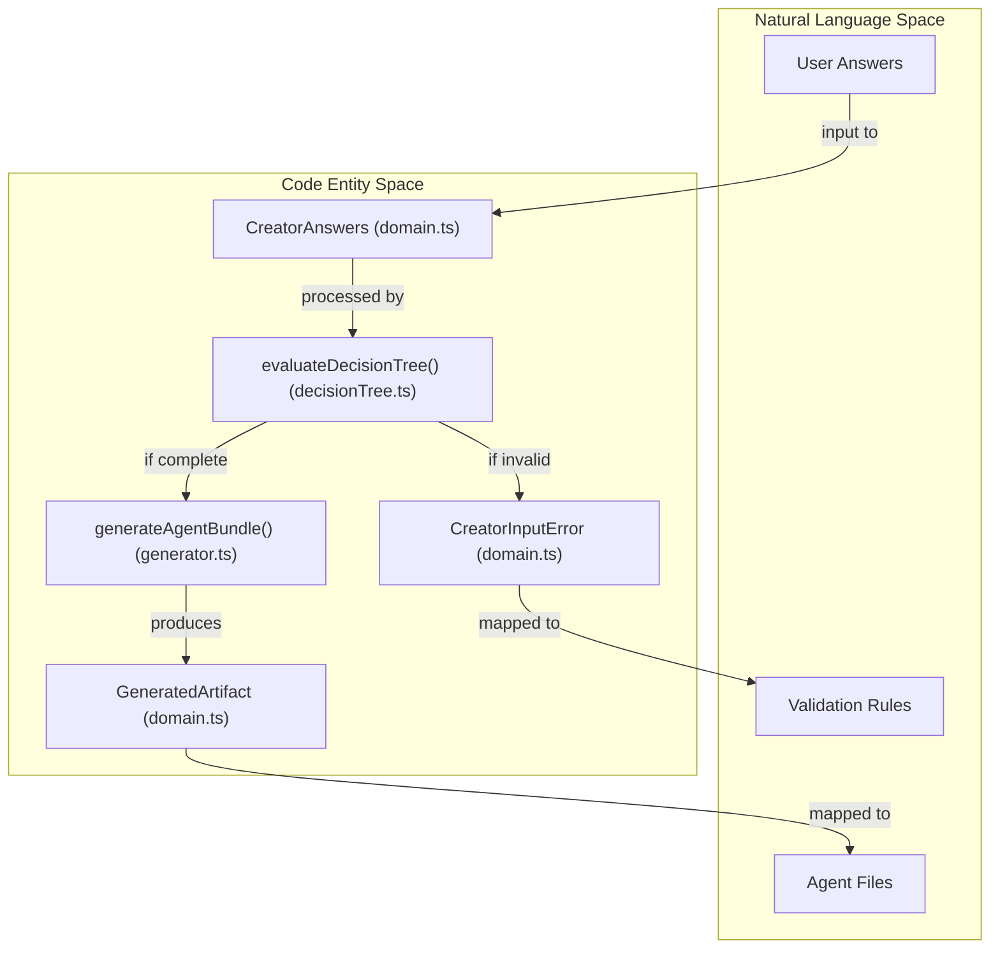
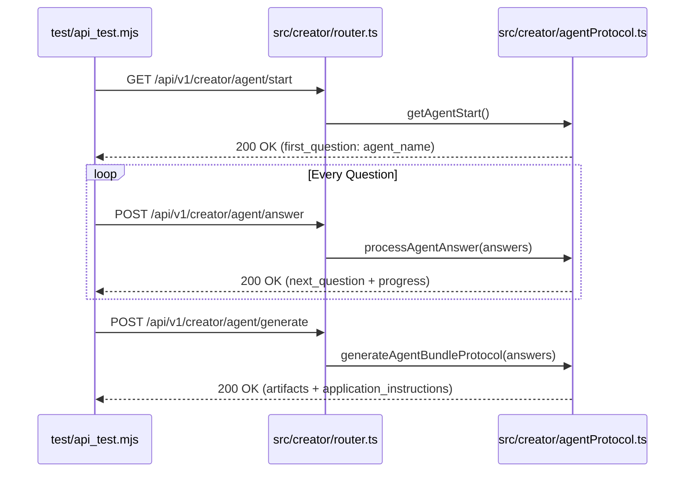

# Backend Tests

Relevant source files

The following files were used as context for generating this wiki page:

- [.devcontainer/devcontainer.json](.devcontainer/devcontainer.json)
- [packages/types/src/index.ts](packages/types/src/index.ts)
- [src/creator/domain.ts](src/creator/domain.ts)
- [src/creator/etag.ts](src/creator/etag.ts)
- [src/creator/router.ts](src/creator/router.ts)
- [src/kiro/schemas/mcps.schema.json](src/kiro/schemas/mcps.schema.json)
- [src/kiro/schemas/security-policy.schema.json](src/kiro/schemas/security-policy.schema.json)
- [src/kiro/schemas/steering.schema.json](src/kiro/schemas/steering.schema.json)
- [test/agents-doc.test.mjs](test/agents-doc.test.mjs)
- [test/api_test.mjs](test/api_test.mjs)
- [test/backend-hardening.test.mjs](test/backend-hardening.test.mjs)
- [test/contributing.test.mjs](test/contributing.test.mjs)
- [test/creator-caching.test.mjs](test/creator-caching.test.mjs)
- [test/creator-critical-fixes.test.mjs](test/creator-critical-fixes.test.mjs)
- [test/creator-purpose-recommendations.test.mjs](test/creator-purpose-recommendations.test.mjs)
- [test/creator-testing-tools.test.mjs](test/creator-testing-tools.test.mjs)
- [test/creatorFixture.mjs](test/creatorFixture.mjs)
- [test/e2e-agent-creation.test.mjs](test/e2e-agent-creation.test.mjs)
- [test/generated-artifacts-schema.test.mjs](test/generated-artifacts-schema.test.mjs)
- [test/issue-256-docker-nonroot.test.mjs](test/issue-256-docker-nonroot.test.mjs)
- [test/kiro-schema.test.mjs](test/kiro-schema.test.mjs)
- [test/metrics-auth.test.mjs](test/metrics-auth.test.mjs)
- [test/rate-limiting.test.mjs](test/rate-limiting.test.mjs)
- [test/test-utils.mjs](test/test-utils.mjs)

The Artemisa backend testing suite ensures the reliability of the stateless generator, the integrity of the security middleware, and the correctness of the agent protocol. Tests are located in the `test/` directory and primarily use the Node.js native test runner.

## Test Suite Architecture

The testing strategy is divided into four distinct layers: unit tests for domain logic, security hardening tests, integration contract tests, and invariant tests for documentation and project structure.

### 1. Creator Domain and Generator Tests

These tests validate the `evaluateDecisionTree()` and `generateAgentBundle()` functions. They ensure that user answers correctly traverse the decision tree and produce valid, deterministic artifacts.

- **Decision Tree Evaluation**: Tests in `test/e2e-agent-creation.test.mjs` simulate a full user journey (e.g., "TypeScript Security Reviewer") to verify that `visibleWhen` conditions correctly branch the flow [test/e2e-agent-creation.test.mjs:7-113](<>).
- **Artifact Generation**: Validates that `generateAgentBundle()` produces the required file set (e.g., `.cursorrules`, `AGENTS.md`, `.kiro/steering/`) based on the `agent_targets` selected in the answers [test/e2e-agent-creation.test.mjs:115-142](<>).
- **Schema Validation**: Ensures generated JSON artifacts for Kiro (steering, security policy, MCPs) conform to their respective JSON schemas [test/kiro-schema.test.mjs:1-20](<>).

### 2. Security and Hardening Tests

Security tests focus on the middleware pipeline and environmental configurations to prevent common vulnerabilities and misconfigurations.

| Test File                                | Focus Area        | Key Validations                                                                                                                                                                           |
| :--------------------------------------- | :---------------- | :---------------------------------------------------------------------------------------------------------------------------------------------------------------------------------------- |
| `test/rate-limiting.test.mjs`            | Rate Limiting     | Verifies default limits (`RATE_LIMIT_GLOBAL=100`, `RATE_LIMIT_CREATOR=120`) and IP-based key generation [test/rate-limiting.test.mjs:16-47](<>).                                          |
| `test/backend-hardening.test.mjs`        | Request Integrity | Rejects non-JSON POST requests, redacts sensitive tokens (e.g., `sk-`, `ghp_`) from logs, and warns about empty `BYPASS_SECRET` in production [test/backend-hardening.test.mjs:5-50](<>). |
| `test/metrics-auth.test.mjs`             | Auth/Metrics      | Validates that `/api/metrics` requires `METRICS_SECRET` and that output is sanitized to prevent path leakage [test/metrics-auth.test.mjs:5-50](<>).                                       |
| `test/issue-256-docker-nonroot.test.mjs` | Infrastructure    | Ensures Dockerfiles use `USER` directives and `caddy` for static serving to maintain a non-root security posture [test/issue-256-docker-nonroot.test.mjs:6-36](<>).                       |

**Sources:** [test/rate-limiting.test.mjs:1-48](<>), [test/backend-hardening.test.mjs:1-51](<>), [test/metrics-auth.test.mjs:1-51](<>), [test/issue-256-docker-nonroot.test.mjs:1-37](<>)

### 3. API Contract Tests (`api_test.mjs`)

This suite performs black-box integration testing by spawning a live server instance and executing HTTP requests against the `creatorPublicRouter` and `creatorProtectedRouter` [src/creator/router.ts:26-27](<>).

**Implementation Flow:**
The test script `test/api_test.mjs` automates the following sequence:

1.  **Spawn Server**: Starts `src/server.ts` on port 3002 with `AUTH_REQUIRED=false` [test/api_test.mjs:27-35](<>).
2.  **Health Check**: Polls `/api/health` until the server is ready [test/api_test.mjs:39-45](<>).
3.  **Endpoint Verification**:
    - Verifies GET endpoints for `/catalog`, `/workflow`, `/skills`, and `/mcps` [test/api_test.mjs:51-55](<>).
    - Tests `POST /evaluate` for version mismatch handling (409 Conflict) [test/api_test.mjs:59](<>).
    - Tests the **Agent Protocol** flow: `/agent/start` → `/agent/answer` → `/agent/generate` [test/api_test.mjs:72-103](<>).
4.  **Legacy Cleanup**: Confirms that removed runtime routes (e.g., `/api/agent/execute`) return 404 [test/api_test.mjs:64-69](<>).

**Sources:** [test/api_test.mjs:1-158](<>), [src/creator/router.ts:1-192](<>)

### 4. Invariant and Structure Tests

These tests ensure the repository maintains its documented conventions.

- **AGENTS.md Integrity**: Verifies that the generated `AGENTS.md` contains mandatory sections like "Identity", "Capabilities", and "Rules of Engagement" [test/agents-doc.test.mjs:1-20](<>).
- **Shared Types**: Validates that the `@artemisa/types` package correctly exports the interfaces used by both backend and frontend [packages/types/src/index.ts:1-221](<>).

## Data Flow: From Answer to Artifact

The following diagram associates natural language concepts (e.g., "Answering questions") with the specific code entities that process them during a test run.

**Diagram: Creator Evaluation Data Flow**

**Sources:** [src/creator/domain.ts:3-173](<>), [src/creator/decisionTree.ts:5](<>), [src/creator/generator.ts:6](<>)

## Testing the Agent Protocol

The Agent Protocol is a machine-friendly API designed for AI agents to configure themselves. The `api_test.mjs` file contains a specific "Full Flow" test to ensure this multi-step process remains deterministic.

**Diagram: Agent Protocol Test Sequence**

**Sources:** [test/api_test.mjs:124-148](<>), [src/creator/router.ts:194-200](<>), [src/creator/agentProtocol.ts:11-17](<>)

## Running Tests

Tests are executed using the following commands:

- **Unit & Hardening Tests**: `node --test test/*.test.mjs`
- **API Integration Tests**: `node test/api_test.mjs`
- **All Backend Tests**: `npm test` (from the backend workspace)

**Fixture Data**: Most tests utilize `test/creatorFixture.mjs`, which provides standardized answer sets for `developmentAnswers` (frontend-focused) and `productionAnswers` (operations-focused) [test/creatorFixture.mjs:1-61](<>).
