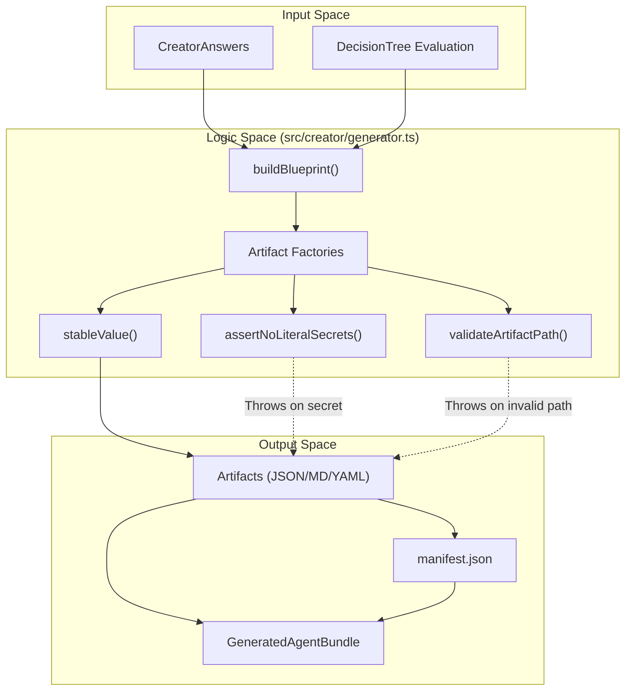
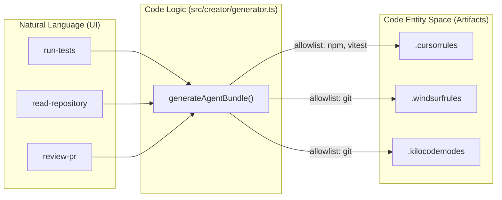

# Bundle Generator and Artifact System

<details>
<summary>Relevant source files</summary>

The following files were used as context for generating this wiki page:

- [AGENTS.md](AGENTS.md)
- [docker/Dockerfile.frontend](docker/Dockerfile.frontend)
- [docs/CONVENTIONS.md](docs/CONVENTIONS.md)
- [docs/apply-bundle.md](docs/apply-bundle.md)
- [docs/images/creator-flow.svg](docs/images/creator-flow.svg)
- [e2e/README.md](e2e/README.md)
- [frontend/README.md](frontend/README.md)
- [packages/types/README.md](packages/types/README.md)
- [src/creator/generator.ts](src/creator/generator.ts)
- [src/kiro/schemas/mcps.schema.json](src/kiro/schemas/mcps.schema.json)
- [src/kiro/schemas/rag.schema.json](src/kiro/schemas/rag.schema.json)
- [src/kiro/schemas/security-policy.schema.json](src/kiro/schemas/security-policy.schema.json)
- [src/kiro/schemas/steering.schema.json](src/kiro/schemas/steering.schema.json)
- [test/CreatorGenerator.test.mjs](test/CreatorGenerator.test.mjs)
- [test/conventions.test.mjs](test/conventions.test.mjs)
- [test/generated-artifacts-schema.test.mjs](test/generated-artifacts-schema.test.mjs)
- [test/kiro-schema.test.mjs](test/kiro-schema.test.mjs)

</details>

The Bundle Generator is the terminal stage of the Artemisa Creator pipeline. It transforms a validated set of user answers and the resulting decision tree evaluation into a deterministic, machine-readable package of configuration files, instructions, and security policies.

## Core Generation Logic

The entrypoint for the generation process is `generateAgentBundle()`, which coordinates the transformation of raw answers into a `GeneratedAgentBundle` object [src/creator/generator.ts:3-12](<>). This process is entirely stateless and deterministic; providing the same input answers always results in identical artifact hashes [test/CreatorGenerator.test.mjs:53-57](<>).

### Blueprint Construction

The first step is `buildBlueprint()`, which maps `CreatorAnswers` to a canonical `AgentBlueprint` [src/creator/generator.ts:128](<>).

- **Validation**: It verifies that the decision tree evaluation is complete and free of issues before proceeding [src/creator/generator.ts:129-140](<>).
- **Normalization**: Names are converted into URL-friendly slugs via `slugify()` [src/creator/generator.ts:41-50](<>).
- **Resolution**: It resolves selected technologies, skills, and MCPs by querying their respective catalogs using IDs provided in the answers [src/creator/generator.ts:160-183](<>).

### Artifact Factories

Artifacts are generated using specialized factory functions that ensure consistency in formatting and metadata:

- **`makeArtifact()`**: The base constructor that performs path validation and secret detection before calculating a SHA-256 hash of the content [src/creator/generator.ts:97-107](<>).
- **`jsonArtifact()`**: Generates JSON files. It uses `stableValue()` to recursively sort object keys alphabetically, ensuring that the resulting JSON string (and its hash) is independent of key insertion order [src/creator/generator.ts:109-116](<>), [src/creator/generator.ts:21-31](<>).
- **`markdownArtifact()`**: Produces normalized Markdown files with trimmed content and a trailing newline [src/creator/generator.ts:118-126](<>).

### Data Flow: Answers to Artifacts

The following diagram illustrates how user-provided data flows through the generator components to produce the final bundle.

**Generator Component Interaction**



Sources: [src/creator/generator.ts:21-35](<>), [src/creator/generator.ts:81-126](<>), [src/creator/generator.ts:128-185](<>)

---

## Target-Specific Generation

Artemisa supports multiple agentic environments by generating specialized rule files and configuration formats [test/CreatorGenerator.test.mjs:26-51](<>).

| Target         | Artifacts Generated                         | Description                                                                                                 |
| :------------- | :------------------------------------------ | :---------------------------------------------------------------------------------------------------------- |
| **Cursor**     | `.cursorrules`, `.cursor/rules/*.mdc`       | System prompts and tool allowlists for Cursor IDE [test/CreatorGenerator.test.mjs:13-16](<>).               |
| **Kiro**       | `.kiro/steering/*.md`, `.kiro/hooks/*.json` | AWS Kiro-specific steering and quality hooks [test/CreatorGenerator.test.mjs:42-43](<>).                    |
| **CodeRabbit** | `.coderabbit.yaml`                          | PR review instructions and language settings [test/generated-artifacts-schema.test.mjs:50-57](<>).          |
| **Kilo Code**  | `.kilocode/rules/*.md`, `.kilocodemodes`    | Mode definitions and command allowlists for Kilo Code [test/generated-artifacts-schema.test.mjs:59-71](<>). |
| **Universal**  | `AGENTS.md`                                 | Markdown-based directives compatible with most LLM agents [AGENTS.md:1-3](<>).                              |

### Mapping Code Entities to Agent Targets

The generator maps high-level "capabilities" selected in the UI to specific binary allowlists in the target configuration files [test/generated-artifacts-schema.test.mjs:73-82](<>).

**Capability to Binary Mapping**



Sources: [test/generated-artifacts-schema.test.mjs:73-91](<>), [src/creator/generator.ts:148-151](<>)

---

## Security Policy Engine

Artemisa enforces security at generation time through three primary mechanisms: path validation, secret detection, and a formal security policy schema.

### 1. Path Validation

The `validateArtifactPath()` function prevents path traversal attacks by rejecting any artifact path that is absolute, uses backslashes, or contains `..` segments [src/creator/generator.ts:66-79](<>).

### 2. Secret Detection

`assertNoLiteralSecrets()` scans all generated content for common patterns of sensitive data, such as GitHub Personal Access Tokens (`ghp_`), OpenAI keys (`sk-`), and AWS Access Keys. If a secret is detected, generation is aborted with a `422 Unprocessable Entity` error [src/creator/generator.ts:81-95](<>), [test/CreatorGenerator.test.mjs:88-94](<>).

### 3. Security Policy Artifact

For supported targets, Artemisa generates a `security-policy.json` file following a strict JSON schema [src/kiro/schemas/security-policy.schema.json:1-46](<>).

- **Mode**: Defaults to `allowlist` [src/kiro/schemas/security-policy.schema.json:15](<>).
- **Allowed Commands**: Maps binaries to specific permitted arguments [src/kiro/schemas/security-policy.schema.json:27-31](<>).
- **Filesystem**: Defines `default_filesystem_mode` (e.g., `read-only` vs `read-write`) based on the agent's purpose [src/kiro/schemas/security-policy.schema.json:44](<>).

---

## Manifest and Integrity

Every bundle includes a `manifest.json` which serves as the source of truth for the package contents [docs/apply-bundle.md:9-14](<>).

### Manifest Structure

The manifest includes:

- **Metadata**: Agent name and version [test/generated-artifacts-schema.test.mjs:32-33](<>).
- **Targets**: A list of the environments the bundle was generated for [test/generated-artifacts-schema.test.mjs:34](<>).
- **File Inventory**: An array of file objects, each containing the relative `path`, the artifact `kind` (e.g., `configuration`, `instruction`), and a `sha256` hash [test/generated-artifacts-schema.test.mjs:36-40](<>).

### Integrity Verification

Users are encouraged to verify the integrity of the files after deployment using the manifest hashes.

```bash
# Verify all files using the manifest
jq -r '.files[] | "\(.sha256)  \(.path)"' manifest.json | sha256sum -c -
```

Sources: [docs/apply-bundle.md:104-109](<>), [test/generated-artifacts-schema.test.mjs:31-40](<>)

---

## Implementation Details

### Key Classes and Functions

- **`generateAgentBundle(answers)`**: The primary exported function. It returns a `GeneratedAgentBundle` containing the blueprint, manifest, application guide, and all artifacts [src/creator/generator.ts:3-12](<>).
- **`CreatorInputError`**: Custom error class thrown when validation fails (e.g., incomplete answers or security violations) [src/creator/generator.ts:73-77](<>), [src/creator/generator.ts:139](<>).
- **`slugify(name)`**: Normalizes strings by removing diacritics, lowercasing, and replacing non-alphanumeric characters with dashes, truncated to 64 characters [src/creator/generator.ts:41-50](<>).

### Sources:

- [src/creator/generator.ts:1-200](<>)
- [src/kiro/schemas/security-policy.schema.json:1-46](<>)
- [test/CreatorGenerator.test.mjs:1-175](<>)
- [test/generated-artifacts-schema.test.mjs:1-92](<>)
- [docs/apply-bundle.md:1-165](<>)
- [AGENTS.md:1-30](<>)
