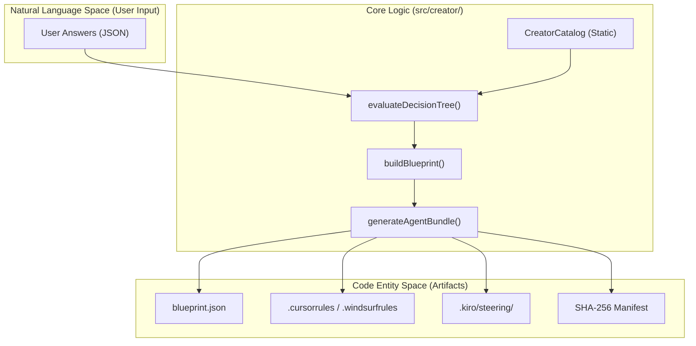
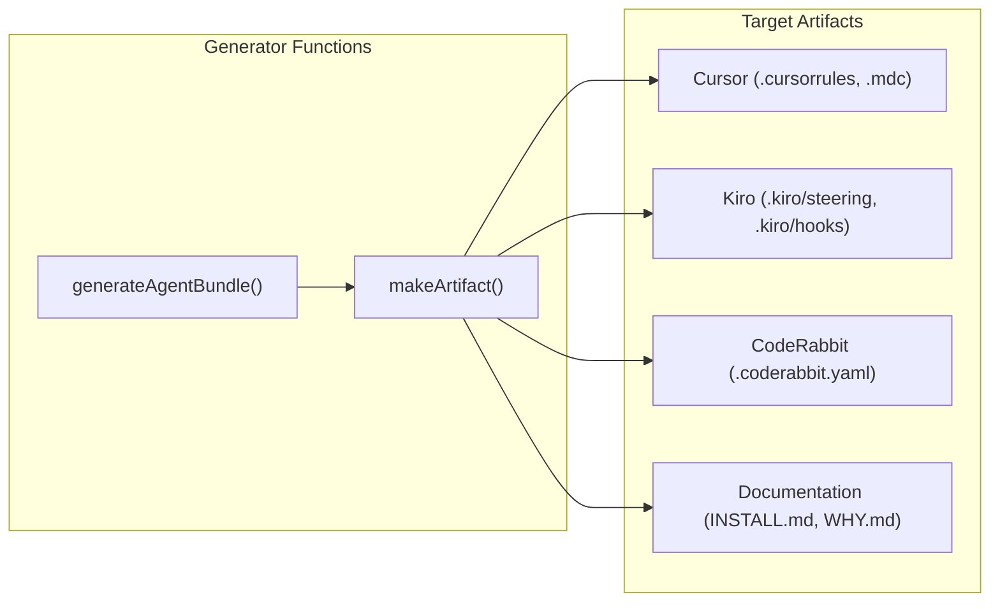

# Creator Pipeline

Relevant source files

The following files were used as context for generating this wiki page:

- [frontend/src/app/docs/page.tsx](frontend/src/app/docs/page.tsx)
- [frontend/src/app/sitemap.ts](frontend/src/app/sitemap.ts)
- [frontend/src/features/creator/components/mcp-browser.tsx](frontend/src/features/creator/components/mcp-browser.tsx)
- [frontend/src/features/creator/components/skills-browser.tsx](frontend/src/features/creator/components/skills-browser.tsx)
- [src/creator/agentProtocol.ts](src/creator/agentProtocol.ts)
- [src/creator/catalog.ts](src/creator/catalog.ts)
- [src/creator/decisionTree.ts](src/creator/decisionTree.ts)
- [src/creator/docs-catalog.ts](src/creator/docs-catalog.ts)
- [src/creator/domain.ts](src/creator/domain.ts)
- [src/creator/generator.ts](src/creator/generator.ts)
- [src/creator/mcpCatalog.ts](src/creator/mcpCatalog.ts)
- [src/creator/modelsCatalog.ts](src/creator/modelsCatalog.ts)
- [src/creator/router.ts](src/creator/router.ts)
- [src/creator/skillsCatalog.ts](src/creator/skillsCatalog.ts)
- [test/CreatorGenerator.test.mjs](test/CreatorGenerator.test.mjs)
- [test/api_test.mjs](test/api_test.mjs)
- [test/creator-testing-tools.test.mjs](test/creator-testing-tools.test.mjs)
- [test/creatorFixture.mjs](test/creatorFixture.mjs)
- [test/skillsAndMcpCatalog.test.mjs](test/skillsAndMcpCatalog.test.mjs)

The `src/creator/` module is the core engine of Artemisa, responsible for transforming natural language requirements into deterministic, secure, and multi-target agent configurations. It follows a stateless design where the backend acts as a pure function: `(Answers, Catalog) -> Bundle`.

## Pipeline Overview

The pipeline operates in three distinct phases: **Discovery**, **Evaluation**, and **Generation**. This flow ensures that the final agent bundle is consistent, valid, and cryptographically signed.

### Data Flow: From Answers to Artifacts

The following diagram illustrates how user input moves through the system's core functions to bridge the gap between "Natural Language Space" and "Code Entity Space."

**Sources:** [src/creator/router.ts:163-191](<>), [src/creator/generator.ts:128-140](<>)

---

## 1. Decision Tree and Catalog

The **Discovery** and **Evaluation** phases rely on a structured decision tree and a curated set of catalogs. The system uses `evaluateDecisionTree()` to process `CreatorAnswers` [src/creator/domain.ts:3-3](<>), determining which questions are relevant based on `visibleWhen` conditions [src/creator/domain.ts:32-51](<>).

- **Static Catalogs:** To maintain a stateless architecture, Artemisa uses versioned snapshots of technologies, skills, and MCP servers [src/creator/catalog.ts:5-7](<>).
- **Skills & MCPs:** Curated lists from sources like `awesome-skills` and `mcpservers.org` provide the building blocks for agent capabilities [src/creator/skillsCatalog.ts:4-12](<>), [src/creator/mcpCatalog.ts:4-9](<>).
- **Recommendations:** As users answer questions, the engine generates evidence-based guidance, warnings, and tradeoffs [src/creator/domain.ts:53-62](<>).

For details, see [Decision Tree and Catalog](#2.2.1).

**Sources:** [src/creator/decisionTree.ts:24-51](<>), [src/creator/catalog.ts:153-170](<>), [src/creator/skillsCatalog.ts:28-65](<>)

---

## 2. Bundle Generator and Artifact System

Once the decision tree is complete, the **Generation** phase takes over. The `generateAgentBundle()` function [src/creator/generator.ts:233-233](<>) orchestrates the creation of a `GeneratedAgentBundle` [src/creator/domain.ts:175-191](<>).

- **Blueprint Construction:** The `buildBlueprint()` function maps raw answers to a structured `AgentBlueprint` [src/creator/generator.ts:128-185](<>).
- **Artifact Factories:** Specialized helpers like `jsonArtifact()` and `markdownArtifact()` ensure that all files (e.g., `.cursorrules`, `AGENTS.md`) are generated with correct media types and normalized content [src/creator/generator.ts:109-126](<>).
- **Security & Integrity:** The generator includes a path validation engine to prevent directory traversal and a secret detection scanner to block literal API keys [src/creator/generator.ts:66-95](<>). Every artifact is hashed using SHA-256 for integrity verification [src/creator/generator.ts:37-39](<>).

### Artifact Generation Mapping

This diagram maps internal generator functions to the specific files they produce.

For details, see [Bundle Generator and Artifact System](#2.2.2).

**Sources:** [src/creator/generator.ts:233-280](<>), [test/CreatorGenerator.test.mjs:26-51](<>)

---

## 3. Agent Protocol and Onboarding Flow

Artemisa includes a machine-friendly **Agent Protocol** [src/creator/agentProtocol.ts](<>) designed for AI-driven self-configuration. This allows an external AI agent to "onboard" itself by interacting with the Creator API.

- **Discovery:** The `/agent` endpoint returns the `AgentProtocolResponse`, describing the steps required for configuration [src/creator/domain.ts:212-224](<>).
- **Step-by-Step Flow:** Using `/agent/start` and `/agent/answer`, an agent can programmatically navigate the decision tree [src/creator/router.ts:194-205](<>).
- **Self-Generation:** The flow culminates in `/agent/generate`, which provides the agent with its own configuration bundle and application instructions [src/creator/domain.ts:257-259](<>).

For details, see [Agent Protocol and Onboarding Flow](#2.2.3).

**Sources:** [src/creator/router.ts:193-210](<>), [test/api_test.mjs:71-104](<>)
