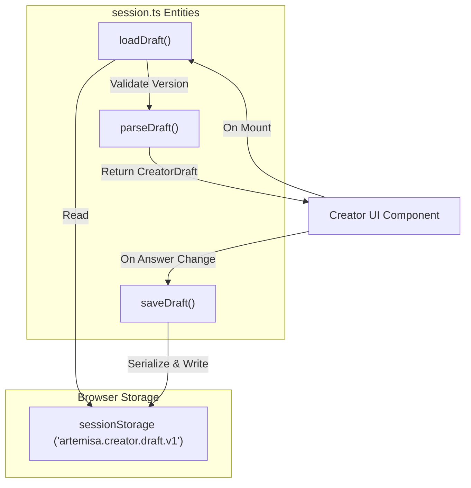
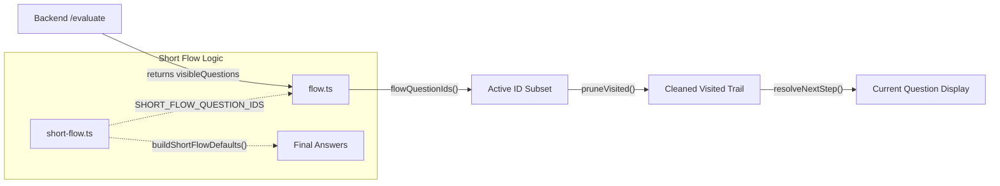

# Creator State Management and Session

Relevant source files

The following files were used as context for generating this wiki page:

- [frontend/src/features/creator/components/review-screen.test.tsx](frontend/src/features/creator/components/review-screen.test.tsx)
- [frontend/src/features/creator/lib/answer-labels.ts](frontend/src/features/creator/lib/answer-labels.ts)
- [frontend/src/features/creator/lib/flow.ts](frontend/src/features/creator/lib/flow.ts)
- [frontend/src/features/creator/lib/session.ts](frontend/src/features/creator/lib/session.ts)
- [frontend/src/features/creator/lib/tech-icons.tsx](frontend/src/features/creator/lib/tech-icons.tsx)
- [frontend/src/features/creator/presets/presets.ts](frontend/src/features/creator/presets/presets.ts)
- [frontend/src/features/creator/presets/short-flow.ts](frontend/src/features/creator/presets/short-flow.ts)
- [test/creator-presets.test.mjs](test/creator-presets.test.mjs)

The Artemisa Creator frontend is designed to manage complex, branching state while communicating with a **stateless backend**. Because the backend does not persist user sessions, the client is responsible for maintaining the draft, calculating navigation logic, and translating internal identifiers into human-readable labels.

## Persistence and Session Management

Client-side state is persisted using `sessionStorage`, ensuring that user progress survives page reloads within the same tab without requiring a backend database or user accounts [frontend/src/features/creator/lib/session.ts:6-11](<>).

### The CreatorDraft Model

The state is encapsulated in the `CreatorDraft` interface, which includes the workflow version to prevent replaying obsolete answers against a modified backend decision tree [frontend/src/features/creator/lib/session.ts:22-30](<>).

| Property            | Description                                                                                                                             |
| :------------------ | :-------------------------------------------------------------------------------------------------------------------------------------- |
| `workflowVersion`   | Matches the backend `WORKFLOW_VERSION` to ensure compatibility [frontend/src/features/creator/lib/session.ts:39-39](<>).                |
| `mode`              | The selected flow: `auto-corto`, `auto-largo`, `presets`, or `avanzado` [frontend/src/features/creator/lib/session.ts:20-20](<>).       |
| `answers`           | A `CreatorAnswers` object containing all key-value pairs provided by the user [frontend/src/features/creator/lib/session.ts:25-25](<>). |
| `visited`           | A trail of question IDs the user has already seen and answered [frontend/src/features/creator/lib/session.ts:26-26](<>).                |
| `currentQuestionId` | The ID of the question currently being displayed [frontend/src/features/creator/lib/session.ts:27-27](<>).                              |

### Logic Flow: Persistence

The following diagram illustrates how the `session.ts` module bridges the gap between the browser's storage and the application's runtime state.

**Draft Persistence Flow**

Sources: [frontend/src/features/creator/lib/session.ts:18-18](<>), [frontend/src/features/creator/lib/session.ts:63-73](<>), [frontend/src/features/creator/lib/session.ts:75-82](<>)

## Flow Navigation Logic

The frontend implements guided navigation modes (`auto-corto` and `auto-largo`) by wrapping the backend's `DecisionEvaluation` result. While the backend identifies the "first unanswered required question," the frontend manages the "visited" history to allow users to go backward and forward [frontend/src/features/creator/lib/flow.ts:7-23](<>).

### Navigation Modes

1.  **Auto-largo (Full Flow):** Walks through every visible question in the backend's declaration order, including optional ones [frontend/src/features/creator/lib/flow.ts:30-30](<>).
2.  **Auto-corto (Short Flow):** Focuses on a curated subset of ~8 key questions defined in `SHORT_FLOW_QUESTION_IDS` [frontend/src/features/creator/presets/short-flow.ts:11-20](<>).
3.  **Presets:** Pre-fills the `answers` object with a complete, valid configuration from `CREATOR_PRESETS` [frontend/src/features/creator/presets/presets.ts:23-23](<>).

### Key Functions

- `pruneVisited(visited, flowIds)`: Removes IDs that are no longer visible due to branching changes (e.g., changing a technology might hide a specific framework question) [frontend/src/features/creator/lib/flow.ts:39-42](<>).
- `resolveNextStep(...)`: Determines if the flow should show a new question, is blocked by a required answer, or is exhausted (finished) [frontend/src/features/creator/lib/flow.ts:104-126](<>).
- `resolvePreviousStep(...)`: Pops the last ID from the visited trail to navigate backward [frontend/src/features/creator/lib/flow.ts:133-141](<>).

**Navigation and Branching State**

Sources: [frontend/src/features/creator/lib/flow.ts:28-32](<>), [frontend/src/features/creator/lib/flow.ts:39-42](<>), [frontend/src/features/creator/lib/flow.ts:104-126](<>), [frontend/src/features/creator/presets/short-flow.ts:31-31](<>)

## Answer Labels and Formatting

To provide a user-friendly review screen, the frontend must resolve internal IDs (e.g., `typescript`) back to human-readable labels (e.g., `TypeScript`). This is handled by `answer-labels.ts`, which uses the `Catalog` and `Workflow` metadata provided by the backend [frontend/src/features/creator/lib/answer-labels.ts:5-11](<>).

### Resolution Strategy

1.  **Boolean:** Maps `true/false` to "Sí/No" [frontend/src/features/creator/lib/answer-labels.ts:150-150](<>).
2.  **Select/Multiselect:** Looks up the ID in the question's `options` array [frontend/src/features/creator/lib/answer-labels.ts:125-126](<>).
3.  **Catalog Items:** Resolves IDs against the global `Catalog` [frontend/src/features/creator/lib/answer-labels.ts:130-131](<>).
4.  **Custom Values:** Handles IDs prefixed with `custom:` by humanizing the slug (e.g., `custom:my-tool` becomes "Personalizado: My tool") [frontend/src/features/creator/lib/answer-labels.ts:121-123](<>).

### Grouping and Icons

Answers are grouped by their `section` (defined in the `Workflow`) for the `ReviewScreen` [frontend/src/features/creator/lib/answer-labels.ts:193-202](<>). Additionally, `tech-icons.tsx` provides a mapping from catalog IDs to `react-icons` (Simple Icons and Lucide) to render brand logos next to technology choices [frontend/src/features/creator/lib/tech-icons.tsx:8-12](<>).

Sources: [frontend/src/features/creator/lib/answer-labels.ts:70-88](<>), [frontend/src/features/creator/lib/answer-labels.ts:138-166](<>), [frontend/src/features/creator/lib/tech-icons.tsx:254-339](<>)

## Presets and Contract Testing

Presets are plain data objects containing complete `CreatorAnswers`. They are used to jumpstart the configuration process [frontend/src/features/creator/presets/presets.ts:16-22](<>).

### Validation

Because presets are hardcoded in the frontend but validated by the backend, a contract test (`test/creator-presets.test.mjs`) ensures that:

- Every preset is complete and valid for the current `WORKFLOW_VERSION` [test/creator-presets.test.mjs:99-115](<>).
- All keys in a preset correspond to real question IDs in the backend `decisionTree.ts` [test/creator-presets.test.mjs:118-127](<>).
- Auto-corto defaults correctly complete the tree for any environment selection [test/creator-presets.test.mjs:173-175](<>).

Sources: [frontend/src/features/creator/presets/presets.ts:23-54](<>), [test/creator-presets.test.mjs:12-20](<>)
