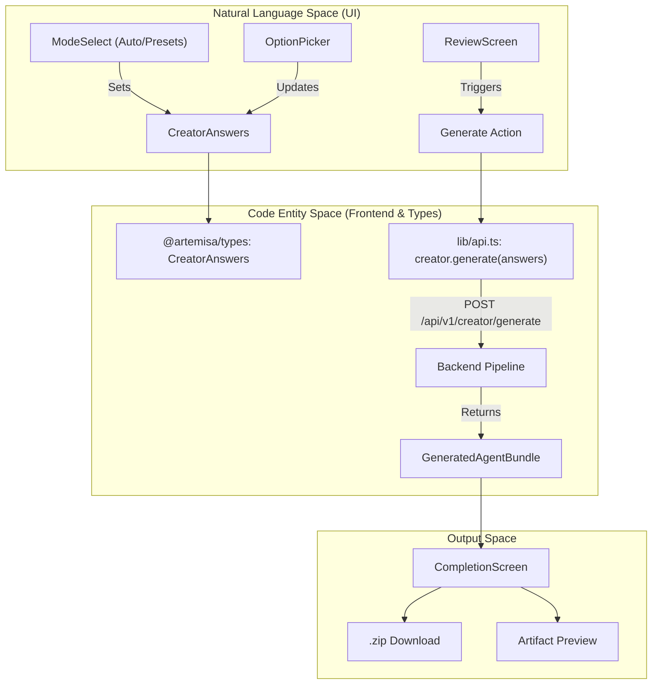
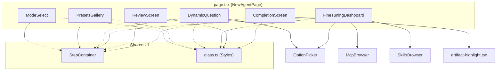

# Creator UI

Relevant source files

The following files were used as context for generating this wiki page:

- [frontend/src/app/agents/new/page.tsx](frontend/src/app/agents/new/page.tsx)
- [frontend/src/components/ui/**tests**/quick-start-copy.test.tsx](frontend/src/components/ui/__tests__/quick-start-copy.test.tsx)
- [frontend/src/components/ui/glass-icon-button.tsx](frontend/src/components/ui/glass-icon-button.tsx)
- [frontend/src/components/ui/quick-start-copy.tsx](frontend/src/components/ui/quick-start-copy.tsx)
- [frontend/src/features/creator/components/completion-screen.tsx](frontend/src/features/creator/components/completion-screen.tsx)
- [frontend/src/features/creator/components/creator-states.tsx](frontend/src/features/creator/components/creator-states.tsx)
- [frontend/src/features/creator/components/dynamic-question.tsx](frontend/src/features/creator/components/dynamic-question.tsx)
- [frontend/src/features/creator/components/fine-tuning-dashboard.test.tsx](frontend/src/features/creator/components/fine-tuning-dashboard.test.tsx)
- [frontend/src/features/creator/components/fine-tuning-dashboard.tsx](frontend/src/features/creator/components/fine-tuning-dashboard.tsx)
- [frontend/src/features/creator/components/mode-select.tsx](frontend/src/features/creator/components/mode-select.tsx)
- [frontend/src/features/creator/components/option-picker.tsx](frontend/src/features/creator/components/option-picker.tsx)
- [frontend/src/features/creator/components/presets-gallery.tsx](frontend/src/features/creator/components/presets-gallery.tsx)
- [frontend/src/features/creator/components/review-screen.tsx](frontend/src/features/creator/components/review-screen.tsx)
- [frontend/src/features/creator/components/step-container.tsx](frontend/src/features/creator/components/step-container.tsx)
- [frontend/src/features/creator/components/switch.tsx](frontend/src/features/creator/components/switch.tsx)
- [frontend/src/features/creator/lib/artifact-highlight.test.tsx](frontend/src/features/creator/lib/artifact-highlight.test.tsx)
- [frontend/src/features/creator/lib/artifact-highlight.tsx](frontend/src/features/creator/lib/artifact-highlight.tsx)
- [frontend/src/features/landing/components/content-sections.test.tsx](frontend/src/features/landing/components/content-sections.test.tsx)
- [frontend/src/lib/glass.ts](frontend/src/lib/glass.ts)

The **Creator UI** is the central wizard of the Artemisa frontend, located at `/agents/new`. It provides a multi-modal interface for configuring AI agents, ranging from quick one-click setups to dense, professional-grade fine-tuning. The UI is designed to be a thin, reactive layer over the stateless [Creator Pipeline](#2.2), ensuring that all recommendations and validations are driven by the backend's deterministic logic.

## High-Level Architecture

The Creator is implemented as a single-page wizard within the Next.js App Router [frontend/src/app/agents/new/page.tsx:135-135](<>). It manages a complex internal state machine that transitions between mode selection, question flows, and the final artifact delivery.

### Visual System: Liquid Glass

The interface utilizes the **Liquid Glass** design system, defined in `frontend/src/lib/glass.ts`. This system uses backdrop blurs, subtle transparency, and accent-colored glows to maintain legibility over the animated `SpaceSimulation` background [frontend/src/lib/glass.ts:21-27](<>).

- **`glassPanel` / `glassCard`**: Standard containers for wizard steps [frontend/src/lib/glass.ts:30-49](<>).
- **`glassPrimaryButton`**: Used for the main "Generate" or "Continue" actions [frontend/src/lib/glass.ts:97-110](<>).
- **`glassOptionCard`**: Used for selectable grid items (technologies, models) [frontend/src/lib/glass.ts:129-135](<>).

## Entry Modes

Users can choose from four distinct paths to initialize their agent configuration:

| Mode           | Component             | Purpose                                                                                                                                    |
| :------------- | :-------------------- | :----------------------------------------------------------------------------------------------------------------------------------------- |
| **Auto-corto** | `ModeSelect`          | A minimal 3-step flow for rapid prototyping.                                                                                               |
| **Auto-largo** | `ModeSelect`          | The standard 32-question guided experience.                                                                                                |
| **Presets**    | `PresetsGallery`      | Pre-configured templates (e.g., "PR Reviewer", "Security Audit") [frontend/src/features/creator/components/presets-gallery.tsx:73-74](<>). |
| **Avanzado**   | `FineTuningDashboard` | A single-page, dense dashboard for power users [frontend/src/features/creator/components/fine-tuning-dashboard.tsx:165-174](<>).           |

For details on how these modes affect navigation and state, see [Creator State Management and Session](#3.2.1).

Sources: [frontend/src/features/creator/components/mode-select.tsx:34-45](<>), [frontend/src/features/creator/components/presets-gallery.tsx:20-20](<>)

## Question Flow and Interaction

The guided flows (`auto-corto`, `auto-largo`) utilize the `DynamicQuestion` component to render questions defined by the backend `Workflow`.

### Step-by-Step Flow

1.  **Question Rendering**: `DynamicQuestion` uses `OptionPicker` for selection-based questions [frontend/src/features/creator/components/option-picker.tsx:51-65](<>).
2.  **Navigation**: The `StepContainer` provides a unified shell with a progress bar and smooth panel transitions [frontend/src/features/creator/components/step-container.tsx:31-43](<>).
3.  **Validation**: Every answer change triggers a background call to the backend `/evaluate` endpoint via the [Frontend API Client](#3.2.2) to fetch real-time recommendations and warnings.

### Fine-Tuning Dashboard

The **Advanced Mode** bypasses the step-by-step wizard in favor of the `FineTuningDashboard`. This component groups the entire `Workflow` into logical sections (Identity, Project, DevOps, etc.) [frontend/src/features/creator/components/fine-tuning-dashboard.tsx:49-93](<>). It implements `conditionMatches` to mirror the backend's branching logic, ensuring that dependent questions are only shown when their prerequisites are met [frontend/src/features/creator/components/fine-tuning-dashboard.tsx:111-126](<>).

Sources: [frontend/src/app/agents/new/page.tsx:86-92](<>), [frontend/src/features/creator/components/fine-tuning-dashboard.tsx:206-215](<>)

## Review and Generation

Before final bundle generation, the user is presented with the `ReviewScreen`. This screen serves two primary purposes:

1.  **Decision Audit**: Displays all selected answers grouped by section, allowing users to jump back and edit specific values [frontend/src/features/creator/components/review-screen.tsx:166-185](<>).
2.  **Explicable Recommendations**: Displays `CreatorRecommendation` objects from the backend, including evidence, benefits, and trade-offs for the suggested configuration [frontend/src/features/creator/components/review-screen.tsx:156-164](<>).

### The Generation Bridge

The following diagram illustrates how user interactions in the UI map to the internal data structures and API calls that result in a generated agent.

**UI to Code Entity Mapping**

Sources: [frontend/src/app/agents/new/page.tsx:265-275](<>), [frontend/src/features/creator/components/review-screen.tsx:55-66](<>)

## Completion and Artifact Delivery

The `CompletionScreen` is the final stage of the Creator UI. It handles the presentation and distribution of the `GeneratedAgentBundle` [frontend/src/features/creator/components/completion-screen.tsx:96-106](<>).

- **Artifact Browsing**: Users can preview generated files (e.g., `.cursorrules`, `steering.json`) with syntax highlighting [frontend/src/features/creator/components/completion-screen.tsx:179-195](<>).
- **Platform Filtering**: Artifacts are grouped by target platform (Cursor, Kiro, CodeRabbit, etc.) to help users identify which files apply to their environment [frontend/src/features/creator/components/completion-screen.tsx:120-132](<>).
- **Download Options**:
  - **Single File**: Download individual artifacts.
  - **Full Bundle (ZIP)**: Generates a client-side ZIP containing all artifacts, the manifest, and the blueprint using `jszip` [frontend/src/features/creator/components/completion-screen.tsx:70-84](<>).
- **Application Guide**: Displays the `applicationGuide` (INSTALL.md) which provides instructions on how to manually apply the generated configuration [frontend/src/features/creator/components/completion-screen.tsx:87-95](<>).

**Component Hierarchy Diagram**

Sources: [frontend/src/app/agents/new/page.tsx:18-29](<>), [frontend/src/features/creator/components/completion-screen.tsx:33-43](<>), [frontend/src/features/creator/components/fine-tuning-dashboard.tsx:31-33](<>)
