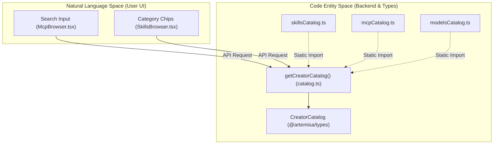
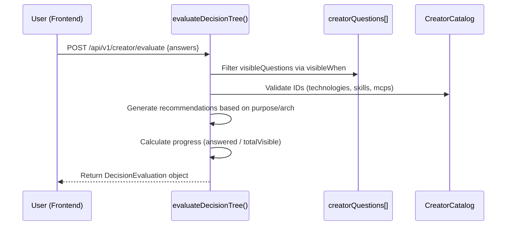

# Decision Tree and Catalog

Relevant source files

The following files were used as context for generating this wiki page:

- [frontend/src/features/creator/components/mcp-browser.tsx](frontend/src/features/creator/components/mcp-browser.tsx)
- [frontend/src/features/creator/components/skills-browser.tsx](frontend/src/features/creator/components/skills-browser.tsx)
- [src/creator/catalog.ts](src/creator/catalog.ts)
- [src/creator/decisionTree.ts](src/creator/decisionTree.ts)
- [src/creator/mcpCatalog.ts](src/creator/mcpCatalog.ts)
- [src/creator/modelsCatalog.ts](src/creator/modelsCatalog.ts)
- [src/creator/skillsCatalog.ts](src/creator/skillsCatalog.ts)
- [test/CreatorDecisionTree.test.mjs](test/CreatorDecisionTree.test.mjs)
- [test/creator-purpose-recommendations.test.mjs](test/creator-purpose-recommendations.test.mjs)
- [test/creator-skills-mcps-consumption.test.mjs](test/creator-skills-mcps-consumption.test.mjs)
- [test/skillsAndMcpCatalog.test.mjs](test/skillsAndMcpCatalog.test.mjs)

The Decision Tree and Catalog form the logical core of the Artemisa Creator. This system provides a deterministic, stateless mechanism to guide users through agent configuration, validate inputs against a curated tech stack, and generate evidence-based architectural recommendations.

## 1. The Decision Tree System

The decision tree is implemented in `src/creator/decisionTree.ts`. It manages the flow of questions, branching logic, and the generation of recommendations based on user answers.

### 1.1 `evaluateDecisionTree()`

This is the primary engine of the Creator. It is a stateless function that takes a `CreatorAnswers` object and returns a `DecisionEvaluation`.

- **Statelessness**: The function does not rely on a database or session. It recalculates the entire state (progress, visible questions, issues) on every call [src/creator/decisionTree.ts:18-23](<>).
- **Branching Logic**: Visibility is controlled by `visibleWhen` conditions on each question. The evaluator prunes answers from branches that are no longer visible to ensure data integrity [test/CreatorDecisionTree.test.mjs:65-79](<>).
- **Validation**: It checks for required fields, catalog existence for selected IDs, and slug format for `custom:<slug>` entries [test/CreatorDecisionTree.test.mjs:51-63](<>).

### 1.2 Branching and Visibility

Questions are defined with conditional logic using operators like `oneOf`. For example, questions about deployment targets only appear if the environment is set to `production` or `both`.

| Operator | Role                                             | Example Usage                                                                                    |
| :------- | :----------------------------------------------- | :----------------------------------------------------------------------------------------------- |
| `oneOf`  | Shows question if the target answer is in a list | `visibleWhen: { operator: 'oneOf', questionId: 'environment', values: ['development', 'both'] }` |

**Sources:** [src/creator/decisionTree.ts:24-153](<>), [test/CreatorDecisionTree.test.mjs:24-33](<>)

## 2. The Creator Catalog

The Catalog provides a structured list of supported entities. It is split into specialized modules to maintain low infrastructure load and high performance without external network calls.

### 2.1 Catalog Components

- **Technologies & Architecture (`catalog.ts`)**: Contains languages, frameworks, databases, and architectural patterns (e.g., Microservices, Monolith) [src/creator/catalog.ts:7-137](<>).
- **Skills (`skillsCatalog.ts`)**: A curated snapshot of agent behaviors (e.g., "Code Review", "Issue Triage") sourced from `awesome-skills` [src/creator/skillsCatalog.ts:1-24](<>).
- **MCP Servers (`mcpCatalog.ts`)**: A directory of Model Context Protocol servers (e.g., GitHub MCP, Slack MCP) curated from `mcpservers.org` [src/creator/mcpCatalog.ts:1-36](<>).
- **Models (`modelsCatalog.ts`)**: LLM metadata including context windows, providers, and tiers (Frontier, Mid, Efficient) [src/creator/modelsCatalog.ts:11-25](<>).

### 2.2 Catalog Data Flow

The following diagram illustrates how catalog data is consumed by the system.

**Catalog Entity Mapping**

**Sources:** [src/creator/catalog.ts:1-5](<>), [frontend/src/features/creator/components/mcp-browser.tsx:27-42](<>), [frontend/src/features/creator/components/skills-browser.tsx:30-45](<>)

## 3. Recommendation Engine

The recommendation engine generates `CreatorRecommendation` objects. Unlike simple suggestions, these are "evidence-based," providing a reason, benefits, tradeoffs, and alternatives.

### 3.1 Recommendation Logic

Recommendations are triggered by specific combinations of answers. For example:

- **Purpose-driven**: Selecting `research` triggers recommendations for `research-reproducibility` [test/creator-purpose-recommendations.test.mjs:13-20](<>).
- **Environment-driven**: Selecting `production` triggers `production-guardrails` [test/CreatorDecisionTree.test.mjs:35-41](<>).

### 3.2 Evaluation Sequence

The system processes answers in a deterministic pipeline to ensure that recommendations are always consistent for the same input.

**Decision Evaluation Pipeline**

**Sources:** [src/creator/decisionTree.ts:18-23](<>), [test/CreatorDecisionTree.test.mjs:87-92](<>), [test/creator-purpose-recommendations.test.mjs:7-10](<>)

## 4. Implementation Details

### 4.1 Key Functions and Interfaces

| Symbol                  | File                          | Role                                                              |
| :---------------------- | :---------------------------- | :---------------------------------------------------------------- |
| `evaluateDecisionTree`  | `src/creator/decisionTree.ts` | Main logic for processing answers and generating recommendations. |
| `getWorkflowDefinition` | `src/creator/decisionTree.ts` | Exports the full list of questions and metadata for the frontend. |
| `CreatorAnswers`        | `@artemisa/types`             | The interface defining the schema for user inputs.                |
| `CatalogItem`           | `@artemisa/types`             | Shared structure for technologies, architectures, and providers.  |

### 4.2 Data Persistence in Bundle

When a user finishes the decision tree and triggers generation, the selected items from the catalog are persisted into the `AgentBlueprint`:

- **Skills**: Explicitly selected skills from `skillsCatalog.ts` are embedded as `SKILL.md` artifacts [test/creator-skills-mcps-consumption.test.mjs:7-17](<>).
- **MCPs**: Selected MCP servers are written to a `mcp.json` manifest [test/creator-skills-mcps-consumption.test.mjs:38-49](<>).

**Sources:** [src/creator/decisionTree.ts:1-12](<>), [src/creator/catalog.ts:139-151](<>), [test/creator-skills-mcps-consumption.test.mjs:51-57](<>)
