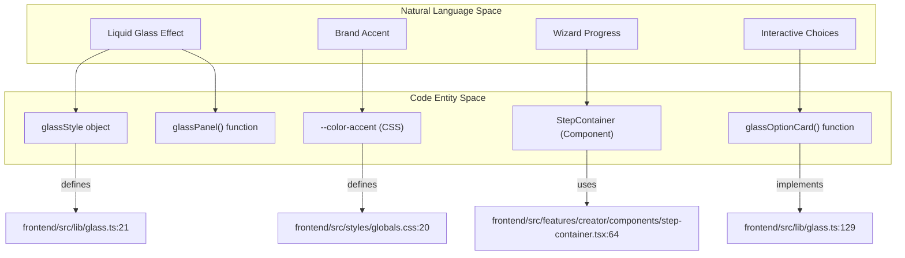
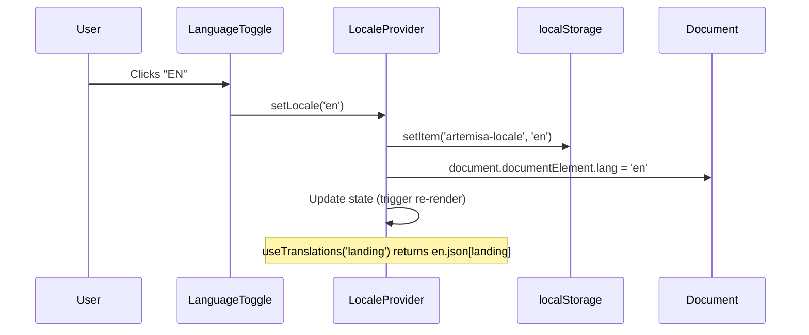

# Design System and Internationalization

Relevant source files

The following files were used as context for generating this wiki page:

- [frontend/src/app/desarrolladores/page.tsx](frontend/src/app/desarrolladores/page.tsx)
- [frontend/src/app/layout.tsx](frontend/src/app/layout.tsx)
- [frontend/src/app/page.tsx](frontend/src/app/page.tsx)
- [frontend/src/features/creator/components/step-container.tsx](frontend/src/features/creator/components/step-container.tsx)
- [frontend/src/features/landing/components/animation-toggle.tsx](frontend/src/features/landing/components/animation-toggle.tsx)
- [frontend/src/features/landing/components/content-sections.tsx](frontend/src/features/landing/components/content-sections.tsx)
- [frontend/src/features/landing/components/language-toggle.tsx](frontend/src/features/landing/components/language-toggle.tsx)
- [frontend/src/features/landing/components/sticky-nav.tsx](frontend/src/features/landing/components/sticky-nav.tsx)
- [frontend/src/i18n/index.test.ts](frontend/src/i18n/index.test.ts)
- [frontend/src/i18n/index.test.tsx](frontend/src/i18n/index.test.tsx)
- [frontend/src/i18n/index.tsx](frontend/src/i18n/index.tsx)
- [frontend/src/i18n/messages/en.json](frontend/src/i18n/messages/en.json)
- [frontend/src/i18n/messages/es.json](frontend/src/i18n/messages/es.json)
- [frontend/src/lib/glass.ts](frontend/src/lib/glass.ts)
- [frontend/src/styles/globals.css](frontend/src/styles/globals.css)
- [frontend/src/test/utils.tsx](frontend/src/test/utils.tsx)

This section covers the visual and linguistic foundations of the Artemisa frontend. The system is built on a "Liquid Glass" aesthetic designed to remain legible over dynamic backgrounds, paired with a deterministic internationalization (i18n) layer that supports Spanish and English.

## Design System: Liquid Glass

Artemisa utilizes a custom glassmorphism utility library defined in `frontend/src/lib/glass.ts`. This system ensures a consistent look across the landing page and the Creator wizard by using light blurs, near-transparent backgrounds, and subtle borders [frontend/src/lib/glass.ts:1-15](<>).

### Global Design Tokens

The visual language is governed by CSS variables defined in the Tailwind `@theme` block. Color is reserved for semantic meaning rather than decoration [frontend/src/styles/globals.css:4-16](<>).

| Token            | Value     | Purpose                                                                                   |
| :--------------- | :-------- | :---------------------------------------------------------------------------------------- |
| `--color-accent` | `#8b5cf6` | Brand accent: selection, progress, primary CTAs [frontend/src/styles/globals.css:20](<>). |
| `--color-warn`   | `#fbbf24` | Backend warnings and blocked interactions [frontend/src/styles/globals.css:26](<>).       |
| `--color-danger` | `#fb7185` | Request/validation failures [frontend/src/styles/globals.css:27](<>).                     |

### Glass UI Utilities

The system provides functional CSS wrappers via the `cn()` utility to apply standardized glass styles [frontend/src/lib/glass.ts:18-38](<>).

- **`glassPanel(className)`**: Base effect for large containers, featuring `backdrop-blur-[6px]` and `bg-white/[0.012]` [frontend/src/lib/glass.ts:30-38](<>).
- **`glassCard(className)`**: Identical to `glassPanel`, used for discrete content units like tech-stack items [frontend/src/lib/glass.ts:41-49](<>).
- **`glassButton(className)`**: Creates a pill-shaped glass button with `rounded-full` and hover transitions [frontend/src/lib/glass.ts:77-90](<>).
- **`glassPrimaryButton(className)`**: Uses `bg-accent-deep/25` and `border-accent/50` to highlight the primary action without breaking the glass aesthetic [frontend/src/lib/glass.ts:97-110](<>).
- **`glassOptionCard(selected, blocked)`**: Specialized utility for the Creator wizard. It modifies borders and opacity based on selection or blocked states [frontend/src/lib/glass.ts:129-135](<>).

### Visual Entities and Code Mapping

Design System to Implementation Mapping:

**Sources:** [frontend/src/lib/glass.ts:21-135](<>), [frontend/src/styles/globals.css:20-27](<>), [frontend/src/features/creator/components/step-container.tsx:64-68](<>)

## Internationalization (i18n)

Artemisa uses a custom, lightweight i18n system designed for React. It prioritizes type safety and persistence without the overhead of heavy third-party libraries [frontend/src/i18n/index.tsx:1-7](<>).

### Message Structure

Translations are stored in flat JSON files categorized by namespaces: `common`, `landing`, and `creator` [frontend/src/i18n/messages/es.json:1-102](<>).

- **`es.json`**: Default Spanish messages [frontend/src/i18n/messages/es.json](<>).
- **`en.json`**: English messages, cast to the same TypeScript structure as Spanish to ensure parity [frontend/src/i18n/messages/en.json](<>).

### Implementation Details

The system is anchored by the `LocaleProvider`, which manages the `Locale` state (`'es' | 'en'`) and persists it to `localStorage` under the key `artemisa-locale` [frontend/src/i18n/index.tsx:24-39](<>).

- **`useLocale()`**: Hook providing the current locale and the `setLocale` function [frontend/src/i18n/index.tsx:71-78](<>).
- **`useTranslations(ns)`**: Hook that returns the specific namespace object for the active locale. It includes a fallback mechanism for usage outside the React tree (e.g., in unit tests) [frontend/src/i18n/index.tsx:86-98](<>).

### Data Flow and Persistence

Language Selection and Storage Flow:

**Sources:** [frontend/src/i18n/index.tsx:52-65](<>), [frontend/src/app/layout.tsx:61-66](<>)

### Key Components

#### `LocaleProvider`

Wrapped around the `RootLayout`, it ensures all child components have access to the translation context [frontend/src/app/layout.tsx:61-66](<>). It also dynamically updates the `html` `lang` attribute to assist screen readers [frontend/src/i18n/index.tsx:60-62](<>).

#### `LanguageToggle`

A floating control (usually paired with `AnimationToggle`) that allows users to switch between Spanish and English. It calls `setLocale` from `useLocale` to trigger the global update [frontend/src/app/layout.tsx:64](<>).

#### `StepContainer`

The primary wizard shell for the Creator UI. It uses `useTranslations('common')` to localize the progress bar labels, such as "Step {step} of {total}" [frontend/src/features/creator/components/step-container.tsx:40-62](<>).

**Sources:** [frontend/src/i18n/index.tsx:1-102](<>), [frontend/src/app/layout.tsx:57-71](<>), [frontend/src/features/creator/components/step-container.tsx:1-78](<>), [frontend/src/i18n/messages/es.json:1-102](<>)
