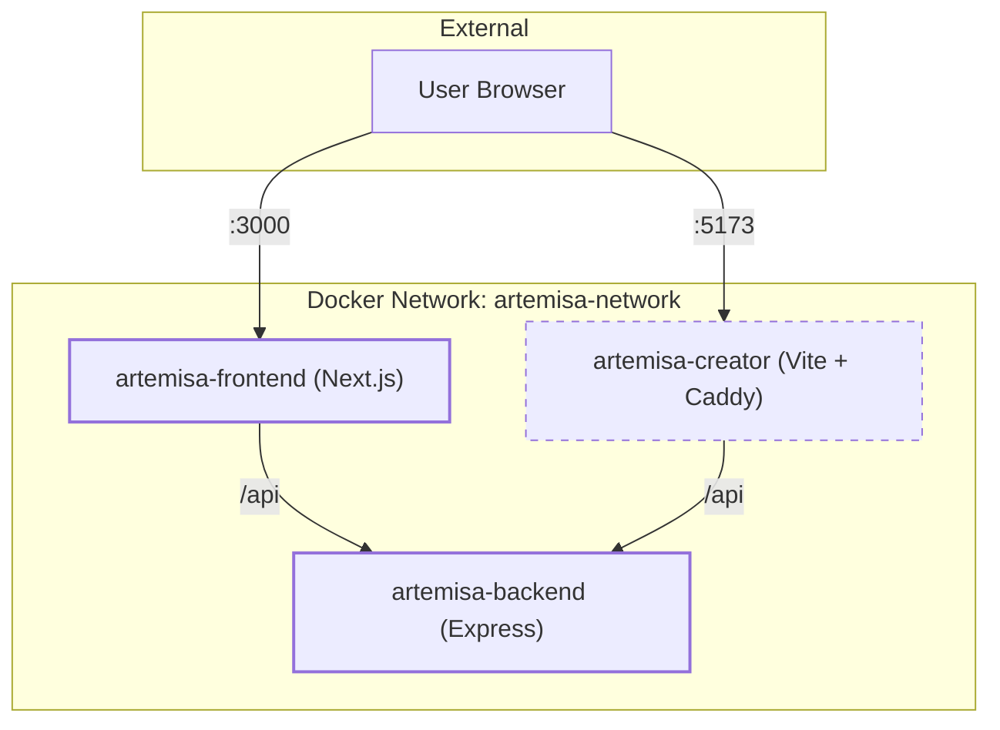
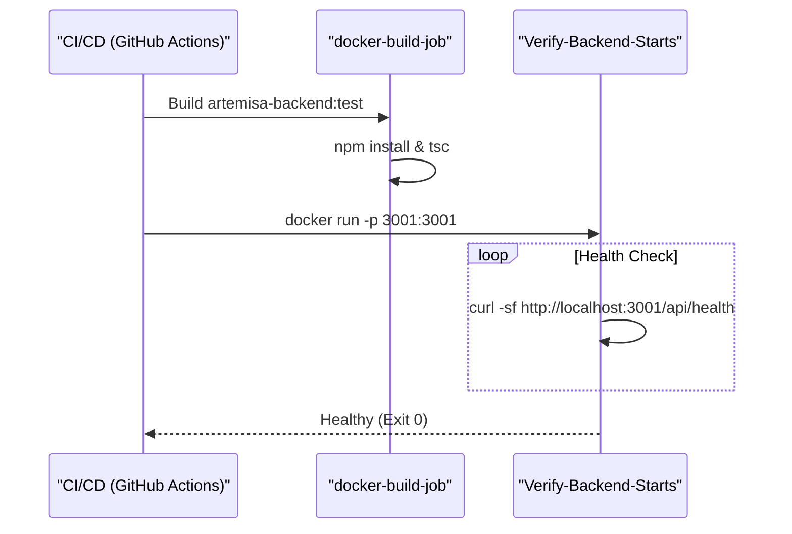

# Docker and Containerization

Relevant source files

The following files were used as context for generating this wiki page:

- [.dockerignore](.dockerignore)
- [.github/CODE_OF_CONDUCT.md](.github/CODE_OF_CONDUCT.md)
- [.github/SECURITY.md](.github/SECURITY.md)
- [.github/cliff.toml](.github/cliff.toml)
- [.github/renovate.json](.github/renovate.json)
- [.github/workflows/ci-extended.yml](.github/workflows/ci-extended.yml)
- [.github/workflows/release.yml](.github/workflows/release.yml)
- [Makefile](Makefile)
- [agent-creator/.env.example](agent-creator/.env.example)
- [docker/Caddyfile.agent-creator](docker/Caddyfile.agent-creator)
- [docker/Dockerfile.agent-creator](docker/Dockerfile.agent-creator)
- [docker/Dockerfile.backend](docker/Dockerfile.backend)
- [docker/docker-compose.production.yml](docker/docker-compose.production.yml)
- [docker/docker-compose.yml](docker/docker-compose.yml)
- [frontend/.env.example](frontend/.env.example)
- [test/env-example-sync.test.mjs](test/env-example-sync.test.mjs)

Artemisa utilizes a multi-container architecture to ensure consistency across development and production environments. The containerization strategy is designed to handle the monorepo structure, specifically managing the Node.js workspaces for the backend, the Next.js frontend, and the legacy agent-creator.

## Container Architecture Overview

The system is partitioned into three primary services, orchestrated via Docker Compose. All services communicate over a dedicated internal bridge network named `artemisa-network`.

### Service Topology

"Artemisa Container Relationships"

**Sources:**

- [docker/docker-compose.yml:1-50](<>)
- [frontend/.env.example:1-4](<>)

---

## Dockerfile Implementations

Artemisa uses specific Dockerfiles for each workspace, optimized for build speed and image size. All Dockerfiles must be built from the **root** of the repository to allow access to the shared `@artemisa/types` package in the `packages/types` workspace.

### Backend (`Dockerfile.backend`)

The backend image encapsulates the Express server. It utilizes a multi-stage build (typically) to compile TypeScript source code from `src/` into `dist/`.

- **Base Image:** Node.js (Version 22 recommended).
- **Security:** Runs as a non-privileged user.
- **Port:** 3001.

### Frontend (`Dockerfile.frontend`)

Handles the Next.js 16 application. Because it requires the shared types during the build process, the build context must include the entire monorepo.

- **Environment:** Requires `NEXT_PUBLIC_API_URL` at build time for client-side fetches.
- **Port:** 3000.

### Legacy Agent Creator (`Dockerfile.agent-creator`)

The legacy React/Vite application is served via **Caddy** in production to provide a robust, lightweight reverse proxy for static assets.

- **Build Step:** Runs `npm run build` to generate static files.
- **Runtime:** Caddy serves the `dist/` directory.
- **Caddy Config:** Uses `docker/Caddyfile.agent-creator` to handle SPA routing (`try_files {path} /index.html`) and compression [docker/Caddyfile.agent-creator:1-12](<>).

**Sources:**

- [.github/workflows/ci-extended.yml:30-67](<>)
- [docker/Caddyfile.agent-creator:1-12](<>)
- [Makefile:34-36](<>)

---

## Orchestration and Configuration

### Development: `docker-compose.yml`

Used for local development, providing hot-reloading (via volume mounts) and immediate access to the full stack.

| Service    | Port | Internal Host | Purpose              |
| :--------- | :--- | :------------ | :------------------- |
| `backend`  | 3001 | `backend`     | API & Creator Engine |
| `frontend` | 3000 | `frontend`    | Main Next.js UI      |
| `creator`  | 5173 | `creator`     | Legacy UI            |

### Production: `docker-compose.production.yml`

Hardened for deployment with the following characteristics:

- **Resource Limits:** Constraints on CPU and Memory to prevent container breakout or DoS.
- **Restart Policy:** `unless-stopped` to ensure high availability.
- **Health Checks:** The backend includes a health check against the `/api/health` endpoint [src/routes/health.ts](<>) (implied by [ci-extended.yml:72](<>)).

"Build and Health Check Flow"

**Sources:**

- [docker/docker-compose.yml:1-50](<>)
- [docker/docker-compose.production.yml:1-50](<>)
- [.github/workflows/ci-extended.yml:68-80](<>)

---

## Security Hardening

### The `.dockerignore` File

A strict `.dockerignore` policy is enforced to prevent sensitive data from entering image layers.

- **Secret Prevention:** Explicitly excludes `.env`, `*.pem`, and `secrets/` [ .dockerignore:6-19](<>).
- **Build Optimization:** Excludes `node_modules`, `test/`, and `.git` to keep context transfers small [ .dockerignore:21-39](<>).
- **Artifact Isolation:** Excludes local `dist/` and `.next/` folders to ensure the container builds its own fresh binaries [ .dockerignore:45-48](<>).

### Environment Variables

Environment variables are managed through `.env` files. The CI pipeline validates that all required production keys (e.g., `AUTH_REQUIRED`, `ARTEMISA_API_KEYS`) are documented in `.env.example` [test/env-example-sync.test.mjs:82-98](<>).

| Variable               | Scope    | Description                                                           |
| :--------------------- | :------- | :-------------------------------------------------------------------- |
| `AUTH_REQUIRED`        | Backend  | Enables API Key validation [src/middleware/auth.ts](<>)               |
| `CORS_ALLOWED_ORIGINS` | Backend  | Restricts cross-origin requests [src/app.ts](<>)                      |
| `NEXT_PUBLIC_API_URL`  | Frontend | Points Next.js to the Backend container [frontend/.env.example:4](<>) |

**Sources:**

- [.dockerignore:1-88](<>)
- [test/env-example-sync.test.mjs:82-98](<>)
- [frontend/.env.example:1-13](<>)

---

## Convenience Tooling

The root `Makefile` provides wrappers for Docker operations to simplify the developer workflow:

- `make docker-build`: Builds all images using the development compose file [Makefile:34-36](<>).
- `make docker-up`: Starts the stack in detached mode [Makefile:38-40](<>).
- `make docker-down`: Stops and cleans up containers [Makefile:42-44](<>).
- `make docker-logs`: Follows logs from all services [Makefile:46-47](<>).

**Sources:**

- [Makefile:34-48](<>)
