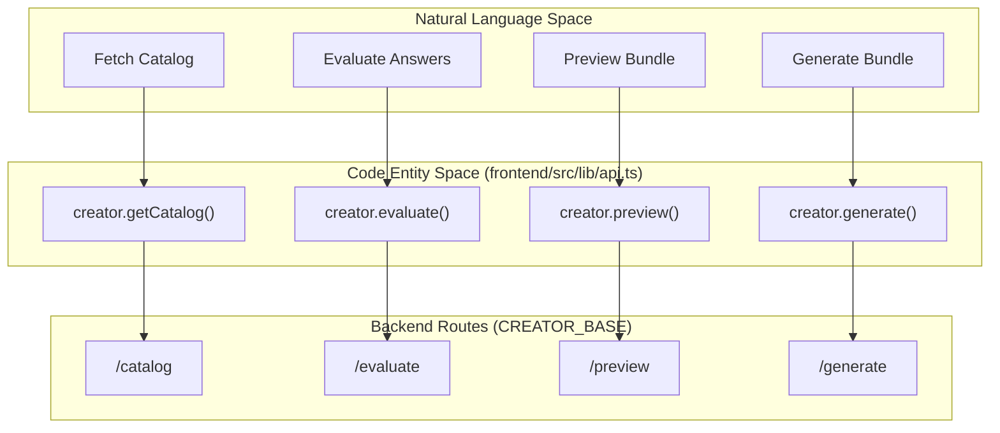
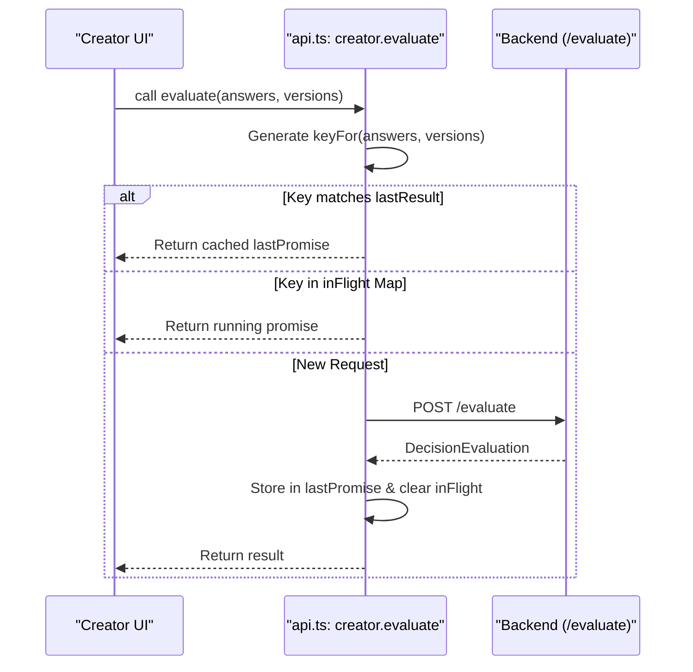

# Frontend API Client

Relevant source files

The following files were used as context for generating this wiki page:

- [frontend/next.config.ts](frontend/next.config.ts)
- [frontend/package.json](frontend/package.json)
- [frontend/src/lib/api.evaluate-dedup.test.ts](frontend/src/lib/api.evaluate-dedup.test.ts)
- [frontend/src/lib/api.ts](frontend/src/lib/api.ts)
- [test/dep-vulnerabilities.test.mjs](test/dep-vulnerabilities.test.mjs)
- [test/frontend-auth.test.mjs](test/frontend-auth.test.mjs)
- [test/issue-273-api-url.test.mjs](test/issue-273-api-url.test.mjs)

The Frontend API Client provides a unified, typed interface for the Next.js application to communicate with the Artemisa backend. Located in `frontend/src/lib/api.ts`, it encapsulates the logic for authentication, error handling, request deduplication, and configuration management.

## Configuration and Environment

The client relies on environment variables for endpoint configuration. It defaults to a local development environment to prevent accidental traffic leakage to production.

| Variable              | Default                 | Purpose                                           |
| :-------------------- | :---------------------- | :------------------------------------------------ |
| `NEXT_PUBLIC_API_URL` | `http://localhost:3001` | Base URL for the backend API.                     |
| `NEXT_PUBLIC_API_KEY` | `""`                    | Optional Bearer token for authenticated requests. |

### Security and Validation

- **Development Warning**: If `NEXT_PUBLIC_API_URL` points to a non-local address while `NODE_ENV` is `development`, a console warning is issued to alert the developer [frontend/src/lib/api.ts:22-33](<>).
- **Build-time Check**: The Next.js configuration (`next.config.ts`) validates that `NEXT_PUBLIC_API_URL` is set during production builds, warning that it will otherwise default to `localhost` [frontend/next.config.ts:8-14](<>).

Sources: [frontend/src/lib/api.ts:16-33](<>), [frontend/next.config.ts:8-14](<>)

## Core Implementation

### The `ApiError` Class

The client uses a custom `ApiError` class to handle failed requests. It extends the standard `Error` and attaches the HTTP status code and an `ApiProblem` object (following RFC 7807-like structures) if provided by the backend [frontend/src/lib/api.ts:44-54](<>).

### Typed Fetch Wrapper

The internal `request<T>` function wraps the native `fetch` API to provide:

1.  **Automatic Header Injection**: Injects `Content-Type: application/json` and any headers returned by `authHeaders()` [frontend/src/lib/api.ts:60](<>).
2.  **Response Parsing**: Automatically parses JSON responses [frontend/src/lib/api.ts:64](<>).
3.  **Error Promotion**: Checks `response.ok` and throws an `ApiError` if the request failed [frontend/src/lib/api.ts:66-68](<>).

### Authentication Headers

The `authHeaders()` function generates the `Authorization` header. If `NEXT_PUBLIC_API_KEY` is present, it returns a `Bearer` token; otherwise, it returns an empty object [frontend/src/lib/api.ts:37-40](<>).

Sources: [frontend/src/lib/api.ts:37-71](<>)

## Creator API Calls

The `creator` object exports functions corresponding to the Backend Creator Pipeline routes. These functions use shared types from `@artemisa/types` to ensure end-to-end type safety.

### Data Flow: Frontend to Code Entities

The following diagram maps the logical Creator actions to their specific implementation entities in the API client.

Title: Creator API Mapping

Sources: [frontend/src/lib/api.ts:75-155](<>)

### Decision Evaluation Deduplication

To optimize performance during the step-by-step question flow, `creator.evaluate` implements a specialized deduplication and memoization strategy. This prevents redundant network calls when users navigate back and forth or click rapidly [frontend/src/lib/api.ts:98-105](<>).

1.  **Key Generation**: A unique key is generated based on the current `answers`, `workflowVersion`, and `catalogVersion` [frontend/src/lib/api.ts:110-112](<>).
2.  **In-Flight Reuse**: If a request with the same key is currently running, the existing promise is returned [frontend/src/lib/api.ts:117-118](<>).
3.  **Last Result Memoization**: The client stores the `lastPromise` and `lastKey`. If the same parameters are requested again (e.g., after a back-navigation), the previous result is returned immediately without a fetch [frontend/src/lib/api.ts:116](<>).

Title: Evaluate Request Lifecycle

Sources: [frontend/src/lib/api.ts:98-134](<>), [frontend/src/lib/api.evaluate-dedup.test.ts:32-64](<>)

## Summary of API Methods

| Method              | Endpoint         | Description                                                                    |
| :------------------ | :--------------- | :----------------------------------------------------------------------------- |
| `getCatalog()`      | `GET /catalog`   | Retrieves the full `Catalog` (tech, skills, MCPs).                             |
| `getWorkflow()`     | `GET /workflow`  | Retrieves the `Workflow` decision tree.                                        |
| `getSkills(filter)` | `GET /skills`    | Fetches filtered skills with `focus` or `q` params.                            |
| `getMcps(filter)`   | `GET /mcps`      | Fetches filtered MCPs with `category` or `q` params.                           |
| `evaluate(...)`     | `POST /evaluate` | Submits answers to get the next questions and recommendations. Includes dedup. |
| `preview(...)`      | `POST /preview`  | Generates a bundle for UI preview (no download).                               |
| `generate(...)`     | `POST /generate` | Finalizes and generates the downloadable agent bundle.                         |

Sources: [frontend/src/lib/api.ts:75-155](<>)
