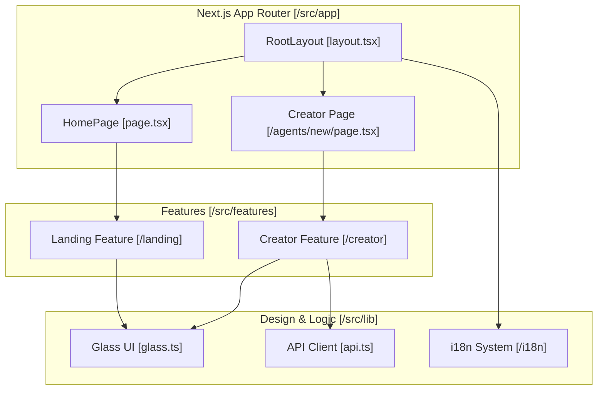
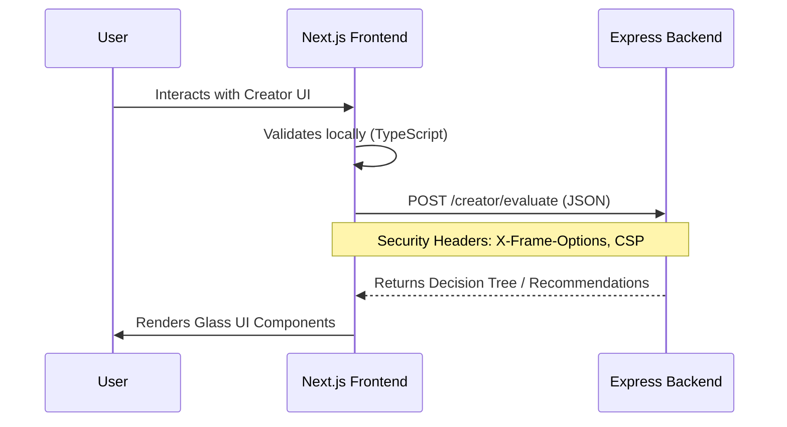

# Frontend Application

Relevant source files

The following files were used as context for generating this wiki page:

- [frontend/next.config.ts](frontend/next.config.ts)
- [frontend/package.json](frontend/package.json)
- [frontend/src/app/layout.tsx](frontend/src/app/layout.tsx)
- [frontend/src/app/page.tsx](frontend/src/app/page.tsx)
- [frontend/src/features/creator/components/step-container.tsx](frontend/src/features/creator/components/step-container.tsx)
- [frontend/src/lib/glass.ts](frontend/src/lib/glass.ts)
- [frontend/src/styles/globals.css](frontend/src/styles/globals.css)
- [test/dep-vulnerabilities.test.mjs](test/dep-vulnerabilities.test.mjs)
- [test/issue-273-api-url.test.mjs](test/issue-273-api-url.test.mjs)

The Artemisa frontend is a high-performance, accessible web application built with **Next.js 16** using the **App Router** architecture [frontend/package.json:22-22](<>). It serves as the primary interface for users to interact with the [Creator Pipeline](#2.2), guiding them through a deterministic decision tree to generate agent configurations.

The application is designed with a "Liquid Glass" aesthetic—a glassmorphism design system that maintains visual continuity across the landing page and the functional Creator UI [frontend/src/lib/glass.ts:1-15](<>).

## System Architecture

The frontend follows a feature-based structure where the landing page and the creator wizard are isolated into distinct modules. It communicates with the backend via a typed API client and maintains session state locally to ensure a seamless user experience.

### Component Relationship Diagram

This diagram maps high-level frontend features to their corresponding code entities and directories.

Sources: [frontend/src/app/layout.tsx:57-71](<>), [frontend/src/app/page.tsx:33-61](<>), [frontend/src/lib/glass.ts:1-15](<>).

## Core Feature Areas

### 1. Landing Page and Navigation

The landing page provides a high-impact introduction to Artemisa using advanced animations and a unified space simulation background. It utilizes a `LandingModalProvider` to manage state for secondary information like developer details or legal notices [frontend/src/app/page.tsx:39-59](<>).

- **Key Components**: `HeroSection`, `ContentSections`, and `SpaceSimulation` [frontend/src/app/page.tsx:4-26](<>).
- **Navigation**: Uses `StickyHeader` and `StickyFooter` for persistent access to site sections [frontend/src/app/page.tsx:49-50](<>).
- **For details, see [Landing Page and Navigation](#3.1).**

### 2. Creator UI

The Creator UI is the core functional area where users generate agent bundles. It is built as a wizard-style interface using the `StepContainer` component, which provides a consistent glass-panel shell with integrated progress tracking [frontend/src/features/creator/components/step-container.tsx:31-77](<>).

- **Wizard Flow**: Supports multiple modes (Auto-corto, Auto-largo, Presets, Avanzado).
- **State Management**: Persists user answers in `sessionStorage` to prevent data loss during refreshes.
- **For details, see [Creator UI](#3.2).**

## Design System: Liquid Glass

The "Liquid Glass" system defines the visual language of Artemisa. It uses Tailwind CSS 4 theme tokens for a corporate accent palette where color is reserved for functional meaning (e.g., `--color-accent` for primary actions, `--color-warn` for backend warnings) [frontend/src/styles/globals.css:17-28](<>).

### Design Token Mapping

| Token          | Code Variable    | Purpose                                                                                     |
| :------------- | :--------------- | :------------------------------------------------------------------------------------------ |
| **Accent**     | `--color-accent` | Selection, progress, primary CTAs, focus rings [frontend/src/styles/globals.css:20-20](<>). |
| **Warning**    | `--color-warn`   | Backend warnings and blocked interactions [frontend/src/styles/globals.css:26-26](<>).      |
| **Danger**     | `--color-danger` | Validation failures and errors [frontend/src/styles/globals.css:27-27](<>).                 |
| **Glass Base** | `glassPanel()`   | Near-transparent background with 6px blur [frontend/src/lib/glass.ts:30-38](<>).            |

- **For details, see [Design System and Internationalization](#3.3).**

## Internationalization (i18n)

The application implements a robust i18n system via `LocaleProvider` [frontend/src/app/layout.tsx:61-61](<>). Translation keys are managed through the `useTranslations` hook, supporting both Spanish (`es`) and English (`en`) [frontend/src/app/page.tsx:35-35](<>).

- **Language Toggle**: A floating `LanguageToggle` component allows users to switch locales globally [frontend/src/app/layout.tsx:64-64](<>).
- **For details, see [Design System and Internationalization](#3.3).**

## Integration and Security

The frontend is strictly decoupled from the backend. It connects via `NEXT_PUBLIC_API_URL`, which defaults to `http://localhost:3001` for development safety [frontend/next.config.ts:8-14](<>).

### Data Flow and Security Controls

Sources: [frontend/next.config.ts:16-22](<>), [test/issue-273-api-url.test.mjs:7-12](<>).

- **Security Headers**: The application enforces `X-Content-Type-Options: nosniff`, `X-Frame-Options: DENY`, and strict `Permissions-Policy` [frontend/next.config.ts:16-22](<>).
- **API Configuration**: Production builds trigger a warning if the API URL is not explicitly configured, preventing accidental leaks to local environments [frontend/next.config.ts:9-14](<>).
