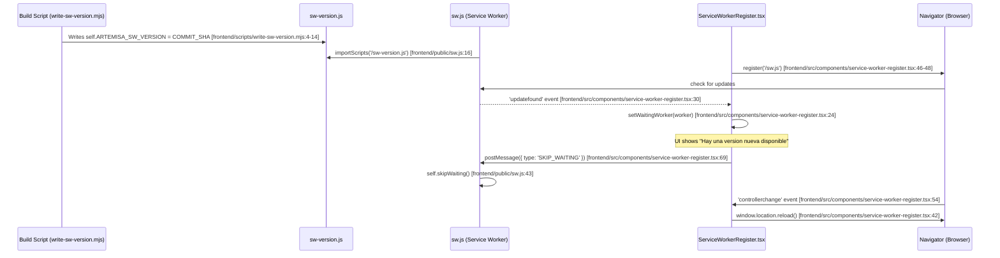
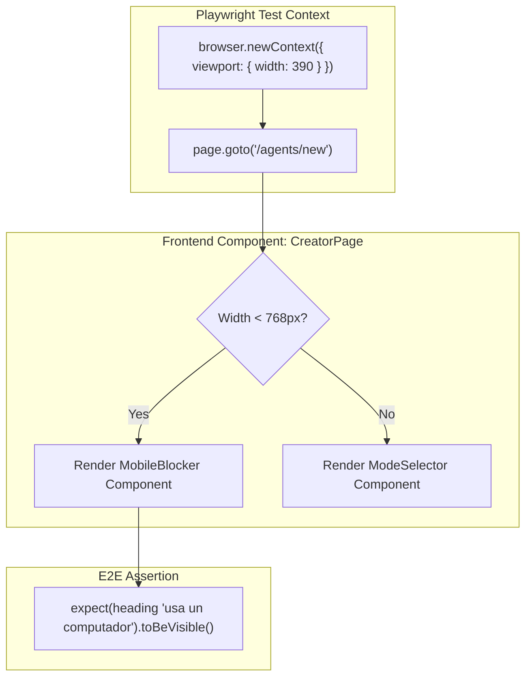

# Frontend Tests and E2E

Relevant source files

The following files were used as context for generating this wiki page:

- [e2e/playwright.config.ts](e2e/playwright.config.ts)
- [e2e/tests/api-health.spec.ts](e2e/tests/api-health.spec.ts)
- [frontend/.gitignore](frontend/.gitignore)
- [frontend/e2e/navigation.spec.ts](frontend/e2e/navigation.spec.ts)
- [frontend/public/sw.js](frontend/public/sw.js)
- [frontend/scripts/write-sw-version.mjs](frontend/scripts/write-sw-version.mjs)
- [frontend/src/components/service-worker-cache.test.ts](frontend/src/components/service-worker-cache.test.ts)
- [frontend/src/components/service-worker-register.test.tsx](frontend/src/components/service-worker-register.test.tsx)
- [frontend/src/components/service-worker-register.tsx](frontend/src/components/service-worker-register.tsx)
- [frontend/src/features/creator/components/review-screen.test.tsx](frontend/src/features/creator/components/review-screen.test.tsx)
- [frontend/src/features/creator/lib/tech-icons.tsx](frontend/src/features/creator/lib/tech-icons.tsx)
- [frontend/src/features/creator/presets/presets.ts](frontend/src/features/creator/presets/presets.ts)
- [frontend/src/features/landing/components/animation-toggle.tsx](frontend/src/features/landing/components/animation-toggle.tsx)
- [frontend/src/i18n/index.test.ts](frontend/src/i18n/index.test.ts)
- [frontend/src/test/setup.ts](frontend/src/test/setup.ts)
- [frontend/src/test/utils.tsx](frontend/src/test/utils.tsx)
- [frontend/vitest.config.ts](frontend/vitest.config.ts)

Artemisa employs a multi-layered testing strategy for its frontend workspace to ensure UI reliability, internationalization accuracy, and cross-browser compatibility. The strategy is divided into **Unit/Component Testing** using Vitest and React Testing Library, and **End-to-End (E2E) Testing** using Playwright.

## Testing Architecture

The frontend testing environment is split between internal component tests (residing within the `frontend/` workspace) and external system-wide E2E tests (residing in the root `e2e/` directory).

### Component and Logic Testing (Vitest)

Vitest is used for high-speed testing of React components and business logic. The configuration is defined in `frontend/vitest.config.ts` and supported by a global setup file `frontend/src/test/setup.ts`.

Key areas covered:

- **I18n Logic**: Ensures the `useTranslations` hook correctly resolves namespaces and provides stable references [frontend/src/i18n/index.test.ts:5-24](<>).
- **Service Worker**: Validates the network-first navigation strategy and build-versioned caching [frontend/src/components/service-worker-cache.test.ts:9-35](<>).
- **Creator UI Components**: Tests complex interactions in the Review Screen, including answer labeling, backend warning rendering, and generation blocking [frontend/src/features/creator/components/review-screen.test.tsx:119-201](<>).

### E2E Testing (Playwright)

Playwright handles integration tests that require a full browser environment. These are split into two suites:

1.  **Frontend-Specific Specs**: Located in `frontend/e2e/`, focusing on routing and viewport-specific behavior (e.g., mobile blocking) [frontend/e2e/navigation.spec.ts:1-26](<>).
2.  **Root E2E Suite**: Located in `e2e/`, focusing on API health, dashboard availability, and cross-service error handling.

---

## Service Worker Lifecycle and Testing

The Service Worker (`sw.js`) implements a hand-rolled caching strategy to avoid build integration risks with Next.js 16 Turbopack [frontend/public/sw.js:13-15](<>).

### Data Flow: SW Versioning and Registration

The following diagram illustrates how the Service Worker version is injected during build and managed by the UI.

**Diagram: Service Worker Versioning Flow**

**Sources:** [frontend/scripts/write-sw-version.mjs:4-14](<>), [frontend/public/sw.js:16-45](<>), [frontend/src/components/service-worker-register.tsx:22-70](<>)

---

## Creator UI Component Testing

The `ReviewScreen` is a critical integration point where frontend state meets backend recommendations. Tests in `review-screen.test.tsx` verify that internal technical IDs are mapped to user-friendly labels before final generation.

### Answer Labeling and Mapping

The UI must translate `CreatorAnswers` (raw data) into readable sections using the `Workflow` and `Catalog` definitions.

| Test Case                  | Code Reference                                                                | Logic Verified                                                                     |
| :------------------------- | :---------------------------------------------------------------------------- | :--------------------------------------------------------------------------------- |
| **Label Mapping**          | `[frontend/src/features/creator/components/review-screen.test.tsx:120-124]()` | Uses `question.prompt` instead of `question.id` for display.                       |
| **Value Formatting**       | `[frontend/src/features/creator/components/review-screen.test.tsx:126-132]()` | Converts booleans to "Sí/No" and Catalog IDs to Labels.                            |
| **Generation Blocking**    | `[frontend/src/features/creator/components/review-screen.test.tsx:162-171]()` | Disables the "Generar" button if the `issues` array from the backend is not empty. |
| **Multi-Target Rendering** | `[frontend/src/features/creator/components/review-screen.test.tsx:187-201]()` | Renders platform targets (e.g., Kiro, Cursor) as individual chips.                 |

**Sources:** [frontend/src/features/creator/components/review-screen.test.tsx:1-202](<>)

---

## E2E Navigation and Mobile Constraints

Artemisa enforces viewport constraints for the Creator UI to ensure the complex catalog and bundle interfaces are usable.

### Mobile Blocking Logic

The `navigation.spec.ts` verifies that users on small viewports (<768px) are redirected or shown a blocking message rather than a broken layout.

**Diagram: E2E Viewport Validation**

**Sources:** [frontend/e2e/navigation.spec.ts:16-26](<>)

---

## Test Utilities and Configuration

### Custom Render Wrapper

To avoid repetitive boilerplate, `frontend/src/test/utils.tsx` provides a custom `render` function that automatically wraps components in the `LocaleProvider`.

- **Function**: `customRender` [frontend/src/test/utils.tsx:13-15](<>)
- **Purpose**: Ensures `useTranslations` works correctly in all component tests without manual provider injection.

### Vitest Configuration

- **Environment**: `jsdom` for DOM simulation.
- **Setup**: `frontend/src/test/setup.ts` initializes `@testing-library/jest-dom` matchers.
- **Coverage**: Configured to exclude `.next/`, `node_modules/`, and E2E specs from coverage reports.

**Sources:** [frontend/src/test/utils.tsx:1-19](<>), [frontend/vitest.config.ts](<>)
