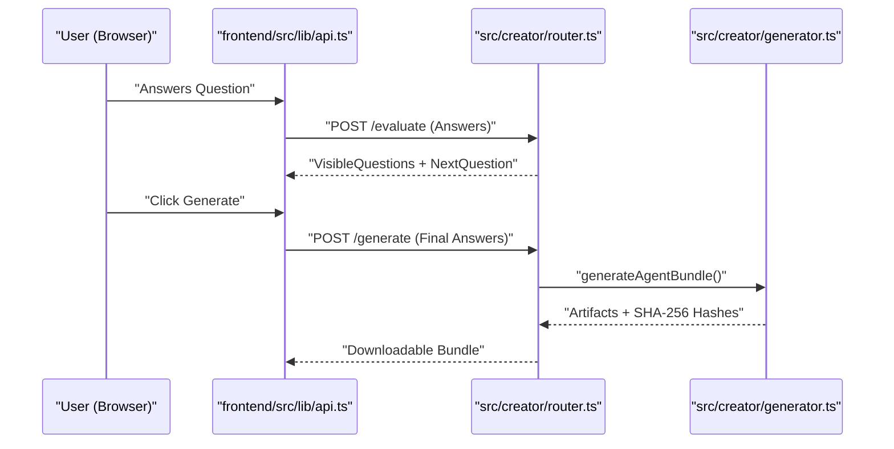

# Getting Started

<details>
<summary>Relevant source files</summary>

The following files were used as context for generating this wiki page:

- [.dockerignore](.dockerignore)
- [.env.example](.env.example)
- [.github/workflows/ci.yml](.github/workflows/ci.yml)
- [.gitignore](.gitignore)
- [.npmrc](.npmrc)
- [.nvmrc](.nvmrc)
- [CONTEXT.md](CONTEXT.md)
- [agent-creator/.env.example](agent-creator/.env.example)
- [agent-creator/README.md](agent-creator/README.md)
- [frontend/.env.example](frontend/.env.example)
- [src/config.ts](src/config.ts)
- [src/middleware/errorHandler.ts](src/middleware/errorHandler.ts)
- [src/server.ts](src/server.ts)
- [test/batch-security-hardening.test.mjs](test/batch-security-hardening.test.mjs)
- [test/env-example-sync.test.mjs](test/env-example-sync.test.mjs)
- [tsconfig.json](tsconfig.json)

</details>

This page provides a comprehensive guide for setting up the Artemisa development environment. Artemisa is a monorepo consisting of a stateless TypeScript backend, a modern Next.js frontend, and a legacy Vite-based creator tool.

## Prerequisites

Before beginning, ensure your local environment meets the following requirements:

- **Node.js**: Version 22.x (LTS) is required [ .github/workflows/ci.yml:16-16 ](<>). You can use `nvm use` if an `.nvmrc` is present.
- **npm**: Version 10+ (included with Node 22). The project uses **npm workspaces** for dependency management [ CONTEXT.md:7-7 ](<>).
- **Git**: For cloning the repository and managing contributions.

## Initial Setup

Artemisa uses a monorepo structure where the root `package.json` manages the backend and hoists shared dependencies for the workspaces [ CONTEXT.md:7-7 ](<>).

### 1. Clone the Repository

```bash
git clone https://github.com/VECTORG99/Artemisa.git
cd Artemisa
```

### 2. Install Dependencies

Do not run `npm install` inside subdirectories. Run the following from the root to install all workspace dependencies:

```bash
npm ci
```

_Note: `npm ci` at the root correctly installs dependencies for `packages/types`, `frontend/`, and `agent-creator/` [ CONTEXT.md:7-7 ](<>)._

### 3. Environment Configuration

Artemisa requires specific environment variables to manage security, CORS, and API routing. Copy the provided templates:

```bash
# Root (Backend)
cp .env.example .env

# Frontend
cp frontend/.env.example frontend/.env.local
```

#### Key Configuration Variables

| Variable               | Default                                       | Description                                                                   |
| :--------------------- | :-------------------------------------------- | :---------------------------------------------------------------------------- |
| `PORT`                 | `3001`                                        | Backend server port [ .env.example:2-2 ](<>).                                 |
| `AUTH_REQUIRED`        | `false`                                       | Set to `true` to enable API Key checks [ .env.example:45-45 ](<>).            |
| `CORS_ALLOWED_ORIGINS` | `http://localhost:3000,http://localhost:5173` | Allowed frontend origins [ .env.example:14-14 ](<>).                          |
| `NEXT_PUBLIC_API_URL`  | `http://localhost:3001`                       | URL the frontend uses to reach the backend [ frontend/.env.example:4-4 ](<>). |

**Sources:** [ .env.example:1-48 ](<>), [ frontend/.env.example:1-13 ](<>), [ src/config.ts:16-22 ](<>)

---

## Running the Full Stack

The Artemisa ecosystem consists of three main processes. You must run the backend to provide the data required by the frontends.

### Service Architecture Overview

The following diagram illustrates the relationship between the local processes and the code entry points.

"Local_Process_Map"

```mermaid
graph TD
    subgraph "Local Environment"
        B["Backend (Port :3001)"]
        F["Next.js Frontend (Port :3000)"]
        L["Legacy Creator (Port :5173)"]
    end

    B -->| "Entrypoint" | S["src/server.ts"]
    B -->| "App Logic" | A["src/app.ts"]

    F -->| "Main Route" | NR["frontend/src/app/agents/new/page.tsx"]
    F -->| "API Client" | AC["frontend/src/lib/api.ts"]

    L -->| "Vite App" | VR["agent-creator/README.md"]

    AC -->| "Fetches Catalog/Workflow" | B
```

**Sources:** [ CONTEXT.md:58-76 ](<>), [ src/server.ts:13-15 ](<>), [ agent-creator/README.md:39-39 ](<>)

### Execution Commands

| Component            | Command (from root)                  | URL                     |
| :------------------- | :----------------------------------- | :---------------------- |
| **Backend**          | `npm run dev`                        | `http://localhost:3001` |
| **Next.js Frontend** | `npm --prefix frontend run dev`      | `http://localhost:3000` |
| **Legacy Tool**      | `npm --prefix agent-creator run dev` | `http://localhost:5173` |

**Sources:** [ agent-creator/README.md:33-42 ](<>), [ CONTEXT.md:7-7 ](<>)

---

## Data Flow and Implementation

Artemisa operates as a **stateless generator**. Unlike previous versions, it does not use a database or persistent storage [ CONTEXT.md:8-11 ](<>).

### Request Lifecycle

When a user interacts with the Creator UI, the data flows as follows:

1.  **State Management**: The frontend maintains the user's answers in `sessionStorage` [ CONTEXT.md:29-29 ](<>).
2.  **Evaluation**: As questions are answered, the frontend calls `POST /api/v1/creator/evaluate`. The backend's `src/creator/` module processes these answers as a pure function to determine the next visible questions [ CONTEXT.md:11-11 ](<>).
3.  **Generation**: Upon completion, the backend generates a deterministic bundle (JSON/Markdown) including SHA-256 hashes for integrity [ CONTEXT.md:24-24 ](<>).

"Generation_Data_Flow"



**Sources:** [ CONTEXT.md:20-25 ](<>), [ src/server.ts:20-22 ](<>), [ frontend/.env.example:1-4 ](<>)

---

## Development Standards

### Testing

New contributors must ensure that all changes pass the local test suite. Artemisa uses the Node.js native test runner for the backend [ CONTEXT.md:50-50 ](<>).

- **Run Unit Tests**: `npm run test:unit` [ CONTEXT.md:50-50 ](<>).
- **Sync Check**: The project enforces that `.env.example` stays in sync with `process.env` calls in the source code via `test/env-example-sync.test.mjs` [ test/env-example-sync.test.mjs:66-73 ](<>).

### Security Hardening

- **Fail-Closed Auth**: If `AUTH_REQUIRED=true` is set, the server will refuse to start if `ARTEMISA_API_KEYS` is empty [ src/server.ts:9-11 ](<>).
- **Graceful Shutdown**: The server handles `SIGTERM` and `SIGINT` to allow in-flight requests to finish before exiting, with a 15-second timeout [ src/server.ts:23-39 ](<>).
- **Audit**: The CI pipeline includes a blocking `npm audit` check for critical vulnerabilities [ .github/workflows/ci.yml:63-94 ](<>).

**Sources:** [ src/server.ts:1-50 ](<>), [ .github/workflows/ci.yml:1-99 ](<>), [ test/batch-security-hardening.test.mjs:6-56 ](<>)
