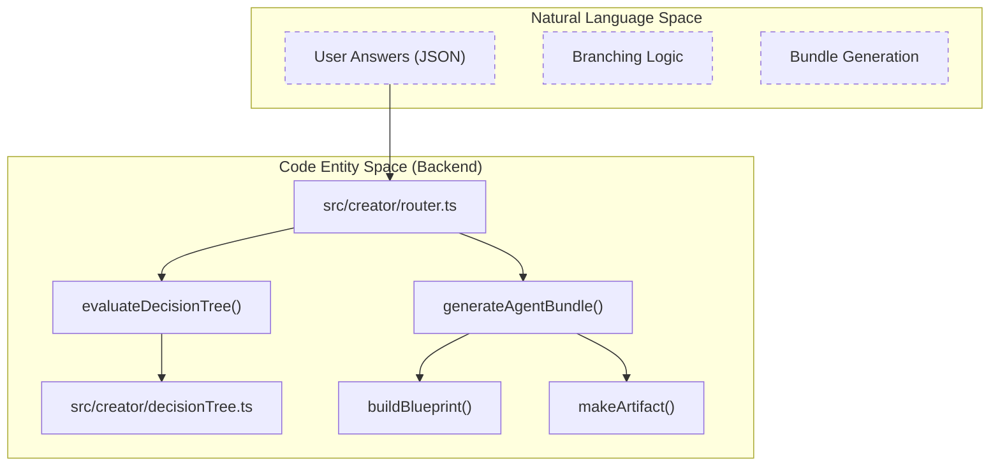
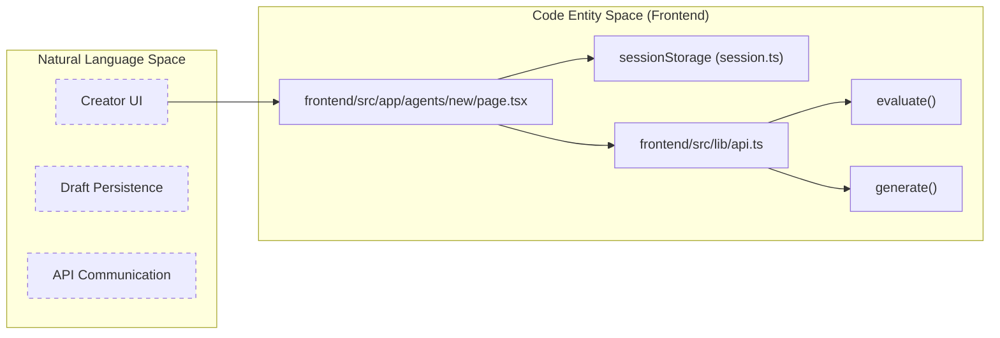

# Glossary

Relevant source files

The following files were used as context for generating this wiki page:

- [.devcontainer/devcontainer.json](.devcontainer/devcontainer.json)
- [.do/app.yaml](.do/app.yaml)
- [AGENTS.md](AGENTS.md)
- [README.md](README.md)
- [docs/CHANGELOG.md](docs/CHANGELOG.md)
- [docs/CONTRIBUTING.md](docs/CONTRIBUTING.md)
- [docs/CONVENTIONS.md](docs/CONVENTIONS.md)
- [docs/adr/0008-remove-runtime-generator-only.md](docs/adr/0008-remove-runtime-generator-only.md)
- [docs/apply-bundle.md](docs/apply-bundle.md)
- [docs/images/creator-flow.svg](docs/images/creator-flow.svg)
- [frontend/src/app/desarrolladores/page.tsx](frontend/src/app/desarrolladores/page.tsx)
- [frontend/src/features/landing/components/content-sections.tsx](frontend/src/features/landing/components/content-sections.tsx)
- [frontend/src/features/landing/components/sticky-nav.tsx](frontend/src/features/landing/components/sticky-nav.tsx)
- [frontend/src/i18n/messages/es.json](frontend/src/i18n/messages/es.json)
- [package-lock.json](package-lock.json)
- [package.json](package.json)
- [packages/types/src/index.ts](packages/types/src/index.ts)
- [src/creator/catalog.ts](src/creator/catalog.ts)
- [src/creator/decisionTree.ts](src/creator/decisionTree.ts)
- [src/creator/generator.ts](src/creator/generator.ts)
- [test/CreatorGenerator.test.mjs](test/CreatorGenerator.test.mjs)
- [test/backend-hardening.test.mjs](test/backend-hardening.test.mjs)
- [test/conventions.test.mjs](test/conventions.test.mjs)
- [test/deploy-security.test.mjs](test/deploy-security.test.mjs)
- [test/metrics-auth.test.mjs](test/metrics-auth.test.mjs)
- [test/rate-limiting.test.mjs](test/rate-limiting.test.mjs)
- [test/test-utils.mjs](test/test-utils.mjs)

This page provides a comprehensive reference for terms, jargon, and domain-specific concepts used within the Artemisa codebase. It bridges the gap between high-level architectural concepts and their specific implementations in the code.

## Core Concepts

### 1. The Creator

The **Creator** is the heart of Artemisa. It is a **stateless and deterministic** engine that transforms user answers into a structured configuration bundle [README.md:18-22](<>). Unlike typical AI tools, it does not use an LLM at runtime to decide architecture; it uses a hardcoded, expert-validated decision tree [README.md:29-31](<>).

- **Statelessness**: The backend does not store sessions or user data. Every request must provide the full set of answers to calculate the next step or generate a bundle [README.md:14-15](<>).
- **Determinism**: Given the same input answers and versioned catalog, the output artifacts and their SHA-256 hashes will always be identical [src/creator/generator.ts:53-57](<>).

### 2. Decision Tree

The logical flow of questions presented to the user. It is defined in `src/creator/decisionTree.ts`.

- **Branching Logic**: Controlled by `visibleWhen` conditions [src/creator/decisionTree.ts:153-153](<>).
- **Progress Calculation**: Handled by `evaluateDecisionTree()`, which determines the `nextQuestion` and the current percentage of completion [src/creator/decisionTree.ts:9-9](<>).
- **Implementation**: Defined as an array of `DecisionQuestion` objects [src/creator/decisionTree.ts:24-24](<>).

### 3. Agent Bundle

The final output of the Creator. A bundle is a collection of files (artifacts) that, when applied to a project, configure an AI agent [README.md:22-26](<>).

- **Blueprint**: The `artemisa.blueprint.json` file. It is the canonical representation of all user decisions [src/creator/generator.ts:23-23](<>).
- **Manifest**: A `manifest.json` file containing an inventory of all generated files and their SHA-256 integrity hashes [src/creator/generator.ts:24-24](<>).
- **Artifacts**: Individual files generated for specific targets (e.g., `.cursorrules`, `.kiro/steering/`, `mcp.json`) [src/creator/generator.ts:26-26](<>).

---

## Domain Vocabulary

| Term         | Definition                                                                       | Code Pointer                                                                      |
| :----------- | :------------------------------------------------------------------------------- | :-------------------------------------------------------------------------------- |
| **Artifact** | A single file generated as part of a bundle.                                     | `GeneratedArtifact` in [src/creator/domain.ts](<>)                                |
| **Catalog**  | A versioned collection of technologies, MCPs, and skills.                        | `src/creator/catalog.ts` [src/creator/catalog.ts:153-153](<>)                     |
| **MCP**      | Model Context Protocol. Servers that provide external context to LLMs.           | `src/creator/mcpCatalog.ts` [src/creator/catalog.ts:3-3](<>)                      |
| **Skill**    | Reusable routines or specialized instructions for an agent.                      | `src/creator/skillsCatalog.ts` [src/creator/catalog.ts:2-2](<>)                   |
| **Slugify**  | The process of turning a human name into a URL/file-safe string.                 | `slugify()` in [src/creator/generator.ts:41-50](<>)                               |
| **Target**   | An AI platform or editor (Cursor, Kiro, CodeRabbit, etc.) supported by Artemisa. | `AgentBlueprint['environments']['target']` [src/creator/generator.ts:143-143](<>) |

---

## Technical Architecture Diagrams

### From Natural Language to Code Entities (Backend)

This diagram maps how the conceptual "Creator Pipeline" is implemented across specific TypeScript modules and functions.

Title: Creator Data Flow Implementation

**Sources:** [src/creator/router.ts:38-39](<>), [src/creator/decisionTree.ts:9-9](<>), [src/creator/generator.ts:128-128](<>), [src/creator/generator.ts:97-97](<>).

### From User Interface to Code Entities (Frontend)

This diagram shows how the Next.js frontend interacts with the backend and manages state.

Title: Frontend Creator State Mapping

**Sources:** [frontend/src/features/landing/components/content-sections.tsx:65-65](<>), [README.md:48-48](<>), [frontend/src/features/landing/components/content-sections.tsx:25-25](<>).

---

## Specific Abbreviations

- **ADR**: Architectural Decision Record. Documents key design choices like [ADR-0008](docs/adr/0008-remove-runtime-generator-only.md) which removed the runtime engine [README.md:14-15](<>).
- **BYPASS_SECRET**: An environment variable used to bypass API key requirements in specific scenarios [README.md:80-84](<>).
- **ESM**: ECMAScript Modules. The project uses strict ESM, requiring `.js` extensions in imports [AGENTS.md:26-26](<>).
- **RAG**: Retrieval-Augmented Generation. While the Creator doesn't execute RAG, it generates configurations for it [README.md:26-26](<>).

---

## Infrastructure Terms

- **npm Workspaces**: The monorepo structure linking `frontend`, `agent-creator`, and `packages/*` [package.json:10-14](<>).
- **Fail-Closed Auth**: The security model where access is denied by default if `AUTH_REQUIRED=true` and no valid key is provided [README.md:80-80](<>).
- **Artifact Integrity**: The use of SHA-256 hashes in the `manifest.json` to ensure generated files haven't been tampered with [src/creator/generator.ts:37-39](<>).

**Sources:**

- [README.md:14-31](<>)
- [package.json:1-116](<>)
- [src/creator/generator.ts:1-127](<>)
- [src/creator/decisionTree.ts:1-153](<>)
- [src/creator/catalog.ts:1-153](<>)
- [AGENTS.md:1-93](<>)
- [docs/CONTRIBUTING.md:47-94](<>)
