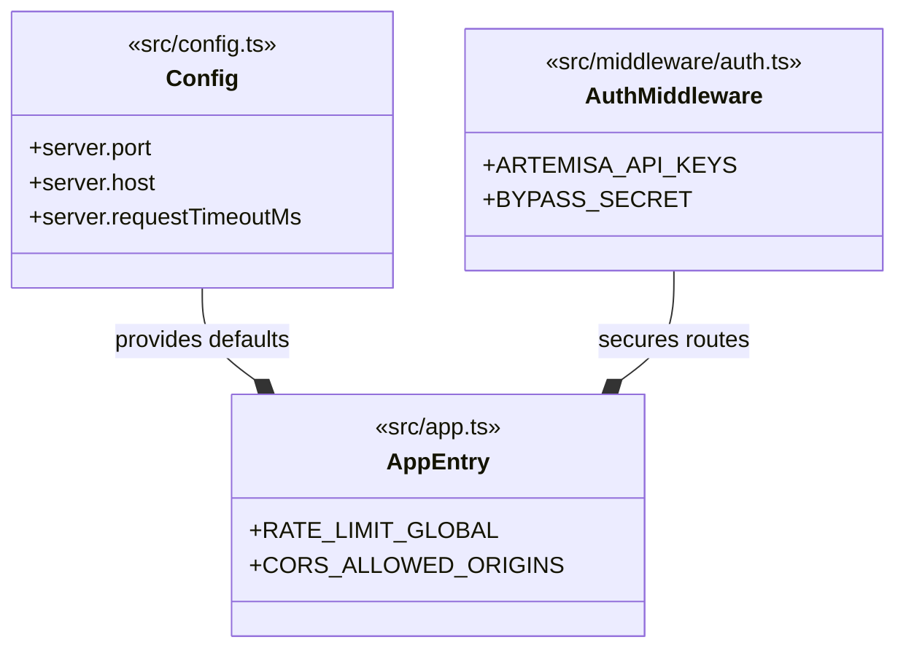

# Infrastructure and Deployment

<details>
<summary>Relevant source files</summary>

The following files were used as context for generating this wiki page:

- [docker/Dockerfile.backend](docker/Dockerfile.backend)
- [docker/docker-compose.yml](docker/docker-compose.yml)
- [docs/architecture.md](docs/architecture.md)
- [docs/deployment.md](docs/deployment.md)

</details>

Artemisa is designed as a stateless, deterministic system that generates configuration bundles without requiring persistent storage, LLM providers, or complex runtime environments [docs/deployment.md:3-3](<>). This infrastructure reflects the architectural pivot to a generator-only model (ADR-0008).

### Deployment Overview

The system can be deployed via Docker containers, as a standalone Node.js application, or using managed platforms like DigitalOcean App Platform. Because the backend is stateless and pure-functional, it does not require a database or persistent disk [docs/deployment.md:148-149](<>).

### Service Architecture

The infrastructure consists of three primary services communicating over a virtual bridge network.

**System Deployment Map**

```mermaid
graph TD
    subgraph "External Access"
        "User Browser" -->|"Port 3000"| FE["frontend (Next.js)"]
        "User Browser" -->|"Port 3001"| BE["backend (Express)"]
        "User Browser" -->|"Port 5173"| AC["agent-creator (Legacy)"]
    end

    subgraph "artemisa-network"
        FE -->|"API Calls"| BE
        AC -->|"API Calls"| BE
    end

    subgraph "Backend Internals"
        BE -->|"src/creator/generator.ts"| PURE["Pure Generation Logic"]
    end
```

**Sources:** [docker/docker-compose.yml:3-96](<>), [docs/architecture.md:25-52](<>)

---

### Docker and Containerization

Artemisa uses a multi-stage Docker setup to minimize image size and security surface area. The backend image is a pure TypeScript build that no longer requires native build tools like Python or G++ [docs/deployment.md:131-132](<>).

- **Dockerfile.backend**: A two-stage build using `node:22-alpine` that compiles TypeScript and prunes development dependencies [docker/Dockerfile.backend:3-27](<>).
- **Orchestration**: `docker-compose.yml` defines the `artemisa-network` bridge and sets resource limits (e.g., 512M memory for the backend) [docker/docker-compose.yml:27-30](<>).
- **Health Checks**: The backend includes a native Node.js health check targeting `/api/health` to ensure service readiness before the frontend starts [docker/Dockerfile.backend:25-26](<>).

For detailed container configuration, health check logic, and resource management, see **[Docker and Containerization](#6.1)**.

**Sources:** [docker/Dockerfile.backend:1-28](<>), [docker/docker-compose.yml:1-97](<>), [docs/deployment.md:13-39](<>)

---

### CI/CD and Code Quality

The project employs a robust CI/CD pipeline managed via GitHub Actions and local Git hooks to ensure deterministic generation and code standards.

- **Workflows**: Automated shards for linting, type-checking, and security scanning (via `ci.yml`).
- **Pre-commit**: Husky and `lint-staged` run `tsc --noEmit` and Prettier before every commit.
- **Dead Code Detection**: Knip is used to identify unused exports and dependencies.
- **Release Automation**: `release.yml` utilizes `git-cliff` for automated changelog generation.

For details on workflow definitions, security shards, and the Makefile convenience targets, see **[CI/CD and Code Quality](#6.2)**.

---

### Environment Configuration

Configuration is managed via environment variables, with `src/config.ts` providing safe defaults for the HTTP server [docs/architecture.md:98-111](<>).

| Category        | Key Variables                             | Purpose                                                           |
| :-------------- | :---------------------------------------- | :---------------------------------------------------------------- |
| **Server**      | `PORT`, `REQUEST_TIMEOUT_MS`              | Network and lifecycle tuning [docs/deployment.md:51-53](<>)       |
| **Auth**        | `AUTH_REQUIRED`, `ARTEMISA_API_KEYS`      | Fail-closed security model [docs/deployment.md:79-80](<>)         |
| **Rate Limits** | `RATE_LIMIT_GLOBAL`, `RATE_LIMIT_CREATOR` | Preventing DoS on generation logic [docs/deployment.md:87-88](<>) |
| **Frontend**    | `NEXT_PUBLIC_API_URL`                     | Build-time API endpoint binding [docs/deployment.md:95-103](<>)   |

**Infrastructure Code Entities**



**Sources:** [docs/architecture.md:66-68](<>), [docs/deployment.md:43-104](<>)

---

### Production Platforms

#### DigitalOcean App Platform

The repository includes a `.do/app.yaml` file for deploying the backend as a Docker web service [docs/deployment.md:137-138](<>). The frontend is typically deployed to Vercel, pointing to the DigitalOcean backend URL via `NEXT_PUBLIC_API_URL` [docs/deployment.md:144-145](<>).

#### Local Development

Contributors use `npm workspaces` to manage dependencies across the monorepo. The `make install` command (or `npm ci` at the root) hoists shared dependencies, including the `@artemisa/types` package [docs/deployment.md:154-168](<>).

**Sources:** [docs/deployment.md:135-168](<>), [docs/architecture.md:58-69](<>)
