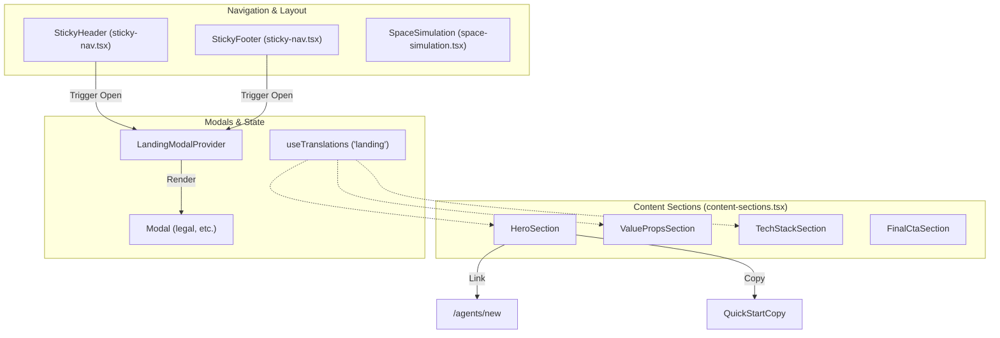
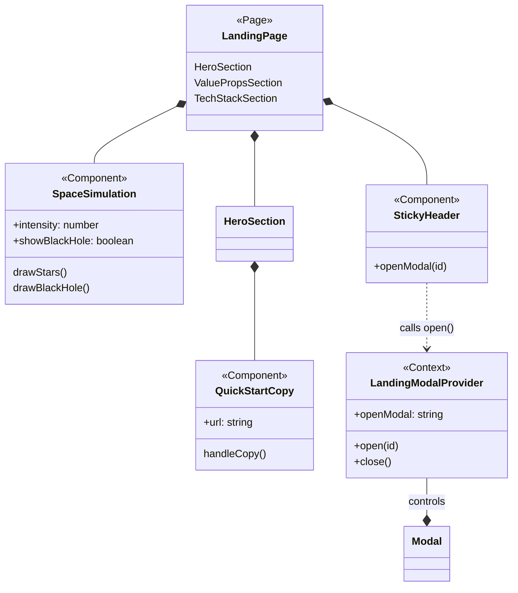

# Landing Page and Navigation

Relevant source files

The following files were used as context for generating this wiki page:

- [frontend/next-env.d.ts](frontend/next-env.d.ts)
- [frontend/src/app/desarrolladores/page.tsx](frontend/src/app/desarrolladores/page.tsx)
- [frontend/src/app/robots.ts](frontend/src/app/robots.ts)
- [frontend/src/components/backgrounds/starfield-background.tsx](frontend/src/components/backgrounds/starfield-background.tsx)
- [frontend/src/components/ui/**tests**/quick-start-copy.test.tsx](frontend/src/components/ui/__tests__/quick-start-copy.test.tsx)
- [frontend/src/components/ui/quick-start-copy.tsx](frontend/src/components/ui/quick-start-copy.tsx)
- [frontend/src/features/creator/components/index.ts](frontend/src/features/creator/components/index.ts)
- [frontend/src/features/creator/components/mode-select.tsx](frontend/src/features/creator/components/mode-select.tsx)
- [frontend/src/features/creator/components/shortcuts-overlay.tsx](frontend/src/features/creator/components/shortcuts-overlay.tsx)
- [frontend/src/features/landing/components/content-sections.test.tsx](frontend/src/features/landing/components/content-sections.test.tsx)
- [frontend/src/features/landing/components/content-sections.tsx](frontend/src/features/landing/components/content-sections.tsx)
- [frontend/src/features/landing/components/landing-modal.tsx](frontend/src/features/landing/components/landing-modal.tsx)
- [frontend/src/features/landing/components/space-simulation.tsx](frontend/src/features/landing/components/space-simulation.tsx)
- [frontend/src/features/landing/components/sticky-nav.tsx](frontend/src/features/landing/components/sticky-nav.tsx)
- [frontend/src/features/landing/hooks/use-animation-preference.tsx](frontend/src/features/landing/hooks/use-animation-preference.tsx)
- [frontend/src/features/landing/hooks/use-section-fade-in.ts](frontend/src/features/landing/hooks/use-section-fade-in.ts)
- [frontend/src/hooks/use-focus-trap.ts](frontend/src/hooks/use-focus-trap.ts)
- [frontend/src/hooks/use-smooth-scroll.ts](frontend/src/hooks/use-smooth-scroll.ts)
- [frontend/src/i18n/messages/es.json](frontend/src/i18n/messages/es.json)

The Artemisa landing page is a high-performance, visually immersive Next.js entry point designed to convert visitors into users of the **Creator UI**. It utilizes a custom physics-based space simulation, a glassmorphism design system, and a deterministic modal/navigation structure.

## Page Architecture

The landing page is composed of several full-viewport sections that utilize CSS scroll snapping. The navigation is handled by floating, pill-shaped components that remain fixed during scrolling.

### Visual Components and Data Flow

**Sources:** [frontend/src/features/landing/components/content-sections.tsx:1-28](<>), [frontend/src/features/landing/components/sticky-nav.tsx:1-15](<>), [frontend/src/features/landing/components/landing-modal.tsx:1-48](<>)

---

## Content Sections

### 1. HeroSection

The `HeroSection` serves as the primary value proposition. It contains the main headline (`heroTitle`) and description (`heroDescription`) retrieved via the `i18n` system [frontend/src/features/landing/components/content-sections.tsx:37-52](<>).

Key technical features:

- **QuickStartCopy**: A component that generates a prompt for AI chats (e.g., ChatGPT, Claude) using the `/api/v1/creator/startup` endpoint [frontend/src/features/landing/components/content-sections.tsx:35-58](<>).
- **Manual Configuration Link**: Redirects users to the `/agents/new` route to start the step-by-step Creator [frontend/src/features/landing/components/content-sections.tsx:64-69](<>).

### 2. ValuePropsSection

Displays three core characteristics of Artemisa: the deterministic decision tree, evidence-based recommendations, and multi-platform compatibility [frontend/src/features/landing/components/content-sections.tsx:109-137](<>). It uses the `useSectionFade-in` hook for entrance animations [frontend/src/features/landing/components/content-sections.tsx:111](<>).

### 3. TechStackSection

A transparency-focused section listing the project's real stack (Node.js, TypeScript, Next.js 16, etc.) [frontend/src/features/landing/components/content-sections.tsx:157-195](<>). Icons are sourced from `react-icons/si` [frontend/src/features/landing/components/content-sections.tsx:5-20](<>).

**Sources:** [frontend/src/features/landing/components/content-sections.tsx:29-195](<>), [frontend/src/i18n/messages/es.json:40-65](<>)

---

## Space Simulation (Background)

The background is a custom HTML5 Canvas simulation (`SpaceSimulation`) that renders a starfield, a black hole with gravitational lensing, and meteors represented as binary characters [frontend/src/features/landing/components/space-simulation.tsx:1-154](<>).

### Implementation Details

- **Physics Engine**: Uses `gravityEffect` and `lensPoint` from `space-physics.ts` to distort light around the "Black Hole" [frontend/src/features/landing/components/space-simulation.tsx:4-170](<>).
- **Dynamic Intensity**: The `intensity` prop allows the simulation to be dimmed (e.g., to `0.6`) when used in background contexts like the `DevelopersPage` [frontend/src/app/desarrolladores/page.tsx:65](<>).
- **Performance**: Uses `requestAnimationFrame` and a `dpr` (device pixel ratio) cap of `1.5` to maintain performance on high-resolution displays [frontend/src/features/landing/components/space-simulation.tsx:209-210](<>).

**Sources:** [frontend/src/features/landing/components/space-simulation.tsx:155-210](<>), [frontend/src/app/desarrolladores/page.tsx:62-66](<>)

---

## Navigation and Modals

### Sticky Components

The `StickyHeader` and `StickyFooter` are floating, pill-shaped elements that use the `glassStyle` utility [frontend/src/features/landing/components/sticky-nav.tsx:14-24](<>).

| Component      | Responsibility          | Key Links/Actions                                                                                   |
| :------------- | :---------------------- | :-------------------------------------------------------------------------------------------------- |
| `StickyHeader` | Primary Site Navigation | Creator, Docs, Team, Technology [frontend/src/features/landing/components/sticky-nav.tsx:25-56](<>) |
| `StickyFooter` | Legal & Secondary Links | Team, Legal Modal, GitHub [frontend/src/features/landing/components/sticky-nav.tsx:71-91](<>)       |

### Modal System

The system uses a `LandingModalProvider` context to manage visibility without interfering with the scroll-snap flow [frontend/src/features/landing/components/landing-modal.tsx:35-42](<>).

- **Focus Management**: The `Modal` component uses a `useFocusTrap` hook to ensure accessibility for keyboard users [frontend/src/features/landing/components/landing-modal.tsx:66](<>).
- **Interaction**: Closes via the `Escape` key, a dedicated close button, or clicking outside the modal content [frontend/src/features/landing/components/landing-modal.tsx:70-87](<>).

**Sources:** [frontend/src/features/landing/components/sticky-nav.tsx:14-156](<>), [frontend/src/features/landing/components/landing-modal.tsx:1-111](<>)

---

## Developers Page

The `DevelopersPage` (`/desarrolladores`) provides information about the core contributors. It reuses the `SpaceSimulation` with specific settings: `showBlackHole={false}` and `maxMeteors={6}` to create a calmer atmosphere [frontend/src/app/desarrolladores/page.tsx:62-66](<>).

- **Data Structure**: Developers are defined in an array containing names, roles, and social links [frontend/src/app/desarrolladores/page.tsx:22-47](<>).
- **Design**: Uses `glassCard` styles to maintain consistency with the landing page design language [frontend/src/app/desarrolladores/page.tsx:49-55](<>).

**Sources:** [frontend/src/app/desarrolladores/page.tsx:1-136](<>)

---

## Component Relationship Diagram

This diagram maps the high-level UI concepts to the specific TypeScript files and functions that implement them.

**Sources:** [frontend/src/features/landing/components/content-sections.tsx:37](<>), [frontend/src/features/landing/components/space-simulation.tsx:182](<>), [frontend/src/features/landing/components/sticky-nav.tsx:14](<>), [frontend/src/features/landing/components/landing-modal.tsx:35](<>), [frontend/src/components/ui/quick-start-copy.tsx:13](<>)
