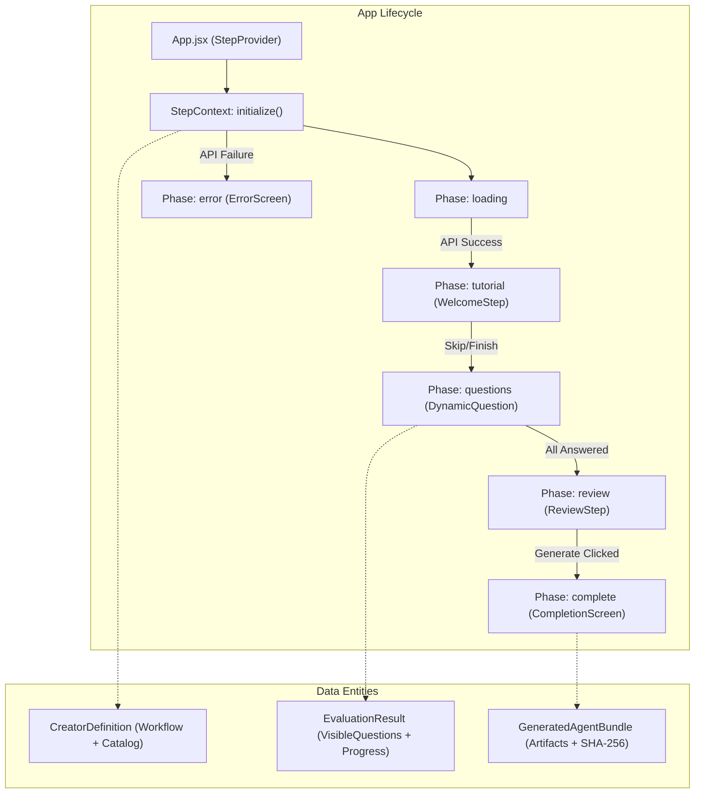
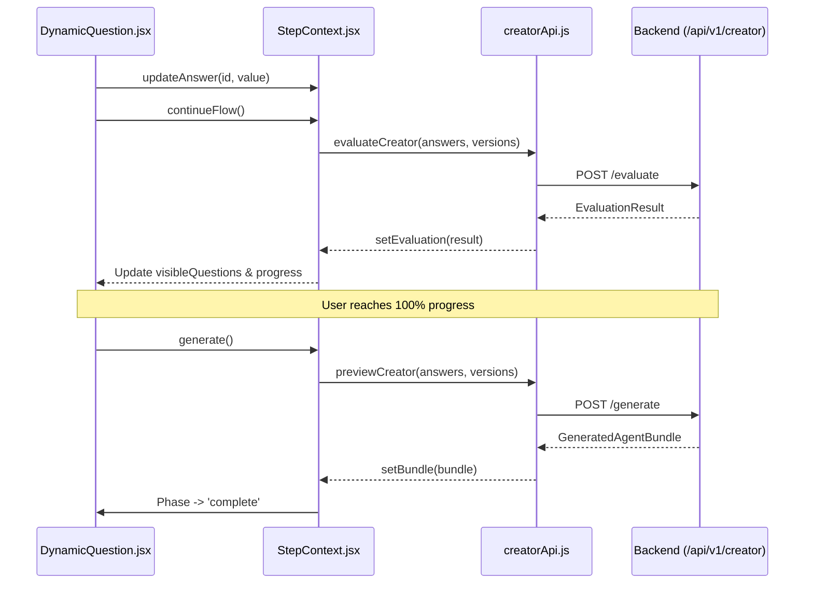

# Legacy Agent Creator (agent-creator/)

<details>
<summary>Relevant source files</summary>

The following files were used as context for generating this wiki page:

- [.gitignore](.gitignore)
- [.npmrc](.npmrc)
- [.nvmrc](.nvmrc)
- [LICENSE](LICENSE)
- [agent-creator/README.md](agent-creator/README.md)
- [agent-creator/index.html](agent-creator/index.html)
- [agent-creator/package-lock.json](agent-creator/package-lock.json)
- [agent-creator/package.json](agent-creator/package.json)
- [agent-creator/src/App.jsx](agent-creator/src/App.jsx)
- [agent-creator/src/components/DynamicQuestion.jsx](agent-creator/src/components/DynamicQuestion.jsx)
- [agent-creator/src/components/StepContainer.jsx](agent-creator/src/components/StepContainer.jsx)
- [agent-creator/src/context/StepContext.jsx](agent-creator/src/context/StepContext.jsx)
- [agent-creator/src/index.css](agent-creator/src/index.css)
- [agent-creator/src/steps/CompletionScreen.jsx](agent-creator/src/steps/CompletionScreen.jsx)
- [agent-creator/src/steps/ReviewStep.jsx](agent-creator/src/steps/ReviewStep.jsx)
- [agent-creator/src/steps/WelcomeStep.jsx](agent-creator/src/steps/WelcomeStep.jsx)
- [agent-creator/vite.config.js](agent-creator/vite.config.js)

</details>

The `agent-creator/` workspace contains the original standalone web application for designing Artemisa agents. Built with **Vite**, **React 19**, and **Tailwind CSS**, it served as the primary user interface before the development of the Next.js-based frontend.

Currently, this application is in a **maintenance-only status**. While it remains fully functional and integrated into the monorepo's development workflow, all new features and UI enhancements are directed toward the modern implementation located in `frontend/agents/new`.

## Role and Maintenance Status

The legacy creator acts as a reference implementation for the Artemisa Creator Protocol. It demonstrates how to consume the backend's stateless API to render a complex, branching decision tree without hardcoding flow logic on the client side [agent-creator/README.md:25-30](<>).

| Feature          | Status                                                                   |
| :--------------- | :----------------------------------------------------------------------- |
| **Maintenance**  | Bug fixes and security patches only [agent-creator/README.md:5-6](<>).   |
| **New Features** | Deprecated in favor of `frontend/` [agent-creator/README.md:5-6](<>).    |
| **Tech Stack**   | Vite + React 19 + Tailwind CSS 4 [agent-creator/package.json:12-24](<>). |
| **API Target**   | Backend `/api/v1/creator` endpoints [agent-creator/README.md:27-27](<>). |

## Step-Based Architecture

The application is structured as a single-page flow managed by a `StepProvider`. It transitions through distinct phases (tutorial, questions, review, completion) based on the state of the user's interaction with the backend Creator module.

### Core Execution Flow

The `CreatorRenderer` component in `App.jsx` acts as the primary switchboard, rendering different screens based on the current `phase` from `StepContext` [agent-creator/src/App.jsx:51-63](<>).



**Sources:** [agent-creator/src/App.jsx:51-63](<>), [agent-creator/src/context/StepContext.jsx:113-139](<>).

## State Management (`StepContext.jsx`)

The `StepProvider` manages the global state, including answers, the current question ID, and the evaluation results returned by the backend.

### Key State Entities

- **`answers`**: A key-value map of question IDs to user responses.
- **`evaluation`**: The result of `evaluateCreator()`, containing the list of currently visible questions (based on branching logic) and the calculated progress [agent-creator/src/context/StepContext.jsx:85-86](<>).
- **`phase`**: Controls the high-level UI state (`loading`, `tutorial`, `questions`, `review`, `complete`) [agent-creator/src/context/StepContext.jsx:79-79](<>).

### Security and Persistence

The context implements a security layer to prevent sensitive data (API keys, tokens) from persisting in the browser's `sessionStorage`.

- **`SENSITIVE_PATTERNS`**: Regular expressions identifying OpenAI keys (`sk-`), GitHub tokens (`ghp_`), etc [agent-creator/src/context/StepContext.jsx:12-22](<>).
- **`redactSensitiveAnswers()`**: A function that replaces values matching sensitive keys or patterns with `[REDACTED]` before calling `sessionStorage.setItem` [agent-creator/src/context/StepContext.jsx:39-51](<>).

## UI Components and Steps

### WelcomeStep (Tutorial)

Renders the "Artemisa Academy" tutorial. It uses a stage-based narrative fetched from the backend to introduce the user to agent concepts before starting the configuration [agent-creator/src/steps/WelcomeStep.jsx:3-62](<>).

### StepContainer and DynamicQuestion

The `StepContainer` provides the layout for the question flow, including a sidebar showing "Decisiones visibles" and a progress bar [agent-creator/src/components/StepContainer.jsx:44-83](<>).

- **Keyboard Navigation**: Supports `Ctrl/Cmd + Enter` to trigger `continueFlow()` [agent-creator/src/components/StepContainer.jsx:16-21](<>).
- **Dynamic Rendering**: `DynamicQuestion` (invoked within `StepContainer`) renders the specific input type (boolean, text, options) defined by the current question metadata [agent-creator/src/App.jsx:59-61](<>).

### ReviewStep

Before final generation, the `ReviewStep` presents a summary of all decisions and recommendations.

- **Decision Summary**: Lists every answered question; clicking one invokes `goToQuestion(id)` to allow editing [agent-creator/src/steps/ReviewStep.jsx:47-67](<>).
- **Explainable Recommendations**: Displays recommendations with their `reason`, `benefits`, and `tradeoffs` [agent-creator/src/steps/ReviewStep.jsx:77-95](<>).

### CompletionScreen

The final stage where the generated bundle is presented.

- **Bundle Download**: Allows downloading the entire bundle as a JSON file [agent-creator/src/steps/CompletionScreen.jsx:19-25](<>).
- **Artifact Preview**: Lists all generated files (e.g., `steering.json`, `manifest.json`) with their descriptions and SHA-256 hashes for integrity verification [agent-creator/src/steps/CompletionScreen.jsx:72-90](<>).

## Data Flow: From Answer to Bundle

The following diagram maps the transition from user input to the final deterministic bundle, highlighting the specific code entities involved.



**Sources:** [agent-creator/src/context/StepContext.jsx:176-200](<>), [agent-creator/src/api/creatorApi.js](<>), [agent-creator/src/steps/ReviewStep.jsx:110-117](<>).

## Development Commands

To run the legacy creator locally alongside the backend:

```bash
# Terminal 1: Start Backend (from root)
npm run dev

# Terminal 2: Start Legacy Creator (from root)
npm --prefix agent-creator run dev
```

The application will be available at `http://localhost:5173` [agent-creator/README.md:33-40](<>).

**Sources:**

- [agent-creator/README.md:33-40](<>)
- [agent-creator/package.json:7-11](<>)
