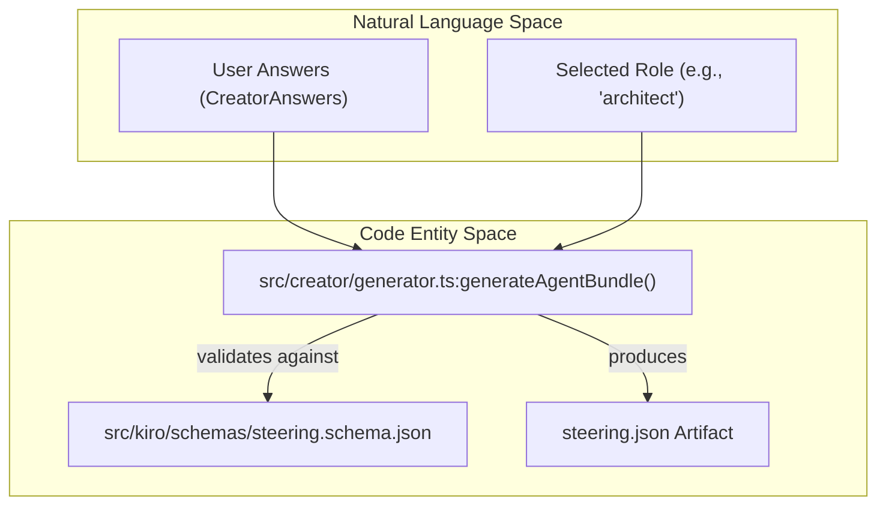
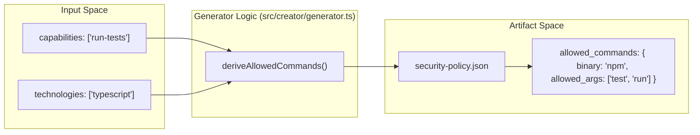

# Reference Artifacts (Steering, Security Policy, Hooks)

Relevant source files

The following files were used as context for generating this wiki page:

- [AGENTS.md](AGENTS.md)
- [docker/Dockerfile.frontend](docker/Dockerfile.frontend)
- [docs/CONVENTIONS.md](docs/CONVENTIONS.md)
- [docs/apply-bundle.md](docs/apply-bundle.md)
- [docs/images/creator-flow.svg](docs/images/creator-flow.svg)
- [docs/reference/rag.example.json](docs/reference/rag.example.json)
- [e2e/README.md](e2e/README.md)
- [frontend/README.md](frontend/README.md)
- [packages/types/README.md](packages/types/README.md)
- [src/kiro/schemas/mcps.schema.json](src/kiro/schemas/mcps.schema.json)
- [src/kiro/schemas/rag.schema.json](src/kiro/schemas/rag.schema.json)
- [src/kiro/schemas/security-policy.schema.json](src/kiro/schemas/security-policy.schema.json)
- [src/kiro/schemas/steering.schema.json](src/kiro/schemas/steering.schema.json)
- [test/conventions.test.mjs](test/conventions.test.mjs)
- [test/generated-artifacts-schema.test.mjs](test/generated-artifacts-schema.test.mjs)
- [test/kiro-schema.test.mjs](test/kiro-schema.test.mjs)

This page documents the reference artifacts located in `docs/reference/` and the associated schemas in `src/kiro/schemas/`. While the Artemisa backend has pivoted to a generator-only architecture (ADR-0008), these artifacts serve as the canonical definitions for the configurations generated in every agent bundle. They define how an AI agent should behave (Steering), what it is allowed to execute (Security Policy), and how it validates its work (Hooks).

## Steering Roles and System Prompts

The steering system defines the identity and operational constraints of the agent. Every generated bundle includes a `steering.json` (for Artemisa targets) or a `.kiro/steering/<agent>.md` (for Kiro targets) based on these reference roles.

### Steering Model Data Flow

The steering configuration is derived from the `CreatorAnswers` provided during the `generateAgentBundle` call.

### Reference Roles

The system supports 7 primary steering roles, each with a specific system prompt and tool permission set:

1.  **Architect**: Focuses on high-level structure and ADRs.
2.  **Developer**: General purpose implementation and testing.
3.  **Security Auditor**: Focuses on vulnerability scanning and policy enforcement.
4.  **DevOps**: Infrastructure, CI/CD, and deployment.
5.  **Reviewer**: Specialized for PR feedback and code quality.
6.  **Maintainer**: Documentation, dependency updates, and issue management.
7.  **Custom**: User-defined prompts for specific domain needs.

**Sources:** [docs/apply-bundle.md:145-152](<>), [src/kiro/schemas/steering.schema.json:1-20](<>), [AGENTS.md:17-18](<>)

---

## Security Policy (Allowlist Model)

Artemisa employs a **fail-closed** security model. The generated `security-policy.json` defines exactly which binaries, arguments, and filesystem paths the agent can access.

### Security Schema Implementation

The security policy is governed by `src/kiro/schemas/security-policy.schema.json`, which enforces a strict structure for allowed commands and blocked patterns.

| Property                  | Description                                                            | Code Reference                                           |
| :------------------------ | :--------------------------------------------------------------------- | :------------------------------------------------------- |
| `mode`                    | Must be `allowlist` or `denylist`.                                     | [src/kiro/schemas/security-policy.schema.json:15-15](<>) |
| `allowed_tools`           | Array of permitted high-level tools (e.g., `git`, `npm`).              | [src/kiro/schemas/security-policy.schema.json:17-17](<>) |
| `allowed_commands`        | Object containing specific binaries and their allowed argument arrays. | [src/kiro/schemas/security-policy.schema.json:18-37](<>) |
| `blocked_args_substrings` | Map of binaries to substrings that trigger a block (e.g., `rm -rf`).   | [src/kiro/schemas/security-policy.schema.json:39-42](<>) |

### Command Derivation Logic

The generator dynamically populates the security policy based on the agent's `capabilities`. For example, an agent with `run-tests` capability will have `npm test` or `vitest` added to its `allowed_commands` entries.

**Sources:** [src/kiro/schemas/security-policy.schema.json:1-46](<>), [test/generated-artifacts-schema.test.mjs:73-81](<>), [docs/apply-bundle.md:50-50](<>)

---

## Hooks Implementation

Hooks provide a mechanism for the agent to perform automated quality gates before finalizing a task. In Kiro targets, these are generated as `.kiro/hooks/<agent>-quality.json`.

### Lifecycle Hooks

Hooks are triggered at specific stages of the agent's execution cycle:

- **Pre-commit**: Runs linting or type-checking before a code change is proposed.
- **Post-generation**: Validates that generated artifacts match the project's architectural constraints.
- **Validation**: Executes the `test` suite to ensure no regressions were introduced.

**Sources:** [docs/apply-bundle.md:28-28](<>), [test/generated-artifacts-schema.test.mjs:59-71](<>)

---

## RAG and MCP Configurations

For advanced agents, Artemisa generates configurations for Retrieval-Augmented Generation (RAG) and Model Context Protocol (MCP) servers.

### RAG Configuration (`rag.json`)

Defines the knowledge bases the agent is permitted to index. The schema supports four source types:

1.  `local_file`: Path to a specific file (e.g., `CONTEXT.md`).
2.  `local_directory`: Path and glob pattern for recursive indexing.
3.  `inline`: Raw text content embedded in the config.
4.  `web_url`: External documentation URLs.

**Sources:** [src/kiro/schemas/rag.schema.json:1-42](<>), [docs/apply-bundle.md:25-25](<>)

### MCP Catalog (`mcps.json`)

Generated from the `mcpCatalog.ts`, this artifact provides the agent with the connection strings and environment variables required to connect to external tools like SQLite explorers, GitHub API connectors, or memory servers.

**Sources:** [src/kiro/schemas/mcps.schema.json:1-10](<>), [docs/apply-bundle.md:79-79](<>)

---

## Integrity and Verification

Every bundle includes a `manifest.json` which serves as the source of truth for all reference artifacts within that specific generation.

### Manifest Structure

The manifest contains:

- `agent`: The slug of the generated agent.
- `artifactCount`: Total number of files generated.
- `files`: An array of objects containing `path`, `sha256` hash, and `kind` (e.g., `configuration`, `instruction`).

Users are instructed to verify the integrity of these artifacts using the SHA-256 hashes provided in the manifest before applying them to a production repository.

**Sources:** [test/generated-artifacts-schema.test.mjs:31-40](<>), [docs/apply-bundle.md:93-113](<>)
