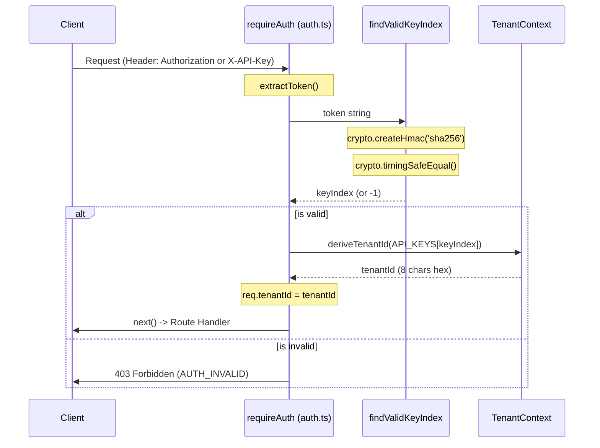
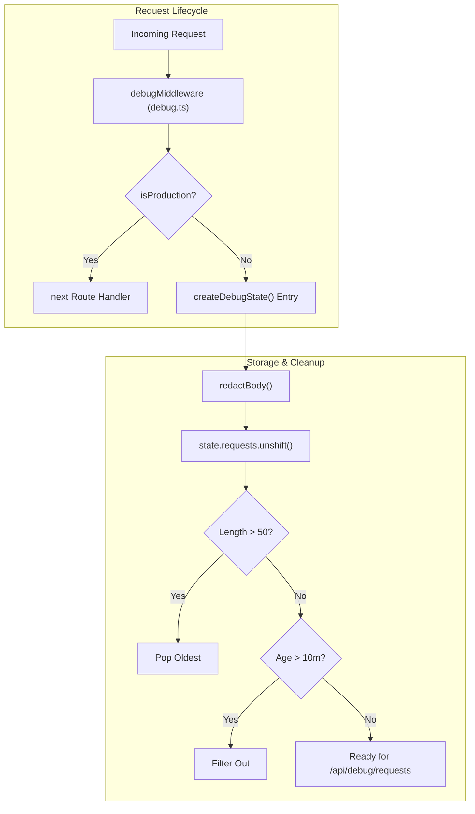

# Security and Authentication

Relevant source files

The following files were used as context for generating this wiki page:

- [.devcontainer/devcontainer.json](.devcontainer/devcontainer.json)
- [.github/workflows/ci.yml](.github/workflows/ci.yml)
- [agent-creator/src/api/creatorApi.js](agent-creator/src/api/creatorApi.js)
- [packages/types/src/index.ts](packages/types/src/index.ts)
- [src/middleware/auth.ts](src/middleware/auth.ts)
- [src/middleware/errorHandler.ts](src/middleware/errorHandler.ts)
- [src/middleware/sanitize.ts](src/middleware/sanitize.ts)
- [src/routes/debug.ts](src/routes/debug.ts)
- [test/auth-default-enabled.test.mjs](test/auth-default-enabled.test.mjs)
- [test/auth.test.mjs](test/auth.test.mjs)
- [test/backend-hardening.test.mjs](test/backend-hardening.test.mjs)
- [test/batch-security-hardening.test.mjs](test/batch-security-hardening.test.mjs)
- [test/cors.test.mjs](test/cors.test.mjs)
- [test/debug-routes-security.test.mjs](test/debug-routes-security.test.mjs)
- [test/issue-250-multi-tenancy.test.mjs](test/issue-250-multi-tenancy.test.mjs)
- [test/issue-266-schema-validation.test.mjs](test/issue-266-schema-validation.test.mjs)
- [test/metrics-auth.test.mjs](test/metrics-auth.test.mjs)
- [test/rate-limiting.test.mjs](test/rate-limiting.test.mjs)
- [test/test-utils.mjs](test/test-utils.mjs)
- [test/timing-safe-auth.test.mjs](test/timing-safe-auth.test.mjs)
- [tsconfig.json](tsconfig.json)

Artemisa employs a **fail-closed security model** designed to protect the generator pipeline and prevent unauthorized access to the Creator's deterministic engine. The security architecture focuses on stateless authentication, strict input sanitization, and multi-layered rate limiting to ensure system stability and data integrity.

## Authentication Model

The authentication logic is centralized in `src/middleware/auth.ts` and operates on a multi-tenant model where API keys are mapped to stable tenant identifiers.

### Fail-Closed Logic

The system is configured via the `AUTH_REQUIRED` environment variable [src/middleware/auth.ts:15-15](<>).

- **Development**: If `AUTH_REQUIRED=false`, authentication is optional, and a default `dev` tenant is assigned [src/middleware/auth.ts:86-90](<>).
- **Production**: If `AUTH_REQUIRED=true` (the default), the server will refuse to start if no `ARTEMISA_API_KEYS` are configured [src/middleware/auth.ts:24-30](<>).

### Token Extraction and Validation

Artemisa supports two authentication methods [src/middleware/auth.ts:63-77](<>):

1. **Bearer Token**: `Authorization: Bearer <token>`
2. **Custom Header**: `X-API-Key: <token>`

To prevent **timing attacks**, token comparison does not use standard string equality. Instead, it uses `crypto.timingSafeEqual` after normalizing keys into fixed-length HMAC-SHA256 digests [src/middleware/auth.ts:42-53](<>).

### Multi-Tenancy

Upon successful authentication, the middleware derives a stable 8-character `tenantId` from the SHA-256 hash of the API key [src/middleware/auth.ts:56-58](<>). This `tenantId` is attached to the `TenantRequest` object for downstream isolation and logging [src/middleware/auth.ts:120-127](<>).

### Auth Data Flow

The following diagram illustrates the transition from raw request headers to the internal `TenantRequest` entity.

**Diagram: Authentication and Tenant Extraction**

Sources: [src/middleware/auth.ts:42-122](<>), [src/middleware/auth.ts:125-132](<>)

## Rate Limiting Strategy

Artemisa implements a dual-layer rate limiting strategy to protect against DoS attacks and resource exhaustion.

| Limiter Type | Default Limit | Configuration Env    | Description                                       |
| :----------- | :------------ | :------------------- | :------------------------------------------------ |
| **Global**   | 100 req/min   | `RATE_LIMIT_GLOBAL`  | Applied to all endpoints including health checks. |
| **Creator**  | 120 req/min   | `RATE_LIMIT_CREATOR` | Specifically for `/api/v1/creator/*` routes.      |

The Creator limit is calibrated to accommodate a full "Auto-largo" workflow run, which typically involves ~35 requests [test/rate-limiting.test.mjs:20-22](<>). The key generator for limiters identifies users by `req.ip`, falling back to `req.socket.remoteAddress` [test/rate-limiting.test.mjs:31-47](<>).

Sources: [test/rate-limiting.test.mjs:1-48](<>)

## Input Sanitization and Hardening

### Prototype Pollution

To prevent prototype pollution attacks, the backend utilizes a sanitization middleware (`src/middleware/sanitize.ts`) that recursively scrubs incoming JSON payloads. This ensures that properties like `__proto__`, `constructor`, and `prototype` are removed before they reach the Creator pipeline.

### Content-Type Enforcement

The backend strictly enforces `application/json` for `POST`, `PUT`, and `PATCH` requests. Non-compliant headers result in immediate rejection [test/backend-hardening.test.mjs:5-15](<>).

### Timing-Safe Metrics

The `/api/metrics` endpoint is protected by a dedicated `METRICS_SECRET`. Similar to API keys, the metrics token is verified using timing-safe comparisons to prevent token discovery via response time variance [test/metrics-auth.test.mjs:4-25](<>). In production, the metrics endpoint is disabled if no secret is configured [test/metrics-auth.test.mjs:33-38](<>).

Sources: [test/backend-hardening.test.mjs:1-51](<>), [test/metrics-auth.test.mjs:1-51](<>), [test/batch-security-hardening.test.mjs:19-22](<>)

## Debug Routes and Lifecycle

The `src/routes/debug.ts` module provides diagnostic endpoints that are strictly restricted to non-production environments.

### Security Controls

- **Production Guard**: A case-insensitive check on `NODE_ENV` returns a `404 Not Found` for all debug routes if set to `production` [src/routes/debug.ts:108-113](<>).
- **Sensitive Key Redaction**: The `redactBody` function scrubs values for keys like `password`, `secret`, `token`, and `api_key` before storing them in the debug state [src/routes/debug.ts:23-33](<>).
- **Auto-Purge**: Debug entries have a TTL (Time To Live) of 10 minutes (`DEBUG_TTL_MS`) and a maximum capacity of 50 requests (`MAX_DEBUG_REQUESTS`) to prevent memory leaks [src/routes/debug.ts:20-22](<>).

**Diagram: Debug State Lifecycle**

Sources: [src/routes/debug.ts:8-142](<>)

## Secure CI/CD Integration

The security posture is enforced during the CI pipeline via `security` shards in `.github/workflows/ci.yml`.

- **Blocking Audits**: `npm audit` is configured to block PRs if critical vulnerabilities are found [test/batch-security-hardening.test.mjs:24-35](<>).
- **Registry Resilience**: The audit job includes a 3-attempt retry logic specifically for network/registry errors to prevent "brownout" failures from blocking development [src/.github/workflows/ci.yml:63-98](<>).
- **Docker Hardening**: The production `docker-compose.production.yml` is hardened by explicitly disabling `env_file` to prevent accidental credential leakage and forcing `AUTH_REQUIRED=true` [test/batch-security-hardening.test.mjs:37-41](<>).

Sources: [.github/workflows/ci.yml:47-98](<>), [test/batch-security-hardening.test.mjs:24-41](<>)
