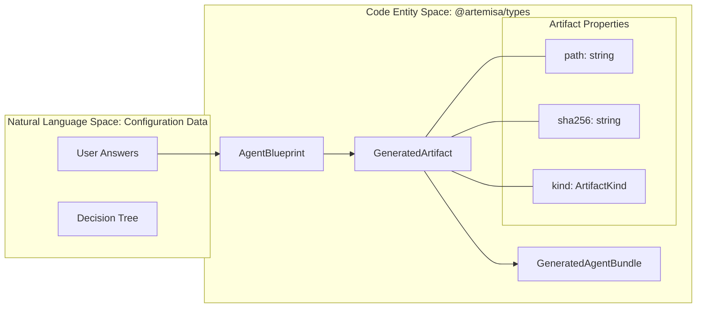

# Shared Types Package (@artemisa/types)

<details>
<summary>Relevant source files</summary>

The following files were used as context for generating this wiki page:

- [.devcontainer/devcontainer.json](.devcontainer/devcontainer.json)
- [docker/Dockerfile.frontend](docker/Dockerfile.frontend)
- [docs/adr/0007-npm-workspaces-for-shared-types-package.md](docs/adr/0007-npm-workspaces-for-shared-types-package.md)
- [e2e/README.md](e2e/README.md)
- [frontend/README.md](frontend/README.md)
- [packages/types/README.md](packages/types/README.md)
- [packages/types/src/index.ts](packages/types/src/index.ts)
- [src/kiro/schemas/rag.schema.json](src/kiro/schemas/rag.schema.json)
- [test/adr.test.mjs](test/adr.test.mjs)
- [test/backend-hardening.test.mjs](test/backend-hardening.test.mjs)
- [test/metrics-auth.test.mjs](test/metrics-auth.test.mjs)
- [test/rate-limiting.test.mjs](test/rate-limiting.test.mjs)
- [test/test-utils.mjs](test/test-utils.mjs)

</details>

The `@artemisa/types` workspace serves as the single source of truth for all data structures shared between the backend (Express), the frontend (Next.js), and the legacy agent-creator. It ensures type safety across the monorepo, preventing drift in the Creator catalog and workflow contracts [docs/adr/0007-npm-workspaces-for-shared-types-package.md:24-25](<>).

## Workspace Architecture

Artemisa utilizes **npm workspaces** to manage internal dependencies [docs/adr/0007-npm-workspaces-for-shared-types-package.md:1-3](<>). The `@artemisa/types` package is located in `packages/types` and is imported by other workspaces as a local dependency [packages/types/README.md:7-7](<>).

### Data Flow and Type Propagation

The following diagram illustrates how types defined in this package synchronize the communication between the Backend and Frontend services.

**Type Synchronization Flow**

```mermaid
graph TD
    subgraph "Code Entity Space: @artemisa/types"
        [index.ts] --> T1["CreatorAnswers"]
        [index.ts] --> T2["DecisionEvaluation"]
        [index.ts] --> T3["GeneratedAgentBundle"]
    end

    subgraph "Natural Language Space: Frontend Application"
        F_State["UI State Management"]
        F_API["API Client (lib/api.ts)"]
    end

    subgraph "Natural Language Space: Backend Core"
        B_Creator["Creator Pipeline"]
        B_Routes["API Routes"]
    end

    T1 -.-> F_State
    T1 -.-> B_Creator
    T2 -.-> F_API
    T2 -.-> B_Routes
    T3 -.-> F_API
    T3 -.-> B_Creator
```

**Sources:** [packages/types/src/index.ts:4-4](<>), [packages/types/src/index.ts:108-108](<>), [packages/types/src/index.ts:213-213](<>), [docs/adr/0007-npm-workspaces-for-shared-types-package.md:17-20](<>)

## Key Interfaces and Primitives

### Creator and Decision Logic

These types define the interaction model for the step-by-step agent configuration process.

- **`CreatorAnswers`**: A record of user responses where keys are question IDs and values are strings, booleans, or arrays of strings [packages/types/src/index.ts:3-4](<>).
- **`DecisionQuestion`**: Defines a single step in the workflow, including its type (e.g., `catalog-multiselect`), requirements, and `visibleWhen` conditions for branching logic [packages/types/src/index.ts:49-61](<>).
- **`QuestionCondition`**: Implements logical operators (`equals`, `oneOf`, `includes`, `all`, `any`) used to evaluate the visibility of questions based on previous answers [packages/types/src/index.ts:42-47](<>).

### Catalog System

The catalog provides the available technologies and skills that can be recommended to the user.

| Interface          | Purpose                         | Key Properties                                                                     |
| :----------------- | :------------------------------ | :--------------------------------------------------------------------------------- |
| `CatalogItem`      | A specific technology or tool.  | `id`, `category`, `tags`, `recommendedFor` [packages/types/src/index.ts:18-26](<>) |
| `SkillCatalogItem` | Pre-defined agent capabilities. | `focus` (e.g., 'security'), `sourceUrl` [packages/types/src/index.ts:244-252](<>)  |
| `McpCatalogItem`   | Model Context Protocol servers. | `official`, `category`, `sourceUrl` [packages/types/src/index.ts:261-280](<>)      |

**Sources:** [packages/types/src/index.ts:18-280](<>)

## Agent Blueprint and Bundles

The output of the Creator pipeline is represented by the `AgentBlueprint` and the final `GeneratedAgentBundle`.

**Bundle Generation Mapping**



**Sources:** [packages/types/src/index.ts:122-122](<>), [packages/types/src/index.ts:191-198](<>), [packages/types/src/index.ts:213-220](<>)

### GeneratedArtifact and Security

Every file generated by the backend is typed as a `GeneratedArtifact`.

- **Integrity**: Each artifact includes a `sha256` hash for verification [packages/types/src/index.ts:197-197](<>).
- **Classification**: Artifacts are assigned an `ArtifactKind` (e.g., `cursor-rules`, `coderabbit-config`, `manifest`) which dictates how the frontend presents them [packages/types/src/index.ts:179-188](<>).
- **Media Types**: Supports `application/json`, `text/markdown`, and `text/yaml` [packages/types/src/index.ts:189-189](<>).

## Integration and Versioning

### Development Workflow

Because the package is part of a workspace, changes to `packages/types` are immediately available to the backend and frontend without requiring an npm registry publication [packages/types/README.md:7-7](<>).

1.  **Installation**: Run `npm ci` at the repo root to link the workspace [docs/adr/0007-npm-workspaces-for-shared-types-package.md:19-19](<>).
2.  **Building**: Run `npm run build --workspace=@artemisa/types` to generate compiled types in `dist/` [packages/types/README.md:12-15](<>).
3.  **Deployment**: In Docker builds, the types package is built before the application code to ensure the `dist/` folder is available for the TypeScript compiler [docker/Dockerfile.frontend:31-31](<>).

### Versioning Contract

The package includes `version` fields in the `Catalog`, `Workflow`, and `GeneratedAgentBundle` interfaces [packages/types/src/index.ts:29-29, 64-64, 214-214](<>). These are used by the backend to ensure that the frontend is submitting answers against a compatible version of the decision tree [packages/types/src/index.ts:225-227](<>).

**Sources:** [packages/types/README.md:1-16](<>), [docs/adr/0007-npm-workspaces-for-shared-types-package.md:29-32](<>), [docker/Dockerfile.frontend:29-31](<>)
