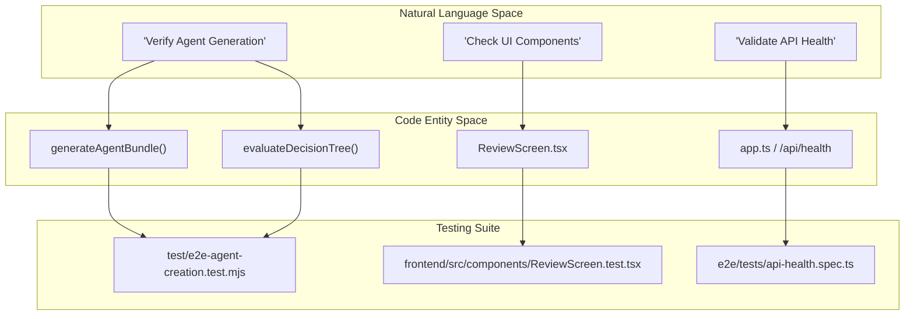
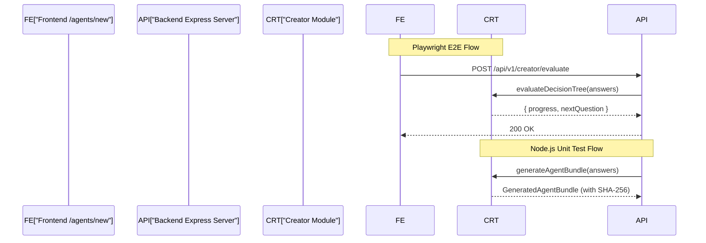

# Testing Strategy

Relevant source files

The following files were used as context for generating this wiki page:

- [AGENTS.md](AGENTS.md)
- [docs/CONVENTIONS.md](docs/CONVENTIONS.md)
- [docs/apply-bundle.md](docs/apply-bundle.md)
- [docs/images/creator-flow.svg](docs/images/creator-flow.svg)
- [e2e/playwright.config.ts](e2e/playwright.config.ts)
- [e2e/tests/api-health.spec.ts](e2e/tests/api-health.spec.ts)
- [test/conventions.test.mjs](test/conventions.test.mjs)
- [test/creator-critical-fixes.test.mjs](test/creator-critical-fixes.test.mjs)
- [test/e2e-agent-creation.test.mjs](test/e2e-agent-creation.test.mjs)
- [test/issue-256-docker-nonroot.test.mjs](test/issue-256-docker-nonroot.test.mjs)

Artemisa employs a multi-layered testing strategy designed to ensure the deterministic nature of the **Creator** engine while maintaining a high-quality glassmorphism UI. The strategy is divided into backend unit/integration tests, frontend component tests, and full-stack end-to-end (E2E) verification.

### Testing Principles

- **Smallest Safe Change:** Tests should be targeted and minimal [AGENTS.md:29-31](<>).
- **Native First:** The backend avoids heavy frameworks, utilizing the `node:test` runner and `node:assert/strict` [AGENTS.md:30-30](<>).
- **Strict ESM:** All tests must respect the project's strict ESM requirements, including `.js` extensions in imports [AGENTS.md:26-26](<>).
- **Deterministic Validation:** Since the backend is stateless and deterministic, tests focus on verifying that specific input answers result in predictable artifact bundles [docs/CONVENTIONS.md:23-24](<>).

---

### Test Architecture Overview

The following diagram illustrates how natural language requirements (e.g., "ensure security") map to specific code entities and their corresponding test suites.

**Natural Language to Code Mapping**

**Sources:** [test/e2e-agent-creation.test.mjs:3-5](<>), [e2e/tests/api-health.spec.ts:6-11](<>), [docs/CONVENTIONS.md:21-27](<>)

---

### Layered Test Execution

The codebase is split into three primary testing domains, managed via root-level `npm` scripts [AGENTS.md:49-55](<>).

| Layer        | Tools        | Scope                                                                   | Command                          |
| :----------- | :----------- | :---------------------------------------------------------------------- | :------------------------------- |
| **Backend**  | `node:test`  | Unit tests for `src/creator/`, security middleware, and contract tests. | `npm run test:unit`              |
| **Frontend** | `Vitest`     | Component testing in `frontend/` and `agent-creator/`.                  | `npm --prefix frontend run test` |
| **E2E**      | `Playwright` | Full flow from UI to Backend; API smoke tests.                          | `npx playwright test`            |

#### Backend Testing

Backend tests are located in the root `test/` directory. They cover the core generation logic, ensuring that the decision tree correctly branches and that the resulting `manifest.json` and `blueprint.json` are accurate [test/e2e-agent-creation.test.mjs:115-125](<>).

For details, see [Backend Tests](#7.1).

#### Frontend & E2E Testing

Frontend tests utilize Vitest for unit logic and Playwright for cross-workspace integration. The Playwright configuration orchestrates three web servers: the Backend (:3001), the Next.js Frontend (:3000), and the Legacy Creator (:5173) [e2e/playwright.config.ts:18-40](<>).

For details, see [Frontend Tests and E2E](#7.2).

---

### Integration and Data Flow

The testing strategy mirrors the production data flow, ensuring that the `POST /api/v1/creator/evaluate` and `POST /api/v1/creator/generate` endpoints remain stable for both the web UI and the AI Agent Protocol [e2e/tests/api-health.spec.ts:36-50](<>).

**System Data Flow Testing**

**Sources:** [e2e/tests/api-health.spec.ts:36-50](<>), [test/e2e-agent-creation.test.mjs:115-116](<>), [docs/apply-bundle.md:93-95](<>)

### Continuous Integration

Quality gates are enforced via GitHub Actions (`ci.yml`), which execute:

1.  **Type Checking:** `npx tsc --noEmit` across all workspaces [AGENTS.md:52-52](<>).
2.  **Linting:** Prettier and ESLint validation.
3.  **Unit Tests:** Backend and Frontend suites.
4.  **Invariant Checks:** Verification of `docs/CONVENTIONS.md` structure and Docker non-root user directives [test/conventions.test.mjs:7-20](<>), [test/issue-256-docker-nonroot.test.mjs:5-10](<>).

**Sources:** [AGENTS.md:45-55](<>), [docs/CONVENTIONS.md:74-76](<>), [e2e/playwright.config.ts:1-41](<>)
